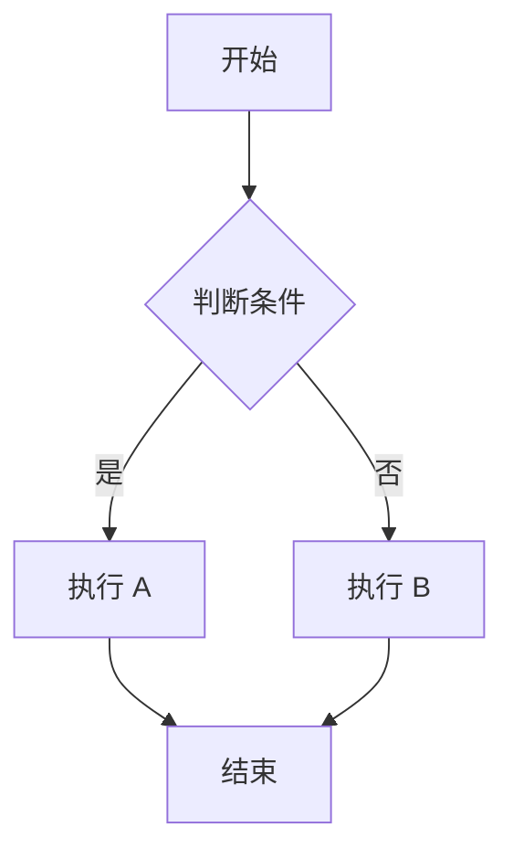

# CLAUDE.md

This file provides guidance to Claude Code (claude.ai/code) when working with code in this repository.

## 变更记录 (Changelog)

### 2025-11-19
- 完善 Mermaid 流程图渲染实现文档
- 添加搜索功能架构详细说明
- 更新数学公式渲染流程文档
- 补充内容集合系统（Zod Schema）细节
- 增强主题切换机制说明
- 添加已知问题和最佳实践章节

---

## 项目概述

Misaka Network Blog 是一个基于 Astro 5.x 构建的现代化静态博客系统，采用 TypeScript + Tailwind CSS 技术栈，部署在 Cloudflare Pages 上。项目以"御坂网络"和"超电磁炮"为主题，具有科技感的设计风格。

**核心技术栈：**
- 框架：Astro 5.15.3 (静态站点生成器)
- 语言：TypeScript 5.0 (严格类型检查)
- 样式：Tailwind CSS 3.4.18 + 自定义主题系统
- 内容：Markdown/MDX + Astro 内容集合 API (glob loader)
- 搜索：Fuse.js 7.1.0 (客户端模糊搜索库)
- 数学公式：remark-math 6.0.0 + rehype-katex 7.0.1 + KaTeX 0.16.9 CDN
- 代码高亮：Shiki (Dracula 主题，支持自动换行)
- 流程图：Mermaid.js 10.x (客户端渲染，CDN 动态加载)
- 部署：Cloudflare Pages (全球 CDN)

## 常用命令

### 开发命令
```bash
npm run dev          # 启动开发服务器 (localhost:4321，支持 HMR)
npm run build        # 构建生产版本到 ./dist/
npm run preview      # 本地预览构建结果
npm run new          # 交互式创建新博客文章 (自动生成时间戳文件名)
```

### 构建和部署
```bash
npm run build-and-preview  # 一键构建并预览
npm run astro -- --help    # 查看 Astro CLI 完整帮助
```

## 项目架构

### 核心目录结构
```
src/
├── components/         # 可复用 Astro 组件
│   ├── BaseHead.astro  # SEO 和主题初始化 (防止 FOUC)
│   ├── Header.astro    # 顶部导航 + 移动菜单 + 搜索按钮
│   ├── Footer.astro    # 页脚
│   ├── ThemeToggle.astro  # 深/浅色主题切换
│   ├── SearchButton.astro # 搜索触发按钮 (快捷键 Cmd/Ctrl+K)
│   ├── SearchModal.astro  # 搜索模态框 (Fuse.js 模糊搜索)
│   ├── TableOfContents.astro  # 浮动目录 (右侧固定，IntersectionObserver)
│   ├── CopyCodeButton.astro   # 代码块复制 (MutationObserver)
│   ├── MermaidRenderer.astro  # Mermaid 流程图渲染器
│   ├── Card.astro      # 文章卡片
│   ├── Tag.astro       # 标签组件
│   ├── PrevNextNav.astro  # 文章前后导航
│   ├── FormattedDate.astro  # 日期格式化
│   ├── HeaderLink.astro     # 导航链接
│   ├── NetworkStats.astro   # 网络状态面板
│   └── FriendCard.astro     # 友链卡片
├── layouts/
│   ├── Layout.astro    # 全局布局 (Header + Footer + 电路板背景 + SearchModal)
│   └── BlogPost.astro  # 文章详情页布局 (面包屑、目录、前后导航、Mermaid)
├── pages/              # 基于文件的路由系统
│   ├── index.astro     # 首页 (最新 6 篇 + 侧栏)
│   ├── blog/
│   │   ├── index.astro     # 博客列表
│   │   └── [...slug].astro # 文章详情 (动态路由)
│   ├── tags/[tag].astro    # 标签归档 (动态路由)
│   ├── about.astro         # 关于页面
│   ├── friends.astro       # 友链页面
│   └── search.json.ts      # 搜索索引 API (返回所有文章的 JSON)
├── content/
│   └── blog/           # 博客文章 Markdown/MDX 文件
│       └── YY-MM-DD-HH-MM.md  # 时间戳命名格式
├── styles/
│   └── global.css      # 全局样式 (CSS 变量 + @layer 结构)
├── scripts/
│   ├── theme.ts        # 主题管理工具函数
│   └── new-post.js     # 交互式创建博客文章工具
├── assets/             # 静态资源 (图片、字体等)
├── consts.ts           # 全局常量 (站点信息、友链)
└── content.config.ts   # 内容集合 Schema 定义 (Zod)
```

### 工具脚本
**`scripts/new-post.js`** - 交互式创建博客文章工具
- 自动生成时间戳文件名格式：`YY-MM-DD-HH-MM.md`
- 交互式输入 frontmatter 字段（标题、描述、标签、草稿状态等）
- 生成带有模板内容的 Markdown 文件
- 文件存在检查和覆盖确认
- 使用：`npm run new`

### 内容管理系统

**内容集合架构 (Astro 5.x)：**
- 使用新的 `glob` loader API (替代旧的文件系统扫描)
- 定义在 `src/content.config.ts` 中
- 严格的 Zod Schema 类型验证
- 支持 `.md` 和 `.mdx` 文件

**文章命名约定：** 文件名格式为 `YY-MM-DD-HH-MM.md` (时间戳)，由 `npm run new` 自动生成。

**Frontmatter Schema** (严格类型验证)：
```typescript
{
  title: z.string(),              // 文章标题 (必填)
  description: z.string(),        // SEO 描述 (必填)
  pubDate: z.coerce.date(),       // 发布日期 (自动转换为 Date 对象)
  updatedDate: z.coerce.date().optional(),  // 更新日期 (可选)
  heroImage: image().optional(),  // 封面图片 (可选，Astro 图片优化)
  tags: z.array(z.string()).default([]),    // 标签数组 (默认空数组)
  draft: z.boolean().default(false)         // 草稿标记 (默认 false)
}
```

**内容处理管道：**
```
Markdown/MDX 文件
  ↓ Astro Glob Loader 加载
  ↓ Zod Schema 严格类型验证
  ↓ remark-math (LaTeX 数学公式解析)
  ↓ rehype-katex (KaTeX 渲染引擎)
  ↓ Shiki (代码语法高亮，Dracula 主题)
  ↓ @tailwindcss/typography (Prose 排版优化)
  ↓ 渲染为优化的 HTML
  ↓ 客户端：Mermaid 渲染、代码复制按钮注入
```

### 数学公式渲染完整流程

**服务端渲染流程：**
1. **remark-math** (构建时)
   - 解析 Markdown 中的 LaTeX 语法：`$...$` (行内) 和 `$$...$$` (块级)
   - 将数学公式转换为中间 AST 节点

2. **rehype-katex** (构建时)
   - 将 AST 节点渲染为 KaTeX HTML
   - 生成数学公式的静态 HTML 结构

3. **KaTeX CSS** (客户端)
   - 通过 CDN 加载：`https://cdn.jsdelivr.net/npm/katex@0.16.9/dist/katex.min.css`
   - 在 `BaseHead.astro` 中预加载，确保公式样式正确

**样式适配：**
- 深色模式：`global.css` 中定义 `.dark .katex` 规则，覆盖默认黑色文本
- 浅色模式：使用 KaTeX 默认样式
- 背景适配：`.dark .katex-display` 添加半透明背景和边框

**支持的公式类型：**
- 行内公式：`$E = mc^2$` → $E = mc^2$
- 块级公式：`$$\int_0^\infty f(x)dx$$`
- 复杂公式：矩阵、分数、求和、积分、希腊字母等

### Mermaid 流程图渲染实现

**架构设计：**
- **组件位置**：`src/components/MermaidRenderer.astro`
- **集成位置**：仅在 `BlogPost.astro` 布局中引入
- **加载策略**：客户端动态加载，CDN：`https://cdn.jsdelivr.net/npm/mermaid@10/dist/mermaid.min.js`
- **渲染时机**：DOMContentLoaded 事件后或页面已加载时立即执行

**核心流程：**
```
1. 查找 Shiki 渲染的代码块：`pre[data-language="mermaid"] code`
2. 提取纯文本内容（去除 Shiki 的 HTML 标签）
3. 动态加载 Mermaid.js（如果未加载）
4. 初始化 Mermaid 主题配置（根据当前主题）
5. 渲染 SVG 图表
6. 替换原始代码块为渲染后的图表
7. 监听主题切换事件，自动重新渲染
```

**主题配置：**
```javascript
mermaid.initialize({
  startOnLoad: false,
  theme: isDark ? 'dark' : 'default',
  themeVariables: {
    primaryColor: '#4ade80',        // 电路板绿
    primaryTextColor: isDark ? '#f0f8ff' : '#0f172a',
    primaryBorderColor: '#4ade80',
    lineColor: '#38bdf8',           // 电磁炮蓝
    secondaryColor: isDark ? '#1e293b' : '#e0f2fe',
    tertiaryColor: isDark ? '#0f172a' : '#f0f9ff',
    fontFamily: 'system-ui, -apple-system, sans-serif',
    fontSize: '14px',
  },
  flowchart: {
    curve: 'basis',
    padding: 20,
    nodeSpacing: 50,
    rankSpacing: 50,
    htmlLabels: true,  // 启用 HTML 标签支持
  },
  securityLevel: 'loose',  // 允许 HTML 和数学公式
});
```

**数学公式支持（实验性）：**
- 设置 `securityLevel: 'loose'` 和 `htmlLabels: true`
- 可在节点标签中使用 LaTeX 公式：`A["$E=mc^2$"] --> B`
- 渲染后的数学公式会通过 KaTeX 进一步处理（如果页面已加载 KaTeX）
- **注意**：复杂公式可能导致渲染失败，建议使用简单公式或文字描述

**错误处理：**
- 渲染失败时保留原始代码块，并在上方显示错误提示
- 错误信息包含 Mermaid 抛出的详细错误描述

**主题切换响应：**
- 使用 `MutationObserver` 监听 `<html>` 元素的 `class` 属性变化
- 检测到 `.dark` 类切换时，延迟 100ms 重新渲染所有图表

**使用方法：**
```markdown
# 在 Markdown 中创建流程图


```

**支持的图表类型：**
- 流程图 (flowchart/graph)
- 时序图 (sequenceDiagram)
- 类图 (classDiagram)
- 状态图 (stateDiagram)
- 甘特图 (gantt)
- 饼图 (pie)
- Git 图 (gitGraph)
- ER 图 (erDiagram)

### 搜索功能架构

**技术栈：**
- **搜索引擎**：Fuse.js 7.1.0 (模糊搜索库，支持中英文)
- **索引生成**：`src/pages/search.json.ts` API 端点
- **UI 组件**：
  - `SearchButton.astro` - 触发按钮（Header 中）
  - `SearchModal.astro` - 搜索模态框（全局布局中）

**搜索索引生成流程：**
```typescript
// src/pages/search.json.ts
export const GET: APIRoute = async () => {
  // 1. 从内容集合获取所有已发布文章 (draft !== true)
  const posts = await getCollection('blog', ({ data }) => data.draft !== true);

  // 2. 提取关键字段生成索引
  const searchIndex = posts.map((post) => ({
    slug: post.id,           // 文章路径 (不含扩展名)
    title: post.data.title,
    description: post.data.description,
    tags: post.data.tags || [],
    pubDate: post.data.pubDate.toISOString(),
  }));

  // 3. 返回 JSON 响应
  return new Response(JSON.stringify(searchIndex), {
    status: 200,
    headers: { 'Content-Type': 'application/json' },
  });
};
```

**Fuse.js 配置：**
```javascript
fuse = new Fuse(searchData, {
  keys: [
    { name: 'title', weight: 3 },        // 标题权重最高
    { name: 'description', weight: 2 },  // 描述次之
    { name: 'tags', weight: 1 },         // 标签权重最低
  ],
  threshold: 0.4,         // 模糊匹配阈值 (0-1，越小越严格)
  ignoreLocation: true,   // 忽略匹配位置
  minMatchCharLength: 2,  // 最小匹配字符长度
});
```

**搜索 UI 特性：**
- **懒加载**：首次打开时才从 `/search.json` 加载索引数据
- **快捷键**：`Cmd/Ctrl + K` 全局触发搜索
- **键盘导航**：
  - `↑/↓` 键选择搜索结果
  - `Enter` 键跳转到选中文章
  - `ESC` 键关闭搜索框
- **高亮匹配**：搜索关键词在标题中高亮显示（使用 `<mark>` 标签）
- **响应式**：移动端和桌面端自适应布局
- **主题适配**：自动跟随深色/浅色模式

**组件通信：**
- **SearchButton** → 发送自定义事件：`window.dispatchEvent(new CustomEvent('open-search'))`
- **SearchModal** → 监听事件：`window.addEventListener('open-search', openSearch)`
- 无需 React/Vue 等框架，使用原生 JavaScript 事件系统

**性能优化：**
- 搜索索引在构建时静态生成，无需数据库或服务端计算
- Fuse.js 实例复用，避免重复初始化
- 搜索结果限制为最多 10 条，避免 DOM 过载
- 使用 `requestAnimationFrame` 优化滚动监听

### 样式系统架构

**双层主题系统：**

1. **CSS 变量层** (支持主题切换)：
   ```css
   :root {
     /* 深色模式（默认） */
     --bg-primary: #0f172a;      /* 主背景 */
     --bg-secondary: #1e293b;    /* 次背景 */
     --text-primary: #f0f8ff;    /* 主文本（Alice Blue） */
     --text-secondary: #e2e8f0;  /* 次文本 */
     --text-muted: #94a3b8;      /* 弱化文本 */
     --border-color: rgba(74, 222, 128, 0.2);  /* 边框（透明绿） */
   }

   :root:not(.dark) {
     /* 浅色模式 */
     --bg-primary: #ffffff;
     --bg-secondary: #f1f5f9;
     --text-primary: #0f172a;
     --text-secondary: #334155;
     --text-muted: #64748b;
     --border-color: rgba(74, 222, 128, 0.4);
   }
   ```

2. **品牌色彩系统** (Tailwind 扩展)：
   - `misaka-circuit` (#4ade80) - 电路板绿 (强调色)
   - `misaka-blue` (#00bfff) - 电磁炮蓝 (交互色)
   - `misaka-accent` (#38bdf8) - 辅助蓝
   - `misaka-bg` (#0f172a) - 深色背景
   - `misaka-dark` (#1e293b) - 深蓝灰
   - `misaka-gray` (#64748b) - 中灰

**@layer 组织结构：**
- `@layer base` - 根级样式、字体、CSS 变量、HTML 标签默认样式
- `@layer components` - 可复用组件类
  - `.btn-misaka` - 电流效果按钮
  - `.card-misaka` - 卡片样式
  - `.tag-misaka` - 标签样式
  - `.divider-circuit` - 电路板分隔线
  - `.network-panel` - 网络状态面板
- `@layer utilities` - 工具类
  - `.text-glow` - 发光文本
  - `.pulse-circuit` - 脉冲动画
  - `.bg-misaka-gradient` - 渐变背景

**主题切换机制详解：**

1. **初始化 (防止 FOUC)：**
   ```javascript
   // BaseHead.astro 中的内联脚本 (is:inline)
   // 在页面渲染前执行，避免闪烁
   (function() {
     function getTheme() {
       // 优先级：localStorage > 系统偏好 > 默认浅色
       if (localStorage.getItem('theme') === 'dark') return 'dark';
       if (localStorage.getItem('theme') === 'light') return 'light';
       if (window.matchMedia('(prefers-color-scheme: dark)').matches) return 'dark';
       return 'light';
     }

     const theme = getTheme();
     if (theme === 'dark') {
       document.documentElement.classList.add('dark');
     }
   })();
   ```

2. **切换逻辑 (ThemeToggle.astro)：**
   ```javascript
   button.addEventListener('click', () => {
     const isDark = document.documentElement.classList.contains('dark');

     if (isDark) {
       document.documentElement.classList.remove('dark');
       localStorage.setItem('theme', 'light');
     } else {
       document.documentElement.classList.add('dark');
       localStorage.setItem('theme', 'dark');
     }
   });
   ```

3. **Tailwind 配置：**
   ```javascript
   // tailwind.config.mjs
   module.exports = {
     darkMode: 'class',  // 使用 .dark 类控制
     // ...
   };
   ```

**电路板背景效果：**
- 使用 SVG data URI 作为背景图案
- `body::before` 伪元素实现固定背景
- 深色/浅色模式自动适配透明度

## 开发指南

### 添加新文章

**推荐方式：** 使用 `npm run new` 命令
```bash
npm run new
# 交互式提示输入：
# - 文章标题 (必填)
# - 描述 (可选)
# - 标签 (逗号分隔)
# - 是否草稿 (y/N)
# - 封面图片路径 (可选)
# - 发布日期 (默认今天)
#
# 自动生成文件名：YY-MM-DD-HH-MM.md
```

**手动创建：** 在 `src/content/blog/` 创建 `.md` 文件
```markdown
---
title: '文章标题'
description: '文章描述'
pubDate: 2025-01-15
updatedDate: 2025-01-20  # 可选
heroImage: ../../assets/your-image.jpg  # 可选
tags: ['标签1', '标签2']
draft: false  # true=仅开发环境显示
---

# 文章内容

支持所有 Markdown 语法，包括：
- 数学公式：$E = mc^2$ 或 $$\int_0^\infty f(x)dx$$
- 代码高亮：```typescript ... ```
- 流程图：```mermaid ... ```
- 表格、列表、引用等
```

### 路由系统

Astro 使用基于文件的路由：

**静态路由：**
- `/` → `src/pages/index.astro` (首页)
- `/blog` → `src/pages/blog/index.astro` (博客列表)
- `/about` → `src/pages/about.astro` (关于页)
- `/friends` → `src/pages/friends.astro` (友链页)

**动态路由：**
- `/blog/[slug]` → `src/pages/blog/[...slug].astro` (文章详情)
  - 使用 `getStaticPaths()` 在构建时生成所有文章页面
  - 从 `getCollection('blog')` 获取所有文章，过滤草稿 (`draft !== true`)
  - 文章的 `id` (文件路径，不含扩展名) 作为 slug
  - 示例：`25-11-19-20-45.md` → `/blog/25-11-19-20-45`
- `/tags/[tag]` → `src/pages/tags/[tag].astro` (标签归档)
  - 自动聚合所有唯一标签
  - 按标签筛选并按 `pubDate` 降序排序文章

**API 路由：**
- `/search.json` → `src/pages/search.json.ts` (搜索索引 API)
  - 构建时生成静态 JSON 文件
  - 包含所有已发布文章的元数据 (title, description, tags, slug, pubDate)

**前后文章导航逻辑：**
```typescript
// 文章按 pubDate 降序排列 (最新在前)
const allPosts = sortedPosts;
const currentIndex = allPosts.findIndex(p => p.id === post.id);

// 注意：因为降序排列
const prevPost = allPosts[currentIndex + 1]; // 时间更早的文章
const nextPost = allPosts[currentIndex - 1]; // 时间更新的文章
```

### 组件开发模式

**Astro 群岛架构：**
- 默认所有组件静态渲染 (零 JavaScript)
- 需要交互时使用 `<script>` 标签（在组件内部）
- `<script>` 标签会自动打包并注入到页面
- 不需要 `client:*` 指令，除非需要 React/Vue 等框架组件

**组件间通信机制：**
- **自定义事件**：使用 `window.dispatchEvent(new CustomEvent('event-name'))` 跨组件通信
  - 示例：`SearchButton` 发送 `'open-search'` 事件，`SearchModal` 监听并打开
- **localStorage**：持久化主题偏好、用户设置等
- **URL 状态**：优先使用 URL 参数传递状态，支持分享和刷新

**Props 定义示例：**
```astro
---
// Props 定义 (TypeScript)
interface Props {
  title: string;
  description?: string;
  tags?: string[];
}

const { title, description = '默认描述', tags = [] } = Astro.props;
---

<div>
  <h1>{title}</h1>
  <p>{description}</p>
  {tags.length > 0 && (
    <div class="flex gap-2">
      {tags.map(tag => <span class="tag-misaka">{tag}</span>)}
    </div>
  )}
</div>
```

**关键组件说明：**

1. **BaseHead.astro** - SEO 和主题初始化
   - 必须在 `<head>` 中使用
   - 内联脚本 (`is:inline`) 在渲染前执行，防止 FOUC
   - 从 localStorage 或系统偏好读取主题设置
   - 预加载 KaTeX CSS 和字体

2. **TableOfContents.astro** - 浮动目录
   - 仅在文章详情页使用 (BlogPost.astro 布局)
   - 自动提取 h2-h6 标题生成层级目录
   - 使用 `IntersectionObserver` 检测当前可见标题
   - 滚动时自动高亮当前章节
   - 响应式：仅在桌面端显示 (max-width: 1280px 隐藏)

3. **CopyCodeButton.astro** - 代码块复制
   - 使用 `MutationObserver` 监听动态插入的代码块
   - Shiki 代码高亮在客户端渲染后插入复制按钮
   - 使用 `navigator.clipboard.writeText()` API
   - 成功/失败状态动画反馈
   - 移动端优化：默认显示按钮，隐藏文字

4. **SearchModal.astro** - 全局搜索
   - 集成在 `Layout.astro` 中，所有页面可用
   - 懒加载：首次打开时才从 `/search.json` 加载索引数据
   - 使用 Fuse.js 进行模糊搜索，支持中英文
   - 键盘导航：`↑/↓` 选择，`Enter` 跳转，`ESC` 关闭
   - 高亮匹配：使用 `<mark>` 标签高亮关键词

5. **MermaidRenderer.astro** - 流程图渲染
   - 仅在博客文章页面 (BlogPost.astro) 中使用
   - 客户端动态加载 Mermaid.js（从 CDN）
   - 查找 `pre[data-language="mermaid"]` 代码块并渲染
   - 主题切换时自动重新渲染
   - 错误处理：渲染失败时显示错误提示

### 样式开发规范

1. **优先使用 Tailwind 类**
   ```astro
   <div class="bg-misaka-dark text-misaka-circuit p-4 rounded-lg">
   ```

2. **需要主题切换时使用 CSS 变量**
   ```css
   .my-component {
     background-color: var(--bg-secondary);
     color: var(--text-primary);
     border: 1px solid var(--border-color);
   }
   ```

3. **自定义可复用组件类使用 @layer components**
   ```css
   @layer components {
     .my-card {
       @apply card-misaka hover:shadow-lg;
       transition: all 0.3s ease;
     }
   }
   ```

4. **全局样式使用 :global() 作用域**
   ```astro
   <style>
     /* 组件作用域样式 */
     .my-class { color: red; }

     /* 全局样式（影响子元素） */
     :global(.prose h1) {
       color: var(--text-primary);
     }
   </style>
   ```

5. **响应式设计**
   - 移动优先：`class="text-sm md:text-base lg:text-lg"`
   - 断点：sm (640px), md (768px), lg (1024px), xl (1280px)
   - 目录、侧边栏等在移动端隐藏

## 技术特性

### 数学公式渲染
- **处理流程**：remark-math → rehype-katex → KaTeX CSS
- **行内公式**：`$E = mc^2$` 渲染为 $E = mc^2$
- **块级公式**：
  ```markdown
  $$
  \int_0^\infty f(x)dx = \lim_{t \to \infty} \int_0^t f(x)dx
  $$
  ```
- **深色模式适配**：`.dark .katex` 规则覆盖默认黑色文本
- **背景优化**：
  - 行内公式：半透明背景 `rgba(30, 41, 59, 0.3)`
  - 块级公式：深色背景 + 边框 + 内边距

### 代码高亮
- **引擎**：Shiki (基于 TextMate 语法)
- **主题**：Dracula (深色主题)
- **自动换行**：`wrap: true` 配置
- **复制按钮**：自动注入到所有 `<pre>` 标签
- **浅色模式增强**：代码块背景 `#334155`，提高对比度

### 流程图渲染 (Mermaid)
- **加载方式**：客户端 CDN 动态加载，无需 npm 依赖
- **支持范围**：仅在博客文章详情页 (BlogPost.astro)
- **渲染目标**：`pre[data-language="mermaid"]` (Shiki 渲染的代码块)
- **主题配置**：Misaka 主题配色（电路板绿、电磁炮蓝）
- **使用方法**：
  ```markdown
  ```mermaid
  graph TD
      A[开始] --> B{判断}
      B -->|是| C[执行]
      B -->|否| D[跳过]
  ```
  ```
- **数学公式支持**：可在节点标签中使用 `$...$` 包裹公式（实验性）
- **主题响应**：监听 HTML 元素 `class` 变化，自动重新渲染

### 搜索功能
- **搜索引擎**：Fuse.js (模糊搜索库)
- **搜索索引**：`/search.json` API 端点，构建时生成
- **搜索范围**：标题(权重3)、描述(权重2)、标签(权重1)
- **快捷键**：`Cmd/Ctrl + K` 打开搜索
- **键盘导航**：`↑/↓` 选择，`Enter` 跳转，`ESC` 关闭
- **性能优化**：懒加载索引数据，仅在首次打开时加载

### SEO 优化
- 自动生成 sitemap.xml 和 RSS feed
- Open Graph 和 Twitter Card 元标签 (BaseHead.astro)
- 结构化数据 (通过 Frontmatter)
- 语义化 HTML 标签
- 图片 alt 属性和懒加载

### 图片处理
- Astro Image 集成，自动优化
- Sharp 引擎，生成 WebP 格式
- 响应式图片 (自动生成多尺寸)
- 懒加载 (`loading="lazy"`)

### 性能优化策略

| 优化策略 | 实现方式 | 效果 |
|---------|---------|------|
| 零 JS 默认 | Astro 静态生成 | 首屏加载 < 1s |
| 代码分割 | 动态导入 | 按需加载 |
| CSS 最小化 | Tailwind PurgeCSS | 生产 < 50KB |
| 图片优化 | Sharp + WebP | 减少 60-80% 体积 |
| 字体预加载 | `rel="preload"` | 减少 FOUT |
| 静态生成 | SSG | 零运行时开销 |
| CDN 加载 | Mermaid/KaTeX | 减少 bundle 大小 |
| 搜索懒加载 | 首次打开时加载 | 减少初始加载 |

## 部署配置

项目配置为 Cloudflare Pages 部署：
- 构建命令: `npm run build`
- 输出目录: `dist`
- 站点 URL: `https://blog.misaka-net.top`
- Node 版本: 18+ (建议使用 20.x)

## 重要注意事项

### 内容编写

1. **Frontmatter 必填字段**
   - 所有博客文章必须包含有效的 frontmatter，否则构建失败
   - 必填字段：`title`, `description`, `pubDate`

2. **草稿文章**
   - 设置 `draft: true` 在生产环境不显示，但开发环境可见
   - 构建时通过 `getCollection('blog', ({ data }) => data.draft !== true)` 过滤

3. **文件命名**
   - 使用 `npm run new` 生成的时间戳格式 (`YY-MM-DD-HH-MM.md`)
   - 避免使用空格、特殊字符
   - 文件名作为 URL slug，建议保持简洁

4. **数学公式**
   - 行内公式使用 `$...$`，不要使用下标字符 (如 `λ₀`) 或代码段 (`` `λ_0` ``)
   - 块级公式使用 `$$...$$`，单独一行
   - 数学符号与中文之间建议添加空格，提升可读性
   - 复杂公式建议使用块级格式，避免行内公式过长

5. **代码块**
   - 使用 ` ```语言名 ` 格式，支持的语言见 [Shiki 文档](https://shiki.style/languages)
   - 代码块会自动添加复制按钮
   - 长代码行会自动换行 (`wrap: true`)

6. **流程图 (Mermaid)**
   - 使用 ` ```mermaid ` 代码块创建流程图
   - 支持的图表类型：flowchart, sequenceDiagram, classDiagram, stateDiagram, gantt, pie, gitGraph, erDiagram
   - **避免在流程图节点中使用复杂数学公式**，可能导致渲染失败
   - 简单公式（如 `$E=mc^2$`, `$x^2$`）通常可以正常渲染
   - 复杂公式建议使用文字描述或单独的数学公式块

### 样式开发

1. **主题切换**
   - 所有颜色使用 CSS 变量或 Tailwind 类，避免硬编码颜色值
   - 测试深色/浅色模式下的显示效果

2. **列表缩进**
   - 一级列表 `ml-3` (12px)
   - 嵌套列表相对缩进 `ml-3`

3. **响应式**
   - 移动优先设计
   - 测试不同断点下的布局

4. **自定义样式**
   - 修改全局样式编辑 `src/styles/global.css`
   - 修改数学公式样式编辑 `.dark .katex` 相关规则
   - 修改代码块样式编辑 `.astro-code` 相关规则

### 组件开发

1. **单一职责原则**
   - 每个组件只负责一个功能
   - 复杂组件拆分为多个子组件

2. **避免客户端 JavaScript**
   - 除非必要，优先静态渲染
   - 需要交互时使用 `<script>` 标签

3. **Props 类型安全**
   - 使用 TypeScript interface 定义 Props
   - 提供默认值和可选字段

4. **可访问性**
   - 添加 `aria-label`, `aria-labelledby` 等属性
   - 图片添加 `alt` 属性
   - 交互元素支持键盘操作

### 构建部署

1. **构建前检查**
   - 运行 `npm run build` 确保无错误
   - 检查 TypeScript 类型错误
   - 验证所有文章的 frontmatter

2. **环境变量**
   - 不要在代码中硬编码敏感信息
   - 使用 `.env` 文件管理环境变量（不提交到 Git）

3. **Cloudflare Pages**
   - 推送到 GitHub 后自动触发构建
   - 构建命令：`npm run build`
   - 输出目录：`dist`

4. **站点 URL**
   - 在 `astro.config.mjs` 中配置 `site` 字段
   - 用于生成 sitemap 和 RSS feed

### 已知问题和解决方案

1. **代码块反引号问题**
   - **问题**：Tailwind Typography 默认在行内 `<code>` 前后添加反引号
   - **解决**：`.prose code::before/::after { content: '' !important; }`

2. **数学公式深色模式**
   - **问题**：KaTeX 默认黑色文本在深色背景下不可见
   - **解决**：在 `global.css` 中定义 `.dark .katex` 规则覆盖颜色

3. **列表缩进不足**
   - **问题**：默认列表缩进过小，层级不清晰
   - **解决**：统一设置 `ml-3` (12px) 缩进

4. **搜索数据加载**
   - **问题**：首次加载搜索数据可能较慢
   - **解决**：懒加载，仅在首次打开搜索时加载 `/search.json`

5. **Mermaid 渲染失败**
   - **问题**：复杂图表或数学公式可能导致渲染失败
   - **解决**：
     - 检查 Mermaid 语法是否正确
     - 避免在节点标签中使用过于复杂的公式
     - 查看浏览器控制台错误信息
     - 降级方案：使用纯文本描述或外部图片

6. **主题切换闪烁 (FOUC)**
   - **问题**：页面加载时短暂显示错误主题
   - **解决**：在 `BaseHead.astro` 中使用内联脚本 (`is:inline`) 在渲染前执行

### 最佳实践

1. **文章创建**
   - 使用 `npm run new` 命令创建文章，确保格式正确
   - 填写完整的 frontmatter，包括 title, description, tags
   - 草稿使用 `draft: true`，完成后改为 `false`

2. **数学公式**
   - 简单公式优先使用行内格式 `$...$`
   - 复杂公式使用块级格式 `$$...$$`
   - 避免在流程图中使用复杂公式

3. **代码块**
   - 添加语言标识，启用语法高亮
   - 长代码块使用折叠或分页
   - 添加注释说明关键逻辑

4. **图片**
   - 使用 Astro Image 组件自动优化
   - 添加有意义的 alt 文本
   - 控制图片尺寸，避免过大

5. **性能**
   - 避免在页面中加载大量图片
   - 使用 CDN 加载第三方库（如 Mermaid, KaTeX）
   - 测试构建后的 bundle 大小

6. **可维护性**
   - 组件拆分合理，避免单文件过大
   - 使用 TypeScript 类型检查
   - 添加必要的注释和文档

## 常见问题 (FAQ)

**Q: 如何添加新的友链？**
A: 编辑 `src/consts.ts` 中的 `FRIEND_LINKS` 数组，添加新的友链对象。

**Q: 如何自定义主题颜色？**
A: 编辑 `tailwind.config.mjs` 中的 `theme.extend.colors` 配置，或在 `global.css` 中修改 CSS 变量。

**Q: 如何禁用搜索功能？**
A: 在 `Layout.astro` 中移除 `<SearchModal />` 组件，在 `Header.astro` 中移除 `<SearchButton />` 组件。

**Q: 如何在文章中嵌入视频？**
A: 使用 HTML `<video>` 标签或 iframe 嵌入（如 YouTube）。Markdown 本身不支持视频。

**Q: 如何添加评论系统？**
A: 可以集成 Giscus, Utterances, Disqus 等第三方评论系统，在 `BlogPost.astro` 布局中添加相应组件。

**Q: 构建时提示 frontmatter 验证失败？**
A: 检查文章的 frontmatter 是否符合 `src/content.config.ts` 中定义的 Schema，确保必填字段存在且类型正确。

**Q: 如何更改代码高亮主题？**
A: 编辑 `astro.config.mjs` 中的 `markdown.shikiConfig.theme` 配置，可选主题见 [Shiki Themes](https://shiki.style/themes)。

**Q: 流程图在某些浏览器中不显示？**
A: 确保浏览器支持 ES6+ JavaScript，Mermaid.js 需要较新的浏览器版本。建议使用 Chrome, Firefox, Safari 或 Edge 最新版本。
