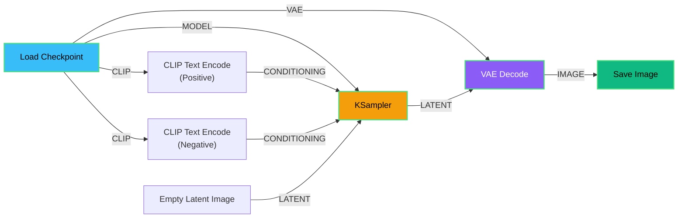
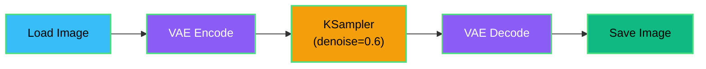
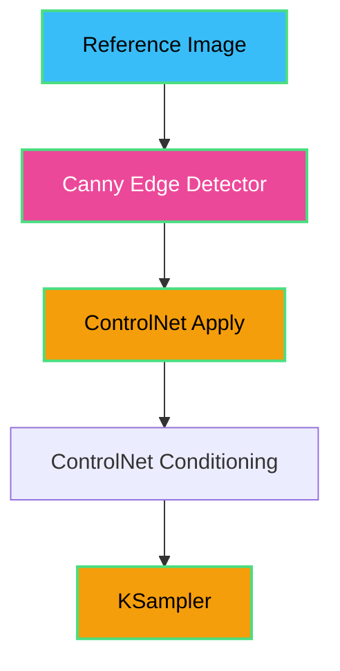
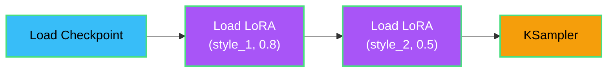

## 前言

在 AI 图像生成领域，ComfyUI 以其强大的节点式工作流系统脱颖而出，成为专业创作者和研究者的首选工具。与传统的一键式 WebUI 不同，ComfyUI 允许你像搭建乐高积木一样，通过连接不同的节点来精确控制整个图像生成流程。本文将从计算机视觉基础开始，系统性地介绍 ComfyUI 及其核心技术概念。

## 一、ComfyUI 简介

### 1.1 什么是 ComfyUI？

ComfyUI 是一个基于 **节点图（Graph/Nodes）** 的 Stable Diffusion 用户界面，它将复杂的图像生成流程分解为可视化的节点单元。每个节点代表一个特定功能（如加载模型、编码文本、采样等），通过连线将节点组合，即可构建从简单到复杂的图像生成工作流。

**核心优势：**
- **模块化设计**：每个步骤都是独立节点，易于理解和调试
- **高度灵活**：支持构建任意复杂的自定义工作流
- **内存优化**：即使在低显存设备上也能运行（支持 CPU 模式）
- **版本兼容**：支持 SD 1.x、SD 2.x、SDXL、SD3.5、FLUX 等多代模型
- **可扩展性**：丰富的社区插件生态系统

### 1.2 节点式工作流的特点

传统 WebUI 采用线性交互界面，隐藏了大量技术细节。ComfyUI 则将整个流程可视化：


这种设计让你能够：
- 在任意节点插入自定义处理逻辑
- 重用中间结果（如潜在空间图像）
- 精确控制每个组件的参数
- 并行执行多个采样分支

### 1.3 基础工作流示例

一个最简单的文本生成图像（Text-to-Image）工作流包含以下节点：

1. **Load Checkpoint**：加载模型文件（`.safetensors`）
2. **CLIP Text Encode (Prompt)**：将正向提示词编码为条件向量
3. **CLIP Text Encode (Negative Prompt)**：将负向提示词编码
4. **Empty Latent Image**：创建初始随机噪声潜在空间
5. **KSampler**：核心采样器，执行去噪过程
6. **VAE Decode**：将潜在空间解码为像素图像
7. **Save Image**：保存最终图像

---

## 二、计算机视觉（CV）基础

### 2.1 什么是计算机视觉？

**计算机视觉（Computer Vision, CV）** 是人工智能的一个分支，致力于让计算机理解和处理视觉信息。其核心任务包括：

- **图像分类**：识别图像中的物体类别
- **目标检测**：定位图像中的多个物体
- **语义分割**：像素级别的场景理解
- **图像生成**：从数据分布中创造新图像（← Stable Diffusion 属于此类）

### 2.2 图像的数字表示

在计算机中，图像本质上是一个 **三维张量（Tensor）**：

$$
I \in \mathbb{R}^{H \times W \times C}
$$

其中：
- $H$（Height）：图像高度（像素）
- $W$（Width）：图像宽度（像素）
- $C$（Channels）：通道数，RGB 彩色图像为 3，灰度图像为 1

例如，一张 512×512 的 RGB 图像可以表示为形状 `(512, 512, 3)` 的张量，每个值范围通常是 $[0, 255]$ 或归一化后的 $[0, 1]$。

### 2.3 传统 CV vs 深度学习 CV

| 方法 | 特征提取 | 优点 | 缺点 |
|------|---------|------|------|
| **传统方法** | 手工设计（如 SIFT、HOG） | 可解释性强 | 特征工程复杂，泛化能力弱 |
| **深度学习** | 卷积神经网络（CNN）自动学习 | 端到端训练，性能优越 | 需要大量数据，黑盒性质 |

Stable Diffusion 属于深度学习范畴，其核心是 **扩散模型（Diffusion Model）**。

### 2.4 扩散模型的基本原理

扩散模型的核心思想是 **逐步去噪**：

**正向过程（加噪）：**
$$
q(x_t | x_{t-1}) = \mathcal{N}(x_t; \sqrt{1-\beta_t} x_{t-1}, \beta_t I)
$$

从真实图像 $x_0$ 开始，逐步添加高斯噪声，经过 $T$ 步后变成完全的随机噪声 $x_T$。

**反向过程（去噪）：**
$$
p_\theta(x_{t-1} | x_t) = \mathcal{N}(x_{t-1}; \mu_\theta(x_t, t), \Sigma_\theta(x_t, t))
$$

训练一个神经网络 $\epsilon_\theta$，学习如何从噪声 $x_t$ 预测并去除噪声，逐步恢复为清晰图像 $x_0$。

**关键优势：**
- 生成质量高于 GAN（生成对抗网络）
- 训练稳定，不存在模式崩溃问题
- 支持条件生成（通过文本、图像等条件引导）

---

## 三、核心概念详解

### 3.1 Checkpoint 模型（检查点）

**定义：** Checkpoint 是一个包含完整 Stable Diffusion 模型权重的文件（通常为 `.safetensors` 或 `.ckpt` 格式），包含三大核心组件：

1. **UNet**：扩散模型的主体，负责预测噪声
2. **VAE**：变分自编码器（下文详述）
3. **CLIP Text Encoder**：文本编码器（下文详述）

**文件大小：**
- SD 1.5 模型：约 2-4 GB
- SDXL 模型：约 6-7 GB

**作用：** 决定生成图像的整体风格和质量。不同 Checkpoint 可能专注于写实风格、动漫风格、艺术风格等。

### 3.2 VAE（Variational Autoencoder，变分自编码器）

**原理：** VAE 是一种压缩技术，将高维像素空间的图像压缩到低维潜在空间（Latent Space），大幅降低计算成本。

**结构：**
```
编码器（Encoder）: 像素图像 (512×512×3) → 潜在空间 (64×64×4)
解码器（Decoder）: 潜在空间 (64×64×4) → 像素图像 (512×512×3)
```

**数学表示：**

编码过程：
$$
z = \text{Encoder}(x), \quad z \sim \mathcal{N}(\mu, \sigma^2)
$$

解码过程：
$$
\hat{x} = \text{Decoder}(z)
$$

**为什么需要 VAE？**
- **降维：** 将 $512 \times 512 \times 3 = 786,432$ 维降至 $64 \times 64 \times 4 = 16,384$ 维（降低 48 倍）
- **加速：** 扩散过程在潜在空间进行，速度提升数十倍
- **语义保留：** 压缩后的 $z$ 保留了图像的关键语义信息

**ComfyUI 中的使用：**
- **VAE Encode**：将输入图像转为潜在空间（用于 Image-to-Image）
- **VAE Decode**：将采样生成的潜在空间解码为最终图像

**常见问题：** 如果生成的图像颜色失真或模糊，可能需要更换 VAE 模型（如使用 `vae-ft-mse-840000` 替代默认 VAE）。

### 3.3 CLIP（Contrastive Language-Image Pre-Training）

**定义：** CLIP 是 OpenAI 开发的多模态模型，能够将文本和图像映射到同一个向量空间，使得语义相似的文本和图像在向量空间中距离接近。

**在 Stable Diffusion 中的作用：**
CLIP 的 **Text Encoder** 部分将用户输入的提示词（Prompt）转换为高维向量，作为扩散模型的条件信号。

**编码过程：**
$$
\text{Prompt: "a cat on the moon"} \xrightarrow{\text{CLIP}} \mathbf{c} \in \mathbb{R}^{77 \times 768}
$$

其中：
- $77$：最大 token 数量（词元数）
- $768$：CLIP ViT-L/14 的嵌入维度

**条件注入：**
在去噪过程中，UNet 通过 **Cross-Attention（交叉注意力）** 机制将文本向量 $\mathbf{c}$ 注入到图像生成过程：

$$
\text{Attention}(Q, K, V) = \text{softmax}\left(\frac{QK^T}{\sqrt{d_k}}\right)V
$$

其中 $Q$ 来自图像特征，$K, V$ 来自文本嵌入 $\mathbf{c}$。

**ComfyUI 节点：**
- **CLIP Text Encode (Positive)**：正向提示词，描述你想要的内容
- **CLIP Text Encode (Negative)**：负向提示词，描述你不想要的内容（如 "blurry, low quality"）

### 3.4 LoRA（Low-Rank Adaptation，低秩适应）

**问题背景：** 完整微调一个 Stable Diffusion 模型需要数十 GB 显存和大量时间。LoRA 提供了一种轻量级的微调方案。

**核心思想：** 冻结原始模型权重 $W_0$，仅训练两个低秩矩阵 $A$ 和 $B$：

$$
W = W_0 + \Delta W = W_0 + BA
$$

其中：
- $W_0 \in \mathbb{R}^{d \times k}$：原始权重（冻结）
- $B \in \mathbb{R}^{d \times r}, A \in \mathbb{R}^{r \times k}$：低秩矩阵（$r \ll d, k$）

**优势：**
- **参数量小：** LoRA 文件通常仅 10-200 MB（相比完整模型的几 GB）
- **可叠加：** 可以同时加载多个 LoRA，组合不同风格
- **灵活切换：** 不修改原始模型，方便实验

**作用：**
- 学习特定风格（如水彩画、油画）
- 学习特定人物、角色
- 学习特定物体、场景

**ComfyUI 节点：**
- **Load LoRA**：加载 LoRA 权重，调整强度（0-1 之间）

### 3.5 Latent（潜在空间）

**定义：** Latent 是图像在 VAE 编码后的压缩表示，是扩散过程实际操作的对象。

**形状：**
对于 512×512 的图像：
$$
\text{Latent Shape} = (B, 4, 64, 64)
$$

其中：
- $B$：批次大小（Batch Size）
- $4$：潜在空间通道数
- $64 \times 64$：空间分辨率（原图的 1/8）

**初始化方式：**
1. **随机噪声**（Text-to-Image）：
   $$
   z_T \sim \mathcal{N}(0, I)
   $$

2. **编码输入图像**（Image-to-Image）：
   $$
   z_0 = \text{VAE}_{\text{encode}}(x_{\text{input}})
   $$
   然后添加部分噪声：
   $$
   z_t = \sqrt{\bar{\alpha}_t} z_0 + \sqrt{1 - \bar{\alpha}_t} \epsilon
   $$

**ComfyUI 节点：**
- **Empty Latent Image**：创建纯噪声潜在空间
- **VAE Encode**：将图像编码为潜在空间
- **Latent Upscale**：放大潜在空间分辨率

### 3.6 KSampler（采样器）

**定义：** KSampler 是 ComfyUI 中执行扩散模型去噪过程的核心节点，基于 Katherine Crowson 的 k-diffusion 库。

**去噪迭代过程：**
从随机噪声 $z_T$ 开始，经过 $T$ 步迭代，逐步去噪到清晰图像的潜在表示 $z_0$：

$$
z_{t-1} = \text{Sampler}(z_t, \epsilon_\theta, \mathbf{c}_{\text{pos}}, \mathbf{c}_{\text{neg}}, \text{CFG})
$$

**关键参数：**

1. **Steps（采样步数）：**
   - 更多步数 → 更精细的结果，但速度更慢
   - 典型值：20-30 步（DPM++ 系列），50-100 步（DDIM/Euler）

2. **CFG Scale（分类器自由引导系数）：**
   $$
   \epsilon_{\text{pred}} = \epsilon_{\text{uncond}} + s \cdot (\epsilon_{\text{cond}} - \epsilon_{\text{uncond}})
   $$

   - $s$：CFG Scale（典型值 7-12）
   - 更高的 CFG → 更符合提示词，但可能过饱和
   - 更低的 CFG → 更自然，但可能偏离提示词

3. **Sampler（采样算法）：**

   | 采样器 | 特点 | 推荐步数 |
   |--------|------|---------|
   | **Euler** | 简单快速，适合快速测试 | 30-40 |
   | **Euler a** | 带随机性，每次结果略有不同 | 20-30 |
   | **DPM++ 2M** | 高质量，收敛快 | 20-25 |
   | **DPM++ SDE** | 更多细节，但速度稍慢 | 15-20 |
   | **DDIM** | 确定性采样，适合重现结果 | 50-100 |

4. **Scheduler（调度器）：**
   控制每步的噪声水平衰减速度：
   - **Karras**：推荐用于 DPM++ 系列，收敛更稳定
   - **Normal**：标准调度
   - **Exponential**：指数衰减

5. **Seed（随机种子）：**
   - 相同种子 + 相同参数 = 相同结果（确定性）
   - 用于复现或微调特定图像

6. **Denoise（去噪强度）：**
   - `1.0`：完全去噪（Text-to-Image）
   - `0.5-0.7`：部分去噪（Image-to-Image，保留原图结构）

### 3.7 Text Embedding（文本嵌入）

**定义：** Text Embedding 是 CLIP 编码器输出的向量表示，包含了提示词的语义信息。

**Tokenization（分词）过程：**
```
"a beautiful cat" → ["a", "beautiful", "cat"] → [49406, 1174, 2368, 2368, 49407, ...]
```

**嵌入查找：**
每个 token ID 映射到一个 768 维向量：
$$
\text{Token ID: } 2368 \rightarrow \mathbf{e}_{\text{cat}} \in \mathbb{R}^{768}
$$

**训练自定义 Embedding：**
- **Textual Inversion**：学习新的 token 嵌入（如特定人物、风格）
- 文件格式：`.pt` 或 `.safetensors`（通常几 KB）
- 用法：在提示词中插入 `<embedding:name>`

**ComfyUI 使用：**
- 在 CLIP Text Encode 节点的提示词中直接引用嵌入名称

### 3.8 Conditioning（条件）

**定义：** Conditioning 是指导扩散模型生成特定内容的控制信号，包括：

**1. 文本条件（Text Conditioning）：**
- **Positive Prompt**：正向引导（想要的内容）
- **Negative Prompt**：负向引导（不想要的内容）

**2. 图像条件（Image Conditioning）：**
- **ControlNet**：基于边缘、深度、姿态等控制生成
- **IP-Adapter**：基于参考图像的风格/内容

**3. 其他条件：**
- **Inpainting Mask**：指定需要重绘的区域
- **Depth Map**：深度信息
- **Canny Edge**：边缘检测结果

**数学表示：**
条件扩散模型的训练目标：
$$
\mathcal{L} = \mathbb{E}_{x_0, \epsilon, t, \mathbf{c}} \left[ \| \epsilon - \epsilon_\theta(x_t, t, \mathbf{c}) \|^2 \right]
$$

其中 $\mathbf{c}$ 是条件向量（如 CLIP 文本嵌入）。

### 3.9 CFG（Classifier-Free Guidance，分类器自由引导）

**核心思想：** 在推理时同时计算条件预测和无条件预测，然后线性外推以增强条件的影响。

**计算公式：**
$$
\tilde{\epsilon}_\theta(x_t, \mathbf{c}) = \epsilon_\theta(x_t, \emptyset) + s \cdot (\epsilon_\theta(x_t, \mathbf{c}) - \epsilon_\theta(x_t, \emptyset))
$$

其中：
- $\epsilon_\theta(x_t, \mathbf{c})$：条件预测（使用正向提示词）
- $\epsilon_\theta(x_t, \emptyset)$：无条件预测（空提示词）
- $s$：CFG Scale（引导强度）

**效果对比：**

| CFG Scale | 效果 |
|-----------|------|
| 1.0 | 无引导，接近无条件生成 |
| 7.0 | 平衡，推荐默认值 |
| 15.0 | 强引导，高度符合提示词但可能过饱和 |
| 30.0+ | 极端引导，通常导致失真 |

**实现细节：**
训练时以一定概率（如 10%）将条件 $\mathbf{c}$ 替换为空，使模型学会无条件生成。

---

## 四、图片生成流程详解

### 4.1 完整工作流（Text-to-Image）

以下是 Stable Diffusion 通过 ComfyUI 生成图像的完整流程：

```mermaid
graph TB
    subgraph Stage1["阶段 1：模型和条件准备"]
        A1[Load Checkpoint] -->|加载| A2["UNet + VAE + CLIP"]
        A3["正向提示词<br/>Positive Prompt"] -->|CLIP Text Encoder| A4["正向条件向量<br/>77×768维"]
        A5["负向提示词<br/>Negative Prompt"] -->|CLIP Text Encoder| A6["负向条件向量<br/>77×768维"]
    end

    subgraph Stage2["阶段 2：潜在空间初始化"]
        B1["Empty Latent Image"] -->|生成| B2["随机噪声<br/>形状: 1×4×64×64"]
    end

    subgraph Stage3["阶段 3：迭代去噪（核心）"]
        C1["KSampler 执行 T 步迭代"]
        C2["循环: t = T 到 1"]
        C3["UNet预测条件噪声"]
        C4["UNet预测无条件噪声"]
        C5["CFG引导合成最终噪声"]
        C6["采样器去噪一步"]
        C7["输出去噪后的潜在空间"]

        C1 --> C2 --> C3 --> C4 --> C5 --> C6 --> C7
    end

    subgraph Stage4["阶段 4：解码为像素图像"]
        D1["VAE Decoder"] -->|解码| D2["最终图像<br/>512×512×3"]
        D2 --> D3["Save Image<br/>保存为 PNG/JPEG"]
    end

    A2 --> B1
    B2 --> C1
    A4 --> C3
    A6 --> C4
    C7 --> D1

    style Stage1 fill:#1e293b,stroke:#4ade80,stroke-width:2px
    style Stage2 fill:#1e293b,stroke:#4ade80,stroke-width:2px
    style Stage3 fill:#1e293b,stroke:#4ade80,stroke-width:2px
    style Stage4 fill:#1e293b,stroke:#4ade80,stroke-width:2px
```



### 4.2 关键阶段详解

**阶段 1：文本处理**
- CLIP 将自然语言转换为模型可理解的数值向量
- 正负提示词分别编码，后续通过 CFG 结合

**阶段 2：潜在空间生成**
- 从标准正态分布采样初始噪声
- 对于 Image-to-Image，先用 VAE 编码输入图像

**阶段 3：迭代去噪（最耗时）**
- UNet 网络预测当前噪声
- 使用采样算法逐步去除噪声
- 每步都受文本条件引导

**阶段 4：图像解码**
- VAE Decoder 将压缩表示还原为高分辨率图像
- 后处理（如上采样、锐化）可选

### 4.3 ComfyUI 工作流节点连接示例



### 4.4 高级工作流示例

**Image-to-Image（图生图）：**


**ControlNet（精确控制姿态/结构）：**


**LoRA 堆叠（组合多种风格）：**


---

## 五、总结与学习路径

### 5.1 ComfyUI 的核心优势

1. **透明化**：每个步骤都可见，便于理解和调试
2. **高效率**：优化的内存管理，低显存也能运行
3. **可复用**：工作流可保存为 JSON 文件，一键加载
4. **社区丰富**：大量预制工作流和自定义节点

### 5.2 学习路径建议

**入门阶段：**
1. 搭建基础 Text-to-Image 工作流
2. 理解每个节点的作用和参数
3. 实验不同采样器和 CFG 值

**进阶阶段：**
1. 学习 LoRA 的使用和训练
2. 探索 ControlNet、IP-Adapter 等高级控制
3. 优化工作流性能（批处理、并行节点）

**高级阶段：**
1. 编写自定义节点（Python）
2. 训练自定义模型和 Embedding
3. 构建自动化生成流程（API 调用）

### 5.3 常见问题与解决方案

| 问题 | 可能原因 | 解决方案 |
|------|---------|---------|
| 图像模糊 | VAE 质量差 | 更换为 `vae-ft-mse-840000` |
| 颜色异常 | VAE 不匹配 | 使用模型配套的 VAE |
| 显存不足 | 分辨率过高/批次过大 | 降低分辨率或启用 `--lowvram` |
| 不符合提示词 | CFG 过低 | 提高 CFG Scale 到 7-12 |
| 图像过饱和 | CFG 过高 | 降低 CFG Scale 或优化提示词 |

### 5.4 资源推荐

- **官方文档**：[ComfyUI GitHub](https://github.com/comfyanonymous/ComfyUI)
- **模型下载**：[Civitai](https://civitai.com)、[HuggingFace](https://huggingface.co)
- **工作流分享**：[OpenArt](https://openart.ai/workflows)、[ComfyUI Wiki](https://comfyui-wiki.com)
- **学术论文**：
  - Latent Diffusion Models (Rombach et al., 2022)
  - Classifier-Free Guidance (Ho & Salimans, 2022)
  - LoRA (Hu et al., 2021)

---

## 结语

ComfyUI 将复杂的 AI 图像生成技术分解为直观的可视化流程,让创作者能够精确控制每个生成环节。通过理解 VAE、CLIP、LoRA、KSampler 等核心概念,你不仅能熟练使用现有工作流,更能根据需求设计创新的生成方案。

希望本文能帮助你建立起对 ComfyUI 和 Stable Diffusion 技术栈的系统性认知。现在,打开 ComfyUI,开始你的 AI 艺术创作之旅吧！🎨✨
