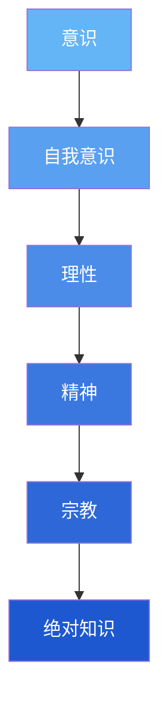
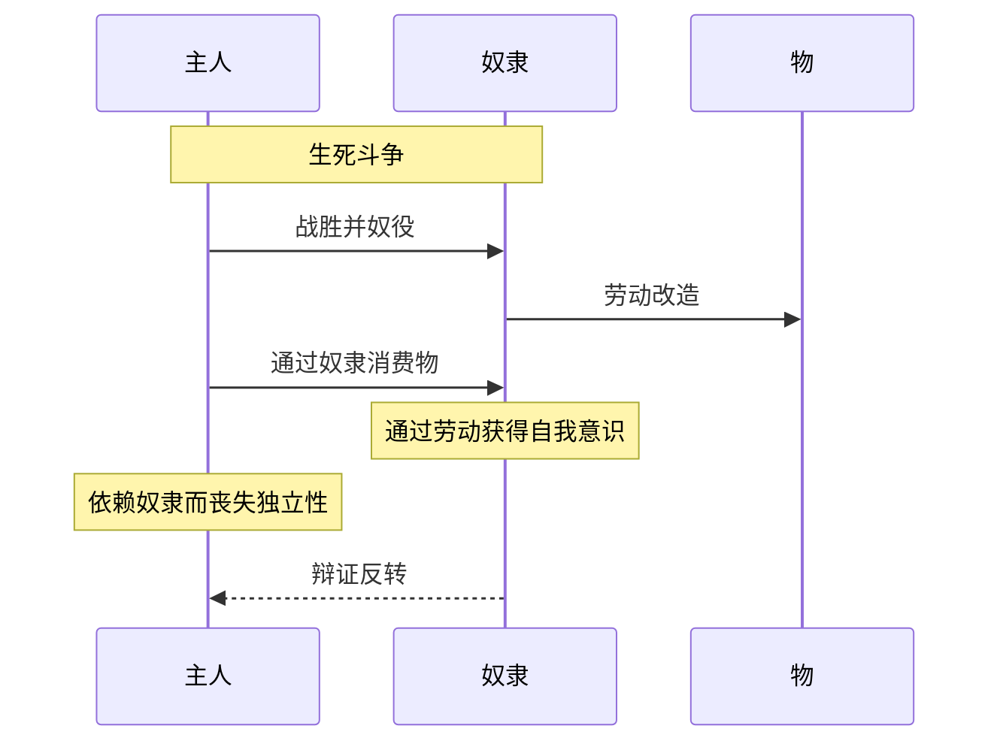
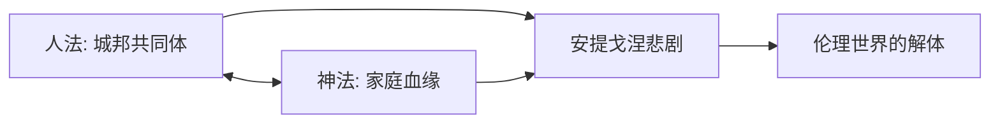
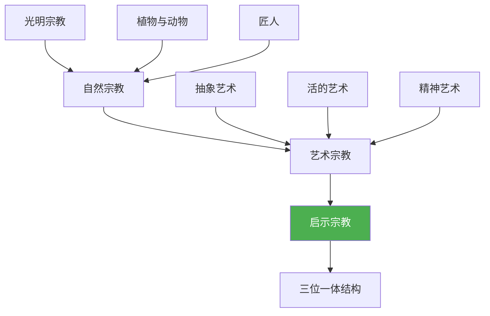
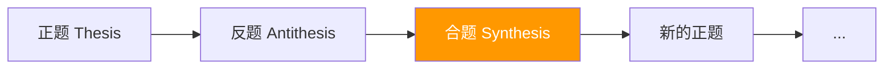

《精神现象学》(Phänomenologie des Geistes, 1807) 是黑格尔哲学体系的入门之作，描述了意识如何通过自我否定和扬弃的辩证过程，从最简单的感性确定性上升到绝对知识的发展历程。

## 全书整体结构

全书展现了精神的 **六大发展阶段**，每个阶段都是前一阶段矛盾的解决与新矛盾的开端。

## 一、意识阶段 (Bewußtsein)

意识阶段是精神发展的最初形态，关注的是 **意识与外在对象的关系**。

### 1. 感性确定性 (Sinnliche Gewißheit)

- **特征**：认为个别的、当下的感性事物是最真实的
- **矛盾**：试图说出"这个"、"此时此刻"时，语言的普遍性消解了个别性
- **结果**：感性确定性的真理在于普遍性，而非个别性

**核心洞察**：$\text{语言表达} \neq \text{直接感受}$

### 2. 知觉 (Wahrnehmung)

- **特征**：对象被把握为具有多种属性的"物"
- **矛盾**：物的统一性与属性的多样性之间的矛盾（"一与多"的矛盾）
- **结果**：物的真理不在于物本身，而在于把握物的知性

### 3. 知性 (Verstand)

- **特征**：通过力、规律、现象与本质的区分来理解对象
- **核心概念**：**内在性** - 现象背后的规律世界
- **矛盾**：本质世界最终表现为 **颠倒世界** (verkehrte Welt)
- **突破**：意识发现对象世界的本质就是意识自身，转向 **自我意识**

## 二、自我意识阶段 (Selbstbewußtsein)

自我意识不再关注外在对象，而是关注 **自我与自我的关系**。

### 1. 欲望 (Begierde)

- **特征**：自我意识通过消费、占有对象来确证自身
- **矛盾**：对象被消灭后，自我意识失去了确证自身的媒介
- **需要**：需要另一个自我意识来相互承认

### 2. 主奴辩证法 (Herrschaft und Knechtschaft)

这是全书最著名的段落之一：

**核心逻辑**：

- **主人**：只享受，不劳动，依赖奴隶的承认（依赖性）
- **奴隶**：通过劳动改造物，在劳动中实现自我意识（独立性）
- **反转**：奴隶通过劳动获得真正的独立性，主人反而依赖奴隶

### 3. 自我意识的三种形态

**斯多葛主义 (Stoizismus)**

- **特征**：思想的自由 - "真正的自由在于内心"
- **矛盾**：只是抽象的自由，与现实生活脱节

**怀疑主义 (Skeptizismus)**

- **特征**：否定一切外在确定性
- **矛盾**：自身的矛盾 - 在否定一切的同时肯定自己的否定行为

**苦恼意识 (Unglückliches Bewußtsein)**

- **特征**：自我意识分裂为不变的本质（神）与可变的自我（人）
- **表现**：中世纪基督教意识 - 在神面前自我贬低
- **转化**：通过劳动、虔诚和禁欲，为理性的出现做准备

## 三、理性阶段 (Vernunft)

理性是自我意识与意识的统一，确信 **自我即实在，实在即自我**。

### 1. 观察理性

- **表现**：用科学方法观察自然、人类（颅相学、相面术等）
- **矛盾**：试图在外在物理特征中找到精神本质，最终失败

### 2. 理性的自我实现

通过实践活动实现理性：

- **快乐与必然性**：追求快乐但遭遇必然性的限制
- **心律**：遵从内心法则但遭遇普遍性的冲突
- **德性**：想改造世界但发现德性是空洞的

### 3. 个体性的现实

- **精神动物王国**：每个人追求自己的事业（"事情本身"）
- **立法理性**：试图为自己立法
- **考察法律**：检验法律的普遍性
- **过渡**：个体理性上升为普遍的伦理精神

## 四、精神阶段 (Geist)

精神是 **个体与共同体的统一**，是伦理实体。

### 1. 真实精神 - 伦理 (Sittlichkeit)

**古希腊城邦**：

- **矛盾**：人法（城邦法律）与神法（家庭义务）的冲突
- **悲剧**：安提戈涅的命运 - 两种正当性的碰撞
- **结果**：伦理世界的直接统一破裂，进入异化

### 2. 自我异化的精神 - 教化 (Bildung)

**现代社会**：

- **异化世界**：财富、国家权力、启蒙运动
- **信仰与纯粹识见**：启蒙理性批判宗教信仰
- **绝对自由与恐怖**：法国大革命 - 抽象自由导致恐怖统治

### 3. 确信自己的精神 - 道德 (Moralität)

**康德道德哲学**：

- **道德世界观**：义务、德性与幸福的和谐
- **矛盾**：道德意识的一系列悖论（神圣性不可达到等）
- **良心**：主观确信的道德行动
- **美丽灵魂**：拒绝行动以保持纯洁性（被批判）
- **相互承认**：通过宽恕与和解，达到精神共同体

## 五、宗教阶段 (Religion)

宗教是精神以 **表象形式** 对绝对真理的把握。

### 1. 自然宗教

- **光明宗教**：波斯拜火教
- **植物与动物**：印度教
- **匠人**：埃及金字塔、人面狮身像

### 2. 艺术宗教

- **希腊宗教**：神以人的形象出现
- **史诗、悲剧、喜剧**：神从崇高走向人性化

### 3. 启示宗教

- **基督教**：神的化身（道成肉身）
- **三位一体**：
  - **圣父**：自在的永恒本质
  - **圣子**：道成肉身的启示
  - **圣灵**：信仰共同体的精神
- **局限**：仍是表象形式，需上升为概念

## 六、绝对知识 (Absolutes Wissen)

绝对知识是精神的最高阶段，扬弃了宗教的表象形式，以 **纯概念** 把握真理。

**特征**：

- **形式与内容的统一**：主体即客体，思维即存在
- **历史与逻辑的统一**：精神的现象学历程就是逻辑必然性
- **回到开端**：从感性确定性到绝对知识，构成完整的圆圈

**公式**：
$$\text{绝对知识} = \text{自我意识} \times \text{实在} = \text{精神的自我认识}$$

**过渡**：绝对知识是《精神现象学》的终点，同时是《逻辑学》的起点。

## 辩证法的核心结构

贯穿全书的方法论：

**辩证三段式**：

1. **肯定** (Affirmation)：直接性、素朴状态
2. **否定** (Negation)：矛盾显现、分裂
3. **否定之否定** (Negation of Negation)：扬弃 (Aufhebung)，在更高层次上统一

**扬弃的三重含义**：

- **保存** (Preserve)：保留合理内核
- **否定** (Negate)：克服片面性
- **提升** (Elevate)：上升到更高阶段

## 核心概念总结

| 概念       | 含义        | 关键阶段        |
|----------|-----------|-------------|
| **意识**   | 意识与对象的对立  | 感性确定性、知觉、知性 |
| **自我意识** | 意识回到自身    | 欲望、主奴、苦恼意识  |
| **理性**   | 自我与实在的统一  | 观察、实践、个体性   |
| **精神**   | 个体与共同体的统一 | 伦理、教化、道德    |
| **宗教**   | 表象形式的绝对真理 | 自然、艺术、启示宗教  |
| **绝对知识** | 概念形式的绝对真理 | 哲学的自我认识     |

## 阅读建议

1. **线性与循环结合**：既要理解线性发展，也要看到各阶段的相互渗透
2. **抓住矛盾**：每个阶段的核心是内在矛盾及其解决
3. **关注转折点**：意识→自我意识、自我意识→理性、理性→精神的转折最关键
4. **历史与逻辑**：黑格尔用历史例证（希腊悲剧、法国大革命等）说明逻辑必然性
5. **从具体到抽象**：先理解具体例子（如主奴辩证法），再把握抽象结构

## 当代意义

《精神现象学》不仅是哲学史的经典，其思想方法至今仍有启发：

- **承认理论**：主奴辩证法启发了现代社会政治哲学（如霍耐特）
- **异化批判**：马克思的异化理论直接源于黑格尔
- **历史意识**：精神的历史性发展深刻影响历史哲学和文化研究
- **辩证思维**：在复杂问题中看到矛盾的统一与转化

---

**参考书目**：

- 黑格尔：《精神现象学》，先刚译，人民出版社
- 科耶夫：《黑格尔导读》
- 加达默尔：《黑格尔的辩证法》
