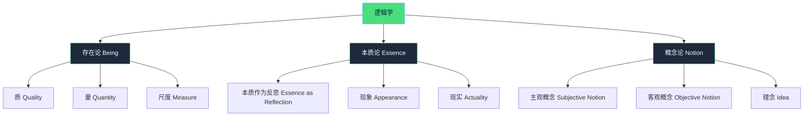
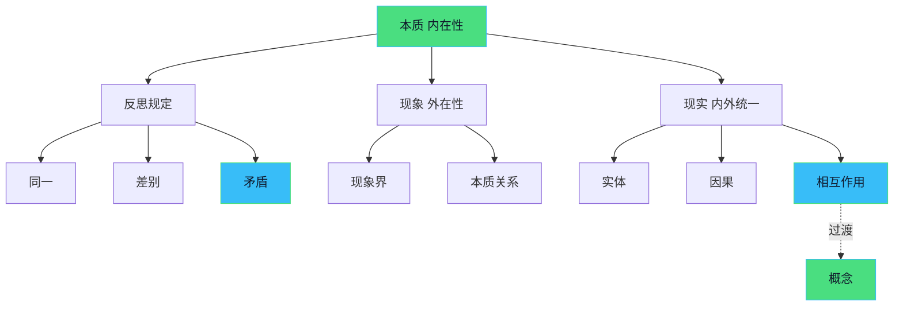
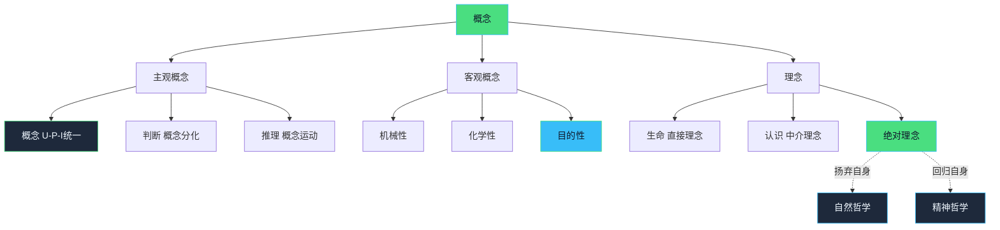
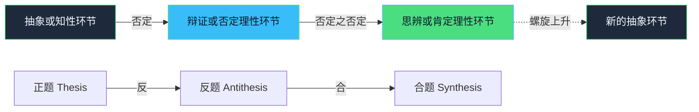
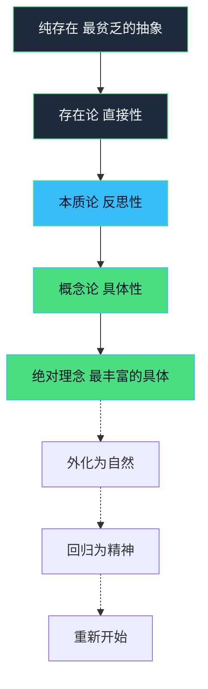

《小逻辑》（又称《哲学全书·逻辑学》）是黑格尔三大逻辑学著作之一，是对其庞大的《大逻辑》的精简版本。这本书阐述了黑格尔哲学体系的核心——绝对理念的自我发展过程，也是理解黑格尔整个哲学体系的关键。

## 逻辑学的总体结构

黑格尔的逻辑学分为三大部分，对应思维发展的三个阶段：

## 第一部分：存在论（Being）

### 核心思想
存在论研究的是最抽象、最直接的思维规定。这是思维的起点，从最贫乏的范畴"纯存在"开始。

### 主要环节

**1. 质（Quality）**
- **存在（Being）**：最抽象的开端，纯粹的"是"
- **无（Nothing）**：与纯存在同样抽象，完全的空无
- **变易（Becoming）**：存在与无的统一，事物的生成与消逝

*关键洞见*：纯粹的存在因其完全抽象而等同于无，二者的真理是变易。

**2. 量（Quantity）**
- **纯量（Pure Quantity）**：抽象的大小、多少
- **定量（Quantum）**：具体的量，有界限的量
- **度（Degree）**：内在的量，强度

**3. 尺度（Measure）**
- 质与量的统一
- 事物的质的规定性与量的规定性的内在联系
- 量变到质变的节点

## 第二部分：本质论（Essence）

### 核心思想
本质论研究事物的内在根据和反思关系。这里思维不再停留于直接性，而是深入到事物的内在本质。

### 主要环节

**1. 本质作为反思（Essence as Reflection）**
- **同一与差别**：本质的自我关系
- **矛盾（Contradiction）**：差别的尖锐化，事物发展的内在动力
- **根据（Ground）**：本质向外显现的中介

*关键洞见*：矛盾不是思维的缺陷，而是一切运动和生命力的根源。

**2. 现象（Appearance）**
- **现象界**：本质的外在显现
- **内容与形式**：本质在现象中的关系
- **关系（Relation）**：整体与部分、力与表现、内与外

**3. 现实（Actuality）**
- **实体性关系**：实体与偶性
- **因果关系**：原因与结果的必然联系
- **相互作用**：因果关系的真理，向概念过渡

## 第三部分：概念论（Notion）

### 核心思想
概念论是逻辑学的最高阶段，思维回到自身，达到主客统一的自由境界。这里的"概念"不是主观的思维形式，而是事物的内在本性。

### 主要环节

**1. 主观概念（Subjective Notion）**
- **概念本身**：普遍性、特殊性、个别性的统一
- **判断（Judgment）**：概念的分化，主词与谓词的关系
- **推理（Syllogism）**：判断的发展，概念的自我中介

**2. 客观概念（Objective Notion）**
- **机械性**：外在联系的客观性
- **化学性**：内在联系的客观性
- **目的性**：主观性与客观性的统一

**3. 理念（Idea）**
- **生命**：直接的理念，有机体
- **认识**：理论理念（认知）与实践理念（意志）
- **绝对理念**：逻辑学的终点与起点，思维与存在的最高统一

## 辩证法的三个环节

黑格尔强调，每个概念的发展都遵循三个辩证环节：

### 1. 知性环节（Understanding）
- 固定概念的规定性
- 形式逻辑的阶段
- 坚持事物的确定性和差别性

### 2. 辩证环节（Dialectical）
- 概念的自我否定
- 揭示固定规定的片面性
- 对立面的相互转化

### 3. 思辨环节（Speculative）
- 对立的统一
- 否定之否定
- 更高层次的综合

## 核心概念解析

### 1. 扬弃（Aufheben）
黑格尔最重要的辩证法概念，包含三重含义：
- **否定**：克服、消除旧阶段的片面性
- **保存**：保留旧阶段的合理内核
- **提升**：上升到更高的发展阶段

### 2. 矛盾（Contradiction）
- 不是思维的错误，而是事物的本性
- 一切运动、生命和活动的根源
- 矛盾的解决不是消除矛盾，而是达到更高的统一

### 3. 中介（Mediation）
- 事物不是孤立的直接存在
- 一切都是通过他物而存在
- 直接性与中介性的统一

### 4. 绝对理念（Absolute Idea）
- 思维与存在的最高统一
- 逻辑学的终点，同时又是新的起点
- 自我认识、自我发展的理性

## 逻辑学的整体运动

## 学习要点

1. **理解辩证运动**：不是外在的正反合套用，而是概念的内在自我发展

2. **把握整体性**：每个范畴都不是孤立的，而是整体系统中的一个环节

3. **重视矛盾**：矛盾是推动思维前进的内在动力，不要回避矛盾

4. **具体的普遍性**：黑格尔的"具体"是包含差别的丰富统一，不是抽象的空洞普遍

5. **逻辑与历史的统一**：逻辑的发展也反映了思想史的发展

## 复习建议

1. **先把握总体框架**：三大部分的基本结构和相互关系
2. **理解核心概念**：扬弃、矛盾、中介、绝对理念等
3. **跟踪辩证运动**：每个范畴如何过渡到下一个范畴
4. **结合具体例子**：用现实例子理解抽象概念
5. **反复阅读**：黑格尔的文本需要多次阅读才能深入理解

## 参考资料

- 黑格尔：《小逻辑》（贺麟译）
- 黑格尔：《逻辑学》（杨一之译）
- 邓晓芒：《思辨的张力——黑格尔辩证法新探》
- 张世英：《黑格尔辩证法新探》

---

*本文为黑格尔《小逻辑》的框架性梳理，旨在帮助理解逻辑学的整体结构和核心概念，适合作为复习提纲使用。*
