《先验唯心论体系》（*System des transzendentalen Idealismus*,
1800）是谢林早期最重要的著作之一，标志着他从自然哲学转向先验哲学的尝试。本书试图建立一个从主观性出发，最终达到主客统一的完整哲学体系，被视为德国古典哲学从康德到黑格尔过渡的关键环节。

**核心任务**：说明客观世界（自然）如何从主观性（自我意识）中产生，以及主观性如何达到对客观性的认识。

## 全书结构概览

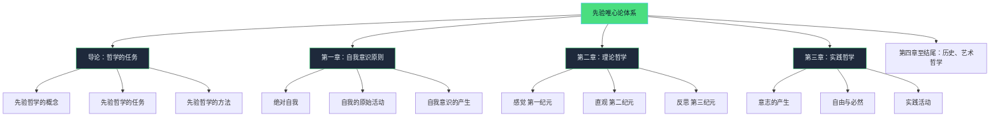

## 导论：先验哲学的概念与任务

### 哲学的基本出发点

谢林指出，一切哲学都面临一个根本问题：**如何解释主观与客观、思维与存在的一致性？**

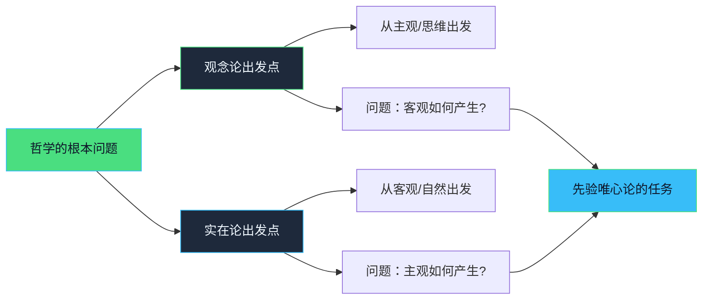

### 先验哲学的基本概念

**1. 先验与经验的区分**

- **经验**：关于对象的知识
- **先验**：关于我们的知识如何可能的知识（康德遗产）
- 先验哲学追问：我们如何可能具有关于外部世界的知识？

**2. 先验唯心论的特殊性**

- 不是主观唯心论（Berkeley）：不否认外部世界的存在
- 不是独断论的实在论：不把外部世界当作无需说明的前提
- **核心主张**：客观世界是自我意识活动的产物，但这种产生过程对日常意识是无意识的

*关键洞见*：我们对外部世界的意识，本身就是自我意识的一种形式。外部世界是"自我的无意识诗作"。

### 先验哲学的三大任务

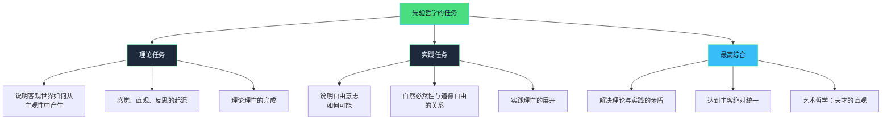

### 先验哲学的方法

**演绎法（Deduction）**：

- 从最高原则（自我=自我）出发
- 逐步推演出整个认识过程
- 每一步都是必然的，不是经验的归纳

**反思方法**：

- 哲学家的反思超越日常意识
- 揭示日常意识中无意识的活动
- 使潜在的变为显明的

**历史-发生学方法**：

- 展示意识的历史
- 不是实际的时间历史，而是逻辑的历史
- 从最简单的阶段到最复杂的阶段

## 第一章：自我意识的原则

### 绝对自我：哲学的最高原则

谢林从费希特那里继承了"自我"作为哲学的最高原则，但做了重要修改。

**自我的三重含义**：

1. **绝对自我**：哲学的起点，超越主客对立
2. **经验自我**：日常意识中的"我"
3. **先验自我**：认识活动的主体（康德的"统觉"）

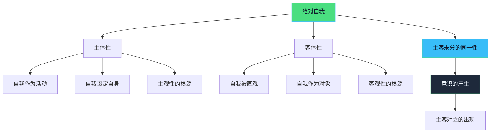

### 自我意识的产生机制

**核心问题**：自我如何成为自己的对象？

**谢林的解决方案**：

1. **原始直观（ursprüngliche Anschauung）**

- 自我直观自身
- 主体与客体同一
- 这是一种智性直观（不同于感性直观）

2. **自我的二重化**

- 自我必须同时是直观者和被直观者
- "自我=自我"这个公式包含着分裂的可能性
- 自我必须从自身中产生出对立面

3. **自我意识的悖论**

- 要意识到自己，必须把自己对象化
- 但对象化就意味着主客分裂
- 因此，完全的自我意识是不可能的（总有无意识的剩余）

*关键洞见*：自我意识不是一个简单的事实，而是一个永无止境的过程。自我永远在追求完全的自我透明，但永远无法完全达到。

### 自我的活动：生产性与再生产性

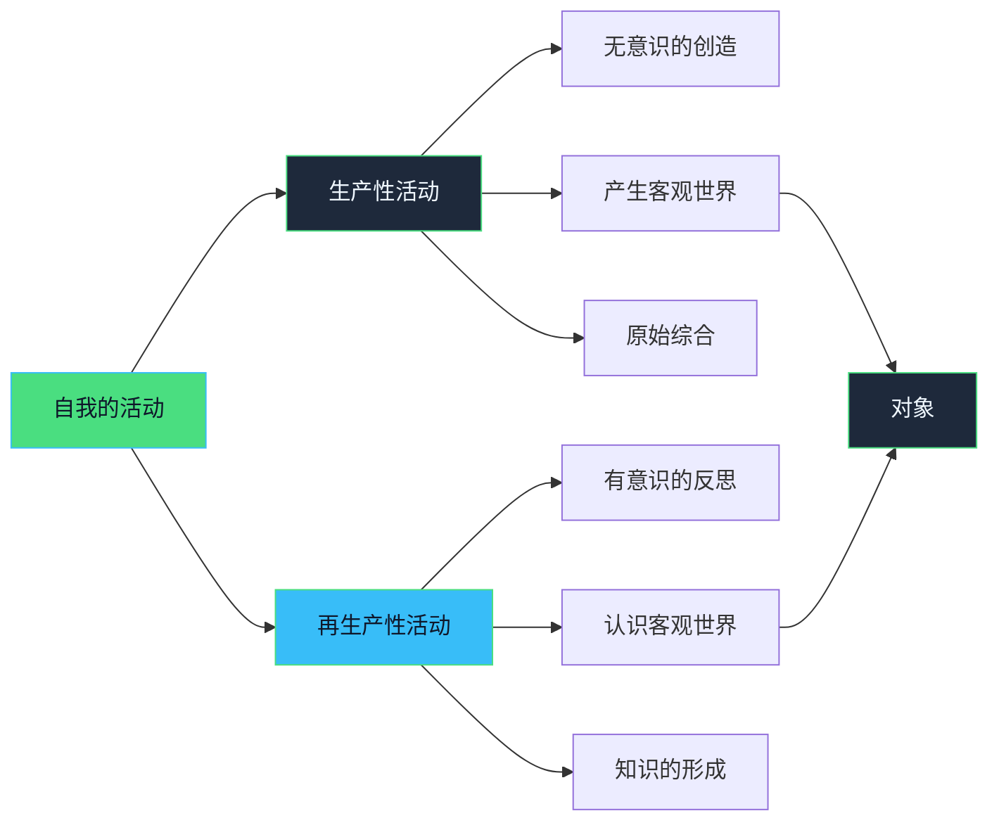

**生产性活动（produktive Tätigkeit）**：

- 自我无意识地创造客观世界
- 这是先验的想象力
- 康德的"生产性想象力"的发展

**再生产性活动（reproduktive Tätigkeit）**：

- 自我有意识地认识客观世界
- 这是理论理性
- 以生产性活动的产物为前提

## 第二章：理论哲学——从感觉到反思

谢林将理论哲学（认识论）的发展分为三个"纪元"（Epochen），每个纪元代表意识发展的一个阶段。

### 理论哲学的整体结构

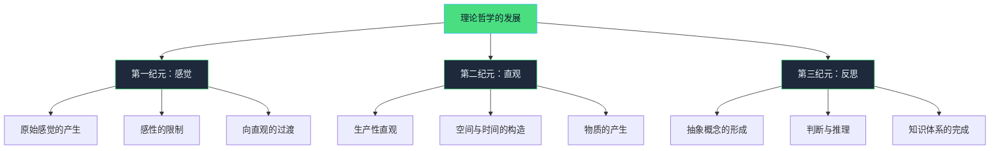

### 第一纪元：感觉的产生

**核心问题**：外部世界的感觉如何从纯粹的自我活动中产生？

**演绎过程**：

1. **自我的自我限制**

- 自我的无限活动必须受到限制
- 这种限制不是外部强加的，而是自我设定的
- 限制是自我自身的活动

2. **感觉的本质**

- 感觉是自我活动受限的直接意识
- 不是被动接受印象，而是主动的自我限制
- 感觉既是主观的（属于自我），又是客观的（似乎来自外部）

3. **感性的二重性**
   ```mermaid
   graph LR
       A[感觉] --> B[主观方面]
       A --> C[客观方面]

       B --> B1[自我感受到限制]
       B --> B2[主观感受 愉快/痛苦]

       C --> C1[外部刺激]
       C --> C2[客观性质 颜色/声音]

       B2 --> D[矛盾需要解决]
       C2 --> D
       D --> E[向直观过渡]

       style A fill:#4ade80,stroke:#38bdf8,color:#0f172a
       style D fill:#38bdf8,stroke:#4ade80,color:#0f172a
       style E fill:#1e293b,stroke:#4ade80,color:#f0f8ff
   ```

*关键洞见*：感觉不是纯粹被动的接受，而是自我活动的一种形式。我们之所以感受到"外部"世界，是因为自我在无意识中设定了这种外部性。

### 第二纪元：直观的构造

**核心问题**：从主观的感觉如何过渡到客观的直观（对象的知觉）？

**关键环节**：

1. **生产性直观的活动**

- 感觉的矛盾（主观性与客观性的冲突）推动自我前进
- 自我必须把感觉投射到外部空间
- 这需要构造空间和时间

2. **空间的先验演绎**

- **空间不是外部给定的容器**
- 空间是自我为了表象对象而构造的
- 自我通过"外化"（Entäußerung）自身的活动产生空间
- 空间的三维性对应于自我活动的三个方向

3. **时间的先验演绎**

- 时间是自我活动的内在形式
- 时间表达了自我活动的连续性
- 时间是自我意识到自身活动的方式

4. **物质的产生**

- 物质不是独立存在的"物自体"
- 物质是感觉在空间中的客观化
- 物质的属性（广延、不可入性等）源于自我构造活动的规律

**直观的结构**：

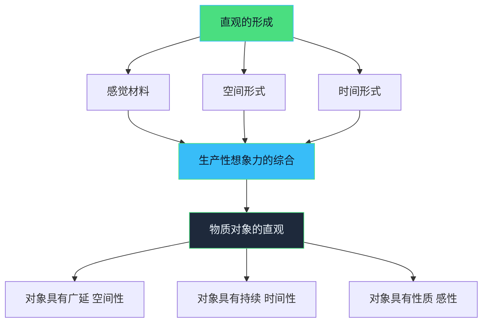

*关键洞见*：我们所知觉的"外部世界"，其实是自我通过生产性想象力构造出来的。空间、时间、物质的客观性，根源于自我活动的普遍性和必然性。

### 第三纪元：反思与概念

**核心问题**：从具体的直观如何上升到抽象的概念和知识？

**演绎过程**：

1. **抽象的开始**

- 直观提供个别的、具体的对象
- 反思活动从具体对象中抽取普遍特征
- 形成概念（Begriff）

2. **判断的形成**

- 概念之间建立联系
- 判断表达主词与谓词的关系
- 判断的形式（肯定、否定、假言等）源于自我活动的不同方式

3. **推理与知识体系**

- 从判断到推理
- 建立系统的科学知识
- 理论理性达到完成

4. **理论理性的局限**

- 理论认识只能达到现象界（康德的遗产）
- 自我在理论活动中仍然受制于对象
- 真正的自由需要实践理性

**从直观到概念的过渡**：

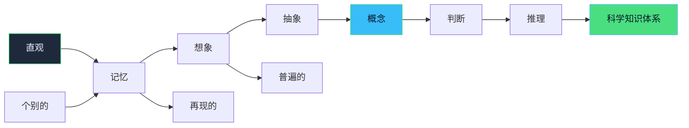

*关键洞见*：整个理论认识过程，从感觉到概念，都是自我意识的自我展开。外部世界不是认识的障碍，而是自我认识自身的中介。

## 第三章：实践哲学——意志与自由

实践哲学考察自我如何从理论认识过渡到实践行动，如何在客观世界中实现自由。

### 从理论到实践的过渡

**理论哲学的结局**：

- 自我在理论活动中认识对象
- 但对象仍然作为既成的东西限制自我
- 自我还没有真正的自由

**向实践的必然过渡**：

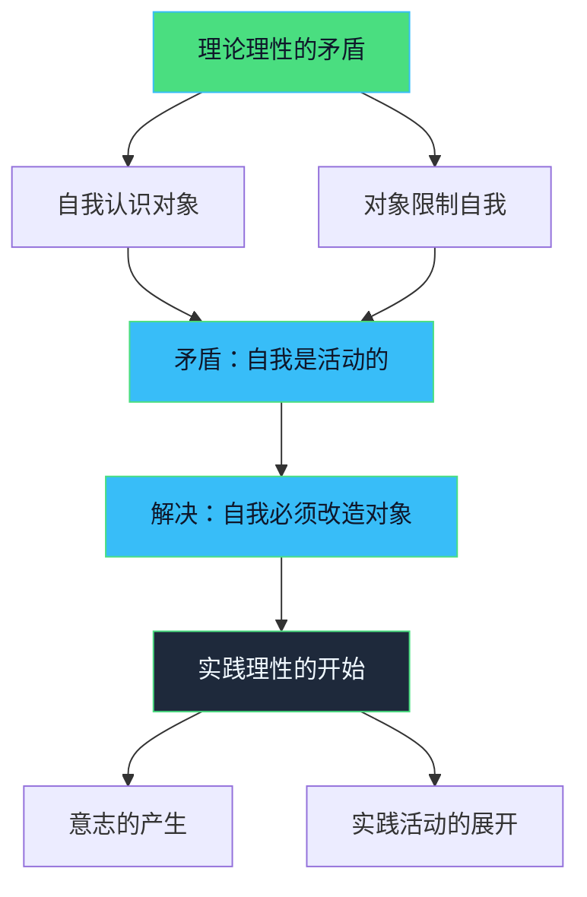

### 意志的产生

**意志的本质**：

- 意志不是与理论认识无关的独立能力
- 意志是自我活动的新形式
- 在意志中，自我不再被动接受对象，而是主动设定目标

**意志与表象的关系**：

1. **表象先于意志**：必须先认识对象，才能意欲改变它
2. **意志超越表象**：意志设定尚未存在的目标
3. **意志与表象的循环**：实践活动产生新的对象，成为新的认识内容

### 自由与必然的问题

这是实践哲学的核心问题，也是谢林与康德、费希特对话的焦点。

**问题的两难**：

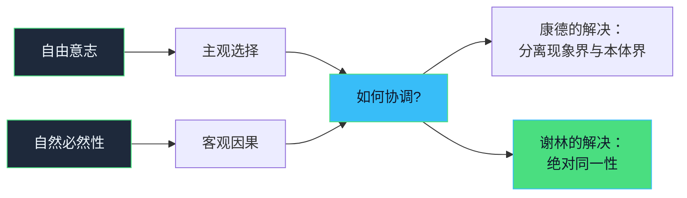

**谢林的解决方案**：

1. **自由不是无规律的任意性**

- 真正的自由是自我决定（Selbstbestimmung）
- 自我依据自己的本质行动

2. **必然性不是外部强制**

- 自然必然性也源于自我的无意识活动
- 自然规律与自由的规律有共同根源

3. **在绝对同一性中统一**

- 自由与必然在绝对者中是同一的
- 个体的自由意志参与了绝对的理性
- 个人行动与世界历史的和谐（"前定和谐"）

### 实践活动的层次

谢林区分了实践活动的不同层次：

1. **冲动（Trieb）**

- 最低层次的实践性
- 受自然本能驱动
- 还没有真正的自由

2. **任意（Willkür）**

- 在不同欲望间选择
- 表面的自由
- 仍然受制于外部动机

3. **自由意志（freier Wille）**

- 依据道德法则行动
- 康德式的道德自律
- 但还有主客对立

4. **绝对意志**

- 个体意志与绝对理性的统一
- 真正的自由
- 向历史哲学和艺术哲学过渡

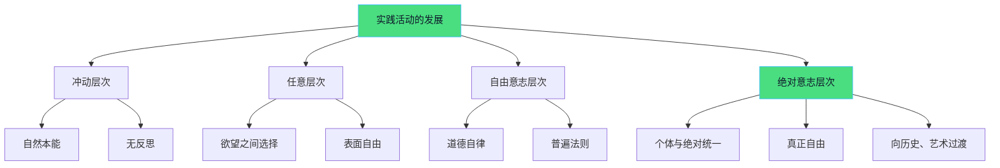

*关键洞见*：自由不是抽象的选择能力，而是自我实现其本质的过程。真正的自由是认识必然性并与之和谐一致。

## 从前三章到整体体系

前三章奠定了先验唯心论的基本框架，后续章节将进一步展开：

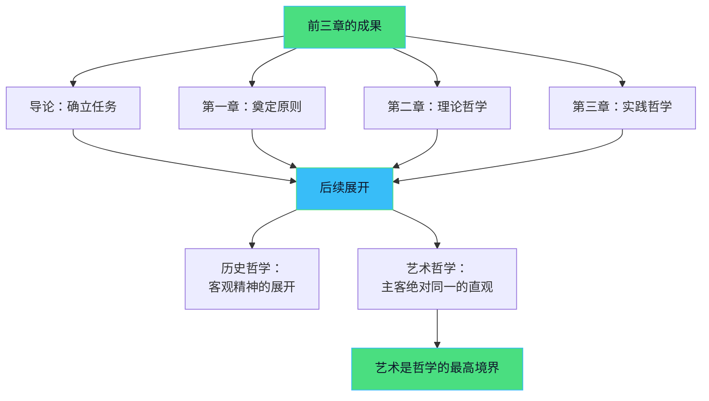

**体系的逻辑**：

- **导论**：提出问题和方法
- **第一章**：建立最高原则（自我意识）
- **第二章**：展示客观性如何从主观性中产生（理论）
- **第三章**：展示主观性如何改造客观性（实践）
- **第四章及以后**：展示主客统一的最高形式（历史、艺术）

## 核心概念总结

### 1. 自我（Ich）

- 不是日常意识的"我"
- 绝对的主客同一性
- 哲学的最高原则和起点

### 2. 智性直观（intellektuelle Anschauung）

- 自我直观自身
- 主体与客体的原始统一
- 区别于感性直观

### 3. 生产性活动（produktive Tätigkeit）

- 无意识的创造活动
- 产生客观世界
- 先验想象力的核心

### 4. 生产性直观（produktive Anschauung）

- 构造空间、时间、物质
- 理论认识的基础
- 连接感觉与概念

### 5. 自由与必然的统一

- 实践哲学的核心
- 在绝对同一性中统一
- 通向历史哲学

### 6. 绝对同一性（absolute Identität）

- 主观与客观的最高统一
- 理论与实践的综合
- 体系的最终目标

## 学习要点

1. **把握体系的系统性**

- 每个环节都是必然的推演
- 不是经验的总结，而是先验的演绎
- 从简单到复杂，从抽象到具体

2. **理解"先验"的含义**

- 不是心理学的描述
- 是认识可能性的条件
- 揭示无意识的活动

3. **注意谢林与康德、费希特的关系**

- 继承康德的先验方法
- 发展费希特的自我学说
- 但更强调主客同一性

4. **关注无意识的重要性**

- 自我的大部分活动是无意识的
- 哲学的任务是揭示这种无意识
- 预示了后来的心理学发展

5. **理解辩证运动**

- 每个阶段都包含矛盾
- 矛盾推动向下一阶段过渡
- 最终达到更高的统一

## 复习建议

1. **先掌握导论的问题意识**

- 主客关系问题
- 先验哲学的任务
- 与独断论和怀疑论的区别

2. **理解第一章的原则**

- 自我意识的结构
- 智性直观的含义
- 生产性与再生产性活动

3. **跟踪理论哲学的演绎**

- 感觉如何产生
- 直观如何构造
- 概念如何形成

4. **把握实践哲学的核心**

- 意志的本质
- 自由与必然的关系
- 实践活动的层次

5. **整体把握体系结构**

- 从主观到客观
- 从理论到实践
- 从有限到无限

## 参考资料

- 谢林：《先验唯心论体系》（梁志学、石泉译）
- 康德：《纯粹理性批判》
- 费希特：《全部知识学的基础》
- 邓晓芒：《康德哲学诸问题》
- 张世英：《论黑格尔的逻辑学》

---

*本文重点梳理《先验唯心论体系》导论和前三章的核心内容，旨在帮助理解谢林先验哲学的基本架构和主要概念，适合作为复习提纲使用。*
