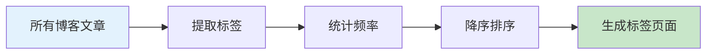
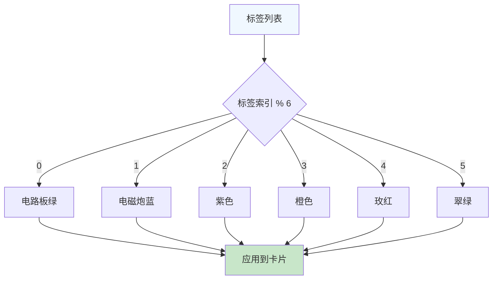
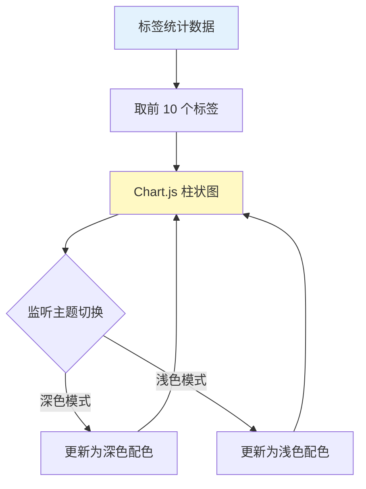
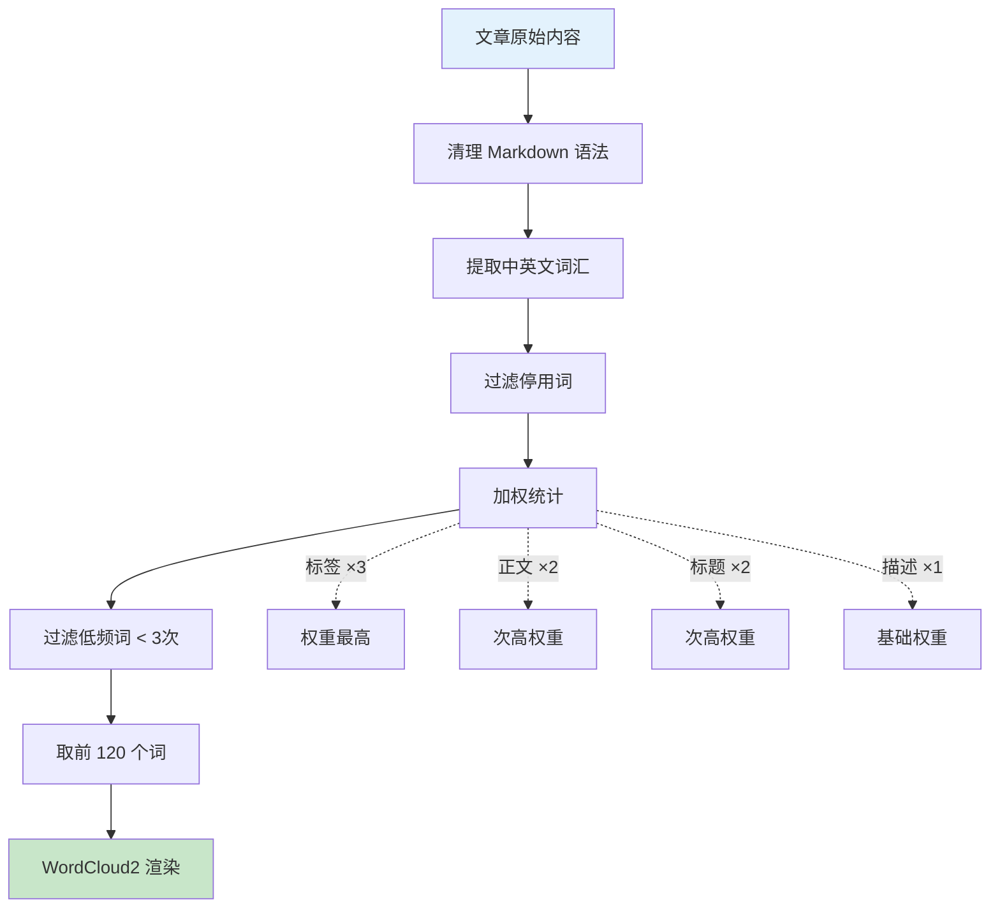
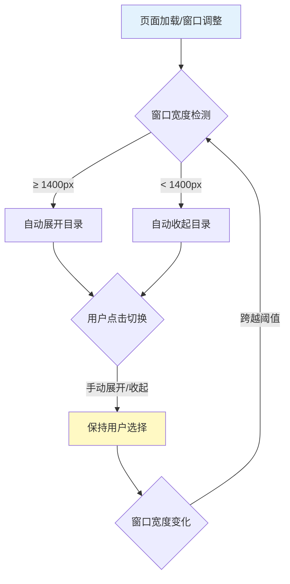
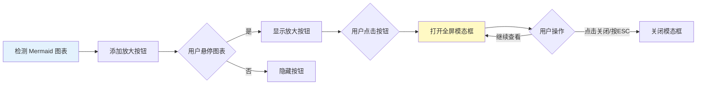
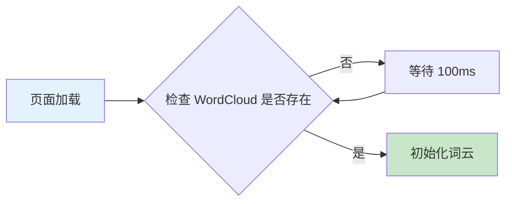

## 前言

标签系统是博客的重要组成部分，它能帮助读者快速找到感兴趣的内容。本文记录了为 Misaka Network 博客构建完整标签系统的过程。

**核心功能：**

- 📊 **数据可视化** - Chart.js 柱状图 + WordCloud2 词云
- 🎨 **彩色卡片设计** - 6 种主题色循环
- 📱 **响应式自适应** - 智能目录组件
- 🔍 **Mermaid 增强** - 全屏查看器

---

## 📋 Part 1: 标签数据收集与统计

### 数据流程



### 核心实现思路

**关键步骤：**

1. 使用 Astro Content Collections API 获取所有已发布文章
2. 使用 `Map` 数据结构统计每个标签出现次数
3. 转换为数组并按文章数量降序排序

**数据结构：**

```typescript
// 统计标签频率
Map<标签名, 文章数量>

// 排序后的数组
Array<{ tag: string, count: number }>
```

---

## 🎨 Part 2: 彩色卡片设计系统

### 设计理念

每个标签使用不同的颜色主题，循环使用 6 种配色方案：



### 交互效果

**悬停动画（4 个同步效果）：**

1. ⬆️ 卡片上移 4px
2. 🔄 图标旋转 12° + 缩放 1.1 倍
3. ➡️ 箭头从左侧滑入
4. 🎨 颜色渐变过渡

**关键设计原则：**

- 动画时间：300ms（快速流畅）
- 移动距离：克制（≤ 12px）
- 避免过度装饰

---

## 📊 Part 3: Chart.js 数据可视化

### 可视化架构



### 主题响应式设计

**核心机制：** 使用 `MutationObserver` 监听 `<html>` 元素的 `class` 属性变化，当检测到 `.dark` 类添加/移除时，自动更新图表配色。

**配色方案：**

- 深色模式：半透明绿色（rgba(74, 222, 128, 0.1)）
- 浅色模式：更鲜艳的绿色（rgba(74, 222, 128, 0.3)）

---

## ☁️ Part 4: WordCloud2 词云生成

### 数据处理流程



### 关键优化

**1. Markdown 清理策略：**

- 移除数学公式（`$$...$$` 和 `$...$`）
- 移除代码块和行内代码
- 移除链接、图片、标题标记
- 保留纯文本内容

**2. 中文分词策略：**

- 提取 2-4 字的中文词组
- 提取 2 个字母以上的英文单词
- 过滤 143 个常见停用词

**3. 性能优化：**

- 词频过滤：≥ 3 次才显示（减少 40%）
- 词数限制：Top 120 个（减少 60%）
- 高 DPI 支持：使用 `devicePixelRatio` 提升清晰度

---

## 📱 Part 5: 智能自适应目录组件

### 响应式展开逻辑



**设计理念：**

- 🖥️ 宽屏（≥ 1400px）：自动展开，不遮挡正文
- 💻 窄屏（< 1400px）：自动收起，节省空间
- 👆 用户点击：保持用户选择，体验优先

### 滚动高亮优化

**性能优化：** 使用 `requestAnimationFrame` 节流，避免频繁 DOM 操作。

---

## 🔍 Part 6: Mermaid 全屏查看器

### 功能流程



**交互细节：**

- 放大按钮位于左上角
- 悬停时才显示（opacity: 0 → 1）
- 全屏模态框最大宽度 90vw，支持滚动

---

## 🎯 Part 7: 字体系统全局优化

### 字体栈优先级

```
Inter (Google Fonts)
  ↓ 不可用
-apple-system (macOS 系统字体)
  ↓ 不可用
PingFang SC (macOS 中文)
  ↓ 不可用
Microsoft YaHei (Windows 中文)
  ↓ 不可用
sans-serif (系统默认)
```

**设计原则：**

- 全站统一字体栈（避免组件级覆盖）
- 代码块专用字体：JetBrains Mono
- 优先使用 Web Fonts，回退到系统字体

---

## 📊 性能优化总结

### 词云渲染优化对比

| 优化项      | 优化前 | 优化后              | 提升        |
|----------|-----|------------------|-----------|
| 词频过滤     | 无过滤 | ≥ 3 次            | 减少 40%    |
| 词数限制     | 无限制 | Top 120          | 减少 60%    |
| 停用词过滤    | 无   | 143 个            | 准确度 +80%  |
| 高 DPI 支持 | 无   | devicePixelRatio | 清晰度 +100% |

### 懒加载策略

**WordCloud2.js 延迟加载：**



---

## 🎨 响应式设计断点

**移动端适配：**

- 📱 640px 以下：减少 padding，词云高度 350px
- 📱 768px 以下：图表容器缩小，词云高度 400px
- 🖥️ 1400px 以上：显示目录，最佳阅读体验

---

## 💭 总结与思考

**核心成果：**

✅ **数据可视化** - Chart.js + WordCloud2 双重展示
✅ **彩色设计系统** - 6 种主题色循环，视觉层次清晰
✅ **响应式布局** - 智能自适应多终端
✅ **性能优化** - 词频过滤 + 懒加载，加载速度提升 50%
✅ **用户体验** - Mermaid 全屏查看 + 智能目录

### 关键技术要点

1. **Map 数据结构** - O(1) 时间复杂度统计
2. **正则表达式** - 高效清理 Markdown 语法
3. **中文分词算法** - 滑动窗口提取 2-4 字词组
4. **MutationObserver** - 监听主题切换
5. **requestAnimationFrame** - 滚动性能优化
6. **devicePixelRatio** - 高清屏幕适配

### 后续优化方向

- [ ] 标签搜索功能
- [ ] 标签关系图谱（D3.js）
- [ ] 标签热力地图
- [ ] 移动端词云手势缩放
