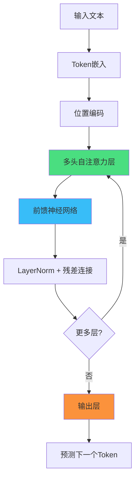
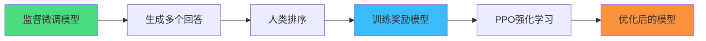
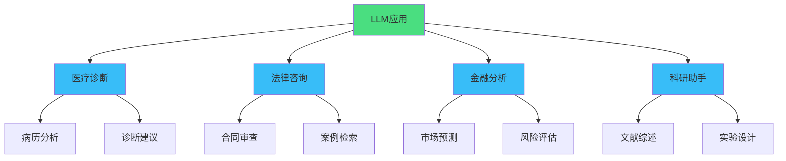

## 什么是大语言模型 (LLM)

大语言模型（Large Language Model，简称 LLM）是一类基于深度学习的人工智能模型，专门用于理解和生成人类语言。这些模型通过在海量文本数据上进行训练，学习语言的模式、语法、语义以及世界知识。

### 核心特征

- **大规模参数**：现代 LLM 通常包含数十亿甚至数千亿个参数
- **预训练架构**：基于 Transformer 架构，使用自注意力机制
- **通用能力**：一个模型可以完成多种不同的语言任务
- **涌现能力**：当模型规模达到一定程度时，会展现出未经专门训练的新能力

## Transformer 架构

LLM 的核心技术基础是 2017 年 Google 提出的 Transformer 架构。其关键创新是 **自注意力机制**（Self-Attention）。

### 自注意力机制

自注意力机制允许模型在处理每个词时，关注输入序列中的所有其他词，从而捕捉长距离依赖关系。

**注意力计算公式：**

$$
\text{Attention}(Q, K, V) = \text{softmax}\left(\frac{QK^T}{\sqrt{d_k}}\right)V
$$

其中：

- $Q$（Query）：查询矩阵
- $K$（Key）：键矩阵
- $V$（Value）：值矩阵
- $d_k$：键向量的维度

### 多头注意力

Transformer 使用多头注意力（Multi-Head Attention），允许模型同时关注不同的表示子空间：

$$
\text{MultiHead}(Q, K, V) = \text{Concat}(\text{head}_1, ..., \text{head}_h)W^O
$$

其中每个注意力头：

$$
\text{head}_i = \text{Attention}(QW_i^Q, KW_i^K, VW_i^V)
$$

### 架构示意



## LLM 的训练方法

### 1. 预训练（Pre-training）

预训练阶段使用 **自监督学习**，主要任务是 **因果语言建模**（Causal Language Modeling）：

**目标函数：**

$$
\mathcal{L}_{\text{CLM}} = -\sum_{t=1}^{T} \log P(x_t | x_1, x_2, ..., x_{t-1})
$$

模型学习预测序列中的下一个 token，通过这种方式学习语言的统计规律和世界知识。

**训练数据来源：**

- 互联网网页（Common Crawl）
- 书籍语料库
- 学术论文
- 代码仓库（GitHub）
- 高质量文本数据集

### 2. 指令微调（Instruction Tuning）

在预训练基础上，使用人类标注的指令-响应对进行监督学习：

```typescript
// 指令微调数据格式示例
const instruction_data = {
  instruction: "将以下句子翻译成英文",
  input: "今天天气真好",
  output: "The weather is really nice today"
};
```

### 3. 人类反馈强化学习（RLHF）

通过人类偏好反馈进一步优化模型：

**训练流程：**



**奖励模型损失函数：**

$$
\mathcal{L}_{\text{RM}} = -\mathbb{E}_{(x, y_w, y_l)} \left[\log \sigma(r(x, y_w) - r(x, y_l))\right]
$$

其中 $y_w$ 是人类偏好的回答，$y_l$ 是不太好的回答。

## 主流 LLM 模型

### GPT 系列（OpenAI）

- **GPT-3**（2020）：175B 参数
- **GPT-3.5**（2022）：ChatGPT 的基础模型
- **GPT-4**（2023）：多模态能力，性能大幅提升

### Claude 系列（Anthropic）

- **Claude 3 Haiku/Sonnet/Opus**：不同规模和能力
- **Constitutional AI**：通过宪法原则进行训练

### 开源模型

- **LLaMA**（Meta）：开源基础模型
- **Mistral**：高效的开源模型
- **Qwen**（阿里巴巴）：中文能力突出

## 关键技术概念

### Token 化

文本需要先被分割成 token（子词单元）：

```python
# 示例：Token化过程
text = "Hello world"
tokens = tokenizer.encode(text)
# 输出: [15496, 1917]（数字ID）
```

### 上下文窗口

模型一次能处理的最大 token 数量：

- GPT-3: 4K tokens
- GPT-4 Turbo: 128K tokens
- Claude 3: 200K tokens

### 温度采样

控制生成文本的随机性：

$$
P(x_i) = \frac{\exp(z_i / T)}{\sum_j \exp(z_j / T)}
$$

- $T < 1$：更确定性，聚焦高概率词
- $T > 1$：更随机，增加多样性

## LLM 的应用场景

### 1. 对话系统

- 智能客服
- 虚拟助手
- 教育辅导

### 2. 内容创作

- 文章写作
- 代码生成
- 创意设计

### 3. 知识工作

- 文档总结
- 信息提取
- 数据分析

### 4. 专业领域



## 挑战与局限

### 1. 幻觉问题（Hallucination）

模型可能生成听起来合理但实际上不准确的内容。

### 2. 计算成本

训练和运行大模型需要大量的计算资源：

- GPT-3 训练成本：约 $4.6M
- 推理成本：每 1M tokens 约 $0.06-$60

### 3. 偏见与安全性

- 训练数据中的社会偏见
- 潜在的有害内容生成
- 隐私和安全风险

### 4. 可解释性

模型决策过程缺乏透明度，难以理解其推理过程。

## 未来发展方向

### 多模态融合

结合文本、图像、音频、视频等多种模态：

$$
\text{Output} = f(\text{Text}, \text{Image}, \text{Audio}, ...)
$$

### 模型压缩与优化

- **量化**：将浮点参数转换为低精度表示
- **剪枝**：移除不重要的连接
- **蒸馏**：将大模型知识转移到小模型

### 工具使用能力

LLM + 工具调用（Function Calling）：

```typescript
// 示例：LLM调用外部工具
const tools = [
  {
    name: "get_weather",
    description: "获取指定城市的天气信息",
    parameters: {
      city: "string"
    }
  }
];

// LLM生成工具调用
const call = {
  tool: "get_weather",
  arguments: { city: "北京" }
};
```

### 长上下文与记忆

- 扩展上下文窗口（1M+ tokens）
- 高效的长文本处理机制
- 持久化记忆系统

## 总结

大语言模型代表了人工智能领域的重大突破，它们展现出了强大的语言理解和生成能力。从 Transformer 架构的创新，到大规模预训练和
RLHF 的应用，LLM 技术栈已经相当成熟。

**关键要点：**

1. **技术基础**：Transformer + 自注意力机制
2. **训练范式**：预训练 → 指令微调 → RLHF
3. **核心能力**：语言理解、推理、生成
4. **应用广泛**：从对话到专业领域的多种场景
5. **持续演进**：多模态、工具使用、长上下文

随着技术的不断发展，LLM 将在更多领域发挥重要作用，同时我们也需要关注其带来的挑战，确保技术的安全、公平和负责任地应用。

---

*参考资料：*

- Vaswani et al. (2017) "Attention Is All You Need"
- Brown et al. (2020) "Language Models are Few-Shot Learners"
- Ouyang et al. (2022) "Training language models to follow instructions with human feedback"
