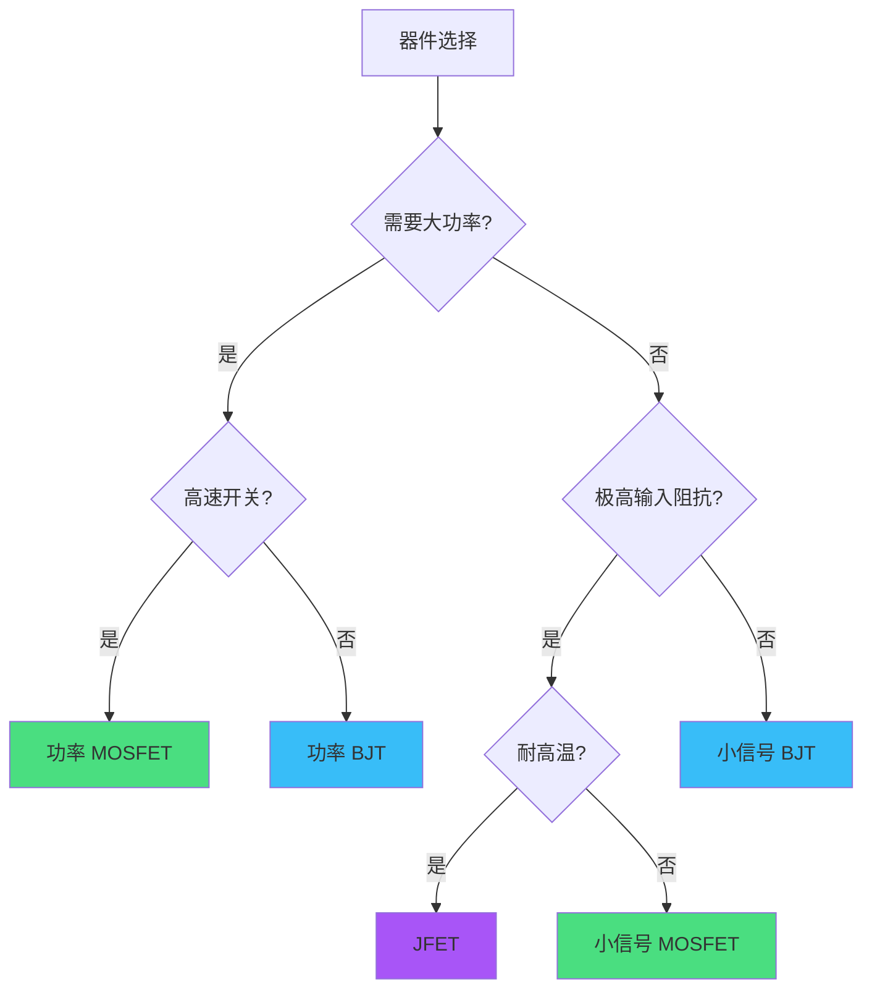

# 模拟电子线路基础知识速查手册

> **适用场景**: 考试复习、工程设计参考、快速查询核心参数
> **知识范围**: BJT、FET/MOSFET 特性 + 基本放大电路对比

---

## 半导体器件基础

### 核心概念速记

**载流子类型**:
- **多数载流子**: N 型半导体中的电子，P 型半导体中的空穴
- **少数载流子**: N 型半导体中的空穴，P 型半导体中的电子

**PN 结基本特性**:
- **正向偏置**: P 端接正，N 端接负，导通 (硅: ~0.7V, 锗: ~0.3V)
- **反向偏置**: P 端接负，N 端接正，截止 (仅微弱漏电流)
- **击穿**: 反向电压过大，雪崩击穿或齐纳击穿

---

## BJT 双极型晶体管

### 结构与工作原理

**三种结构类型**:
- **NPN 型**: 发射极 (N) - 基极 (P) - 集电极 (N)
- **PNP 型**: 发射极 (P) - 基极 (N) - 集电极 (P)

**电流关系**:

$$
I_E = I_B + I_C
$$

$$
I_C = \beta I_B = \alpha I_E
$$

其中:
- $\beta$ (电流放大系数) = 50 ~ 200 (典型值 100)
- $\alpha = \frac{\beta}{\beta + 1} \approx 0.98 \sim 0.99$

### BJT 三种工作状态

| 工作状态 | 发射结 (BE) | 集电结 (BC) | 应用场景 |
|---------|------------|------------|---------|
| **放大区** | 正偏 | 反偏 | 线性放大器 |
| **饱和区** | 正偏 | 正偏 | 开关导通 |
| **截止区** | 反偏 | 反偏 | 开关关断 |

### 主要特性参数

| 参数 | 符号 | 典型值/说明 |
|------|------|-----------|
| 电流放大系数 | $\beta$ (或 $h_{FE}$) | 50 ~ 200 |
| 输入电阻 | $r_{be}$ | 几百欧 ~ 几千欧 |
| 输出电阻 | $r_{ce}$ | 几十千欧 ~ 几百千欧 |
| BE 导通电压 | $U_{BE(on)}$ | 硅: 0.7V, 锗: 0.3V |
| 穿透电流 | $I_{CEO}$ | 微安级 (温度敏感) |
| 极限参数 | $U_{CEO}$, $I_{CM}$, $P_{CM}$ | 器件手册查询 |

### 温度特性

**关键记忆点**:
- $U_{BE}$ 温度系数: **-2 mV/°C** (温度升高，$U_{BE}$ 降低)
- $I_{CEO}$ 温度特性: 温度每升高 10°C，$I_{CEO}$ **约增加一倍**
- $\beta$ 温度系数: 正温度系数，温度升高 $\beta$ 增大

---

## FET 场效应管

### JFET (结型场效应管)

**结构类型**:
- **N 沟道 JFET**: 源极 (S) - 沟道 (N) - 漏极 (D), 栅极 (G) 为 P 型
- **P 沟道 JFET**: 源极 (S) - 沟道 (P) - 漏极 (D), 栅极 (G) 为 N 型

**工作原理**:
- 栅源电压 $U_{GS}$ 控制沟道宽度
- **耗尽型**: 栅极反偏使沟道变窄，$U_{GS}$ 可正可负
- 输入阻抗极高 (兆欧 ~ 吉欧级)

**转移特性方程** (恒流区):

$$
I_D = I_{DSS} \left(1 - \frac{U_{GS}}{U_{P}}\right)^2
$$

其中:
- $I_{DSS}$: $U_{GS} = 0$ 时的饱和漏极电流
- $U_P$: 夹断电压 (Pinch-off Voltage)

### JFET 三种工作状态

| 工作状态 | 条件 | 特点 |
|---------|------|------|
| **可变电阻区** | $U_{DS}$ 小 | $I_D$ 随 $U_{DS}$ 线性增加 |
| **恒流区 (放大区)** | $U_{GS} - U_P < U_{DS} < U_{(BR)DS}$ | $I_D$ 基本不变 |
| **击穿区** | $U_{DS} > U_{(BR)DS}$ | 雪崩击穿 |

### 主要特性参数

| 参数 | 符号 | 典型值/说明 |
|------|------|-----------|
| 饱和漏极电流 | $I_{DSS}$ | mA 级 |
| 夹断电压 | $U_P$ (或 $U_{GS(off)}$) | -2V ~ -8V (N 沟道) |
| 跨导 | $g_m = \frac{\partial I_D}{\partial U_{GS}}$ | mS 级 |
| 输入电阻 | $R_{GS}$ | $10^8 \sim 10^{10}\ \Omega$ |
| 输出电阻 | $r_{ds}$ | 几十千欧 ~ 几百千欧 |

---

## MOSFET 金属氧化物半导体场效应管

### 结构类型

**增强型 (Enhancement Mode)**:
- **N 沟道增强型**: $U_{GS} > U_{GS(th)}$ 时导通
- **P 沟道增强型**: $U_{GS} < U_{GS(th)}$ 时导通
- **特点**: 常态截止，需加栅压才能导通

**耗尽型 (Depletion Mode)**:
- **N 沟道耗尽型**: $U_{GS}$ 可正可负
- **P 沟道耗尽型**: $U_{GS}$ 可正可负
- **特点**: 常态导通，加反向栅压可关断

### 增强型 MOSFET 转移特性

**恒流区方程**:

$$
I_D = K_n (U_{GS} - U_{GS(th)})^2
$$

其中:
- $K_n$: 跨导参数 (器件特性)
- $U_{GS(th)}$: 开启电压 (阈值电压)

### 主要特性参数

| 参数 | 符号 | 典型值/说明 |
|------|------|-----------|
| 开启电压 | $U_{GS(th)}$ (或 $V_{th}$) | 1V ~ 4V (增强型 N 沟道) |
| 导通电阻 | $R_{DS(on)}$ | $\text{m}\Omega \sim \Omega$ 级 (功率 MOSFET) |
| 跨导 | $g_m$ | 几十 mS ~ 几 S |
| 输入电容 | $C_{iss}$ | pF ~ nF 级 |
| 栅极电荷 | $Q_g$ | nC 级 (影响开关速度) |
| 漏源击穿电压 | $U_{(BR)DSS}$ | 几十 V ~ 几百 V |

### 功率 MOSFET 特殊特性

**体二极管 (Body Diode)**:
- 寄生二极管，阳极接源极，阴极接漏极
- 用于续流、反向导通等应用

**安全工作区 (SOA)**:
- 最大漏极电流 $I_{D(max)}$
- 最大漏源电压 $U_{DS(max)}$
- 最大功耗 $P_D = I_D \times U_{DS} \leq P_{D(max)}$

---

## 三种器件特性对比

### 核心参数对比表

| 特性 | BJT | JFET | MOSFET (增强型) |
|------|-----|------|----------------|
| **控制类型** | 电流控制 ($I_B$) | 电压控制 ($U_{GS}$) | 电压控制 ($U_{GS}$) |
| **输入阻抗** | 低 ($\text{k}\Omega$) | 极高 ($\text{G}\Omega$) | 极高 ($\text{G}\Omega$) |
| **输入电流** | $I_B$ (μA ~ mA) | 极小 (pA ~ nA) | 极小 (pA) |
| **驱动功率** | 大 | 极小 | 极小 |
| **开关速度** | 中 (ns ~ μs) | 快 (ns) | 很快 (ns) |
| **噪声** | 中 | 低 | 低 |
| **温度稳定性** | 差 ($\beta$ 和 $I_{CEO}$ 温漂大) | 较好 | 好 |
| **导通压降** | $U_{BE}$ ≈ 0.7V | $U_{GS}$ 可为 0 | $I_D \times R_{DS(on)}$ |
| **功率容量** | 中 ~ 大 | 小 ~ 中 | 大 (功率 MOSFET) |
| **制造成本** | 低 | 中 | 中 ~ 高 |
| **应用场景** | 线性放大、中低频 | 低噪声前置放大、RF | 高速开关、功率转换 |

### 选型决策树



### 优缺点速记

**BJT 优势**:
- ✅ 成本低，工艺成熟
- ✅ 电流放大能力强 ($\beta$ 大)
- ✅ 导通压降低 (仅 0.2V ~ 0.3V，饱和状态)

**BJT 劣势**:
- ❌ 输入阻抗低，需要驱动电流
- ❌ 温度稳定性差
- ❌ 开关速度慢于 MOSFET

**JFET 优势**:
- ✅ 输入阻抗极高
- ✅ 低噪声特性
- ✅ 温度稳定性好
- ✅ 无栅极击穿问题 (PN 结保护)

**JFET 劣势**:
- ❌ 跨导较小 (放大倍数受限)
- ❌ 功率容量小
- ❌ 工艺复杂，成本高

**MOSFET 优势**:
- ✅ 输入阻抗极高 (氧化层隔离)
- ✅ 开关速度快
- ✅ 功率 MOSFET 可处理大功率
- ✅ 正温度系数 (便于并联)

**MOSFET 劣势**:
- ❌ 栅极氧化层易击穿 (需静电保护)
- ❌ 成本相对高
- ❌ 输入电容大 (影响高频特性)

---

## 基本放大电路分析

### 1. 共射 (共源) 放大电路

**BJT 共射电路**:

```
         +VCC
          |
          RC
          |
    C2 ---|--- Uo
    Ui ---||---[RB]---+--- B
          C1          |
                      E
                      |
                      RE
                      |
                     GND
```

**特性**:
- 电压放大倍数: $A_u = -\beta \frac{R_C}{r_{be}}$ (高)
- 输入电阻: $R_i = r_{be}$ (低, $\text{k}\Omega$ 级)
- 输出电阻: $R_o \approx R_C$ (中, $\text{k}\Omega$ 级)
- 相位: **反相** (输出与输入反相 180°)

**MOSFET 共源电路**:

$$
A_u = -g_m R_D
$$

$$
R_i = R_G \parallel R_{GS} \approx R_G \quad (\text{M}\Omega \text{ 级})
$$

$$
R_o \approx R_D \parallel r_{ds}
$$

### 2. 共集 (共漏) 放大电路

**BJT 共集电路 (射极跟随器)**:

```
         +VCC
          |
    Ui ---[RB]--- B
          C1     |
                 E
                 |--- Uo
                 RE
                 |
                GND
```

**特性**:
- 电压放大倍数: $A_u \approx 1$ (接近但小于 1)
- 输入电阻: $R_i = r_{be} + (1+\beta)R_E$ (高, 几十 $\text{k}\Omega$)
- 输出电阻: $R_o \approx \frac{r_{be}}{\beta}$ (低, 几十 $\Omega$)
- 相位: **同相**
- **应用**: 阻抗变换、缓冲隔离

**MOSFET 共漏电路 (源极跟随器)**:

$$
A_u = \frac{g_m R_S}{1 + g_m R_S} \approx 1
$$

$$
R_i \approx R_G \quad (\text{M}\Omega \text{ 级})
$$

$$
R_o \approx \frac{1}{g_m} \parallel R_S
$$

### 3. 共基 (共栅) 放大电路

**BJT 共基电路**:

```
         +VCC
          |
          RC
          |
    C2 ---|--- Uo
          C
          |
    Ui ---[RE]--- E
          C1     |
                GND
```

**特性**:
- 电压放大倍数: $A_u = \beta \frac{R_C}{r_{be}}$ (高)
- 输入电阻: $R_i \approx \frac{r_{be}}{\beta}$ (极低, 几十 $\Omega$)
- 输出电阻: $R_o \approx R_C$ (中)
- 相位: **同相**
- **应用**: 高频放大、宽带放大 (无密勒电容效应)

**MOSFET 共栅电路**:

$$
A_u = g_m R_D
$$

$$
R_i \approx \frac{1}{g_m} \quad (\text{低阻抗})
$$

$$
R_o \approx R_D
$$

---

## 放大电路性能对比

### 三种组态性能对比表

| 性能 | 共射 (共源) | 共集 (共漏) | 共基 (共栅) |
|------|-----------|-----------|-----------|
| **电压放大倍数** | 高 (几十 ~ 几百) | ≈ 1 | 高 (几十 ~ 几百) |
| **电流放大倍数** | 高 ($\beta$) | 高 ($1+\beta$) | ≈ 1 |
| **功率放大倍数** | 高 | 中 | 中 |
| **输入电阻** | 中 ($\text{k}\Omega$) | 高 (几十 $\text{k}\Omega$) | 低 (几十 $\Omega$) |
| **输出电阻** | 中 ($\text{k}\Omega$) | 低 (几十 $\Omega$) | 中 ($\text{k}\Omega$) |
| **频率特性** | 中 (密勒效应) | 好 | 优 (无密勒效应) |
| **相位关系** | 反相 (180°) | 同相 (0°) | 同相 (0°) |
| **典型应用** | 电压放大 | 阻抗变换/缓冲 | 高频放大/电流放大 |

### 密勒效应说明

**共射放大器的密勒效应**:

集电极-基极电容 $C_{bc}$ 等效到输入端的电容:

$$
C_{i(Miller)} = C_{bc}(1 + |A_u|)
$$

- 由于 $A_u$ 很大，等效输入电容显著增加
- **影响**: 高频增益下降，频带变窄
- **解决**: 使用共基组态 (无密勒效应)

---

## 实用设计指南

### 静态工作点设计

**目标**: 确保晶体管工作在放大区，且信号不失真

**BJT 设计步骤**:

1. **确定静态工作点** ($I_{CQ}$, $U_{CEQ}$):
   - $I_{CQ}$ ≈ 1 ~ 5 mA (小信号放大)
   - $U_{CEQ}$ ≈ $\frac{1}{2}V_{CC}$ (最大不失真输出)

2. **计算偏置电阻**:
   - 分压式偏置: $I_B = \frac{I_{CQ}}{\beta}$
   - $U_{BQ} = U_{BE} + I_{EQ}R_E \approx 0.7 + I_{CQ}R_E$

3. **稳定性设计**:
   - 发射极电阻 $R_E$: 提供直流负反馈，稳定工作点
   - 经验值: $U_E \approx (1 \sim 2)$ V

**MOSFET 设计步骤**:

1. **确定静态工作点** ($I_{DQ}$, $U_{DSQ}$):
   - $U_{GSQ} > U_{GS(th)}$ (增强型)
   - $U_{DSQ} > U_{GSQ} - U_{GS(th)}$ (恒流区条件)

2. **源极电阻自偏置**:

   $$
   U_{GS} = -I_D R_S
   $$

   结合转移特性方程求解 $R_S$

### 频率响应优化

**低频截止频率** $f_L$:
- 由耦合电容 $C_1, C_2$ 和旁路电容 $C_E$ 决定
- **设计**: $C \geq \frac{1}{2\pi f_L R}$

**高频截止频率** $f_H$:
- 由晶体管结电容 ($C_{bc}, C_{be}$) 和负载电容决定
- **改进**: 减小负载电阻、使用共基组态

**带宽** $BW$:

$$
BW = f_H - f_L \approx f_H \quad (f_H \gg f_L)
$$

### 负反馈应用

**四种负反馈类型**:

| 类型 | 反馈网络取样 | 反馈网络连接 | 效果 |
|------|------------|------------|------|
| 电压串联 | 输出电压 | 串联到输入 | 稳定 $A_u$，提高 $R_i$，降低 $R_o$ |
| 电压并联 | 输出电压 | 并联到输入 | 稳定 $A_u$，降低 $R_i$，降低 $R_o$ |
| 电流串联 | 输出电流 | 串联到输入 | 稳定 $A_i$，提高 $R_i$，提高 $R_o$ |
| 电流并联 | 输出电流 | 并联到输入 | 稳定 $A_i$，降低 $R_i$，提高 $R_o$ |

**负反馈的优点**:
- ✅ 稳定放大倍数
- ✅ 展宽频带
- ✅ 减小非线性失真
- ✅ 改善输入/输出阻抗

**代价**:
- ❌ 放大倍数降低 (需增加级数补偿)
- ❌ 可能引起自激振荡 (相位裕度不足)

---

## 速记要点总结

### BJT 关键公式

$$
\begin{aligned}
I_C &= \beta I_B \\
r_{be} &\approx 200 + (1+\beta)\frac{26\text{mV}}{I_{EQ}} \\
A_u(\text{共射}) &= -\beta \frac{R_C}{r_{be}} \\
A_u(\text{共集}) &\approx 1 \\
R_i(\text{共集}) &= r_{be} + (1+\beta)R_E
\end{aligned}
$$

### FET 关键公式

$$
\begin{aligned}
I_D &= I_{DSS} \left(1 - \frac{U_{GS}}{U_P}\right)^2 \quad (\text{JFET}) \\
I_D &= K_n(U_{GS} - U_{GS(th)})^2 \quad (\text{增强型 MOSFET}) \\
g_m &= \frac{\partial I_D}{\partial U_{GS}} \\
A_u(\text{共源}) &= -g_m R_D \\
A_u(\text{共漏}) &\approx 1
\end{aligned}
$$

### 温度系数记忆

- BJT: $U_{BE}$ → **-2 mV/°C**
- BJT: $I_{CEO}$ → **10°C 翻倍**
- MOSFET: $U_{GS(th)}$ → **负温度系数** (约 -2 ~ -5 mV/°C)
- MOSFET: $R_{DS(on)}$ → **正温度系数** (温度升高电阻增大)

### 常见电路识别

**看到发射极 (源极) 有电阻接地** → 共射 (共源) 或共集 (共漏)
- 输出取自集电极 (漏极) → **共射 (共源)**
- 输出取自发射极 (源极) → **共集 (共漏)**

**看到基极 (栅极) 直接接地 (交流)** → **共基 (共栅)**

---

## 参考资源

**推荐教材**:
- 《模拟电子技术基础》(童诗白, 华成英) - 清华大学经典教材
- 《电子电路基础》(Thomas L. Floyd) - 实用工程设计
- 《微电子电路》(Sedra/Smith) - 深入理论分析

**在线工具**:
- [Falstad Circuit Simulator](https://www.falstad.com/circuit/) - 在线电路仿真
- [LTspice](https://www.analog.com/ltspice) - ADI 免费 SPICE 仿真器
- [器件手册查询](https://www.alldatasheet.com/) - 全球最大数据手册库

**实验技巧**:
- 使用示波器观察波形，验证相位关系
- 万用表测量静态工作点 ($U_{BEQ}$, $U_{CEQ}$, $I_{CQ}$)
- 信号发生器输入正弦波，观察放大倍数和失真

---

**最后更新**: 2025-11-22
**适用范围**: 本科模拟电路课程、研究生入学考试、工程师速查手册

> 💡 **学习建议**: 先理解器件物理特性 → 掌握基本组态特点 → 分析实际电路 → 动手实验验证

**祝学习顺利！⚡**
