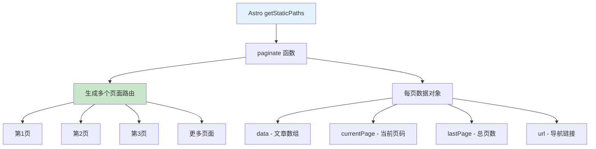
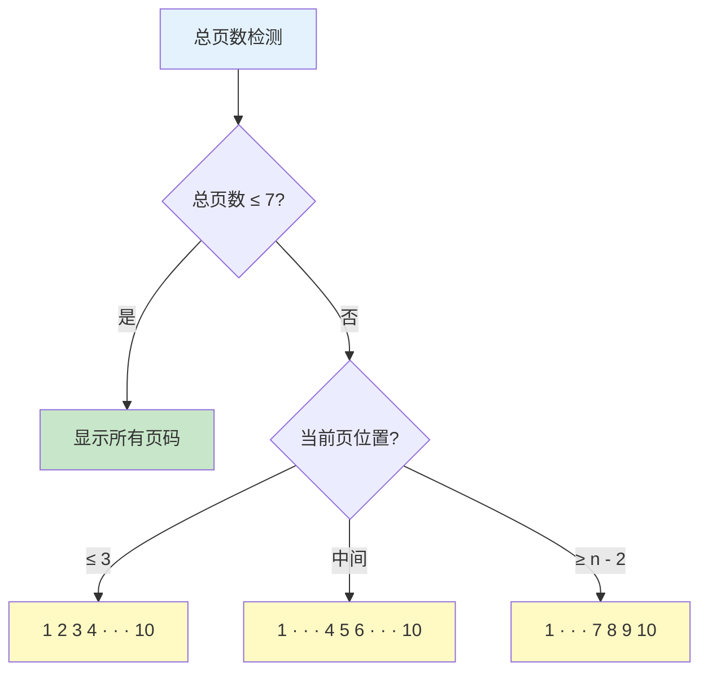
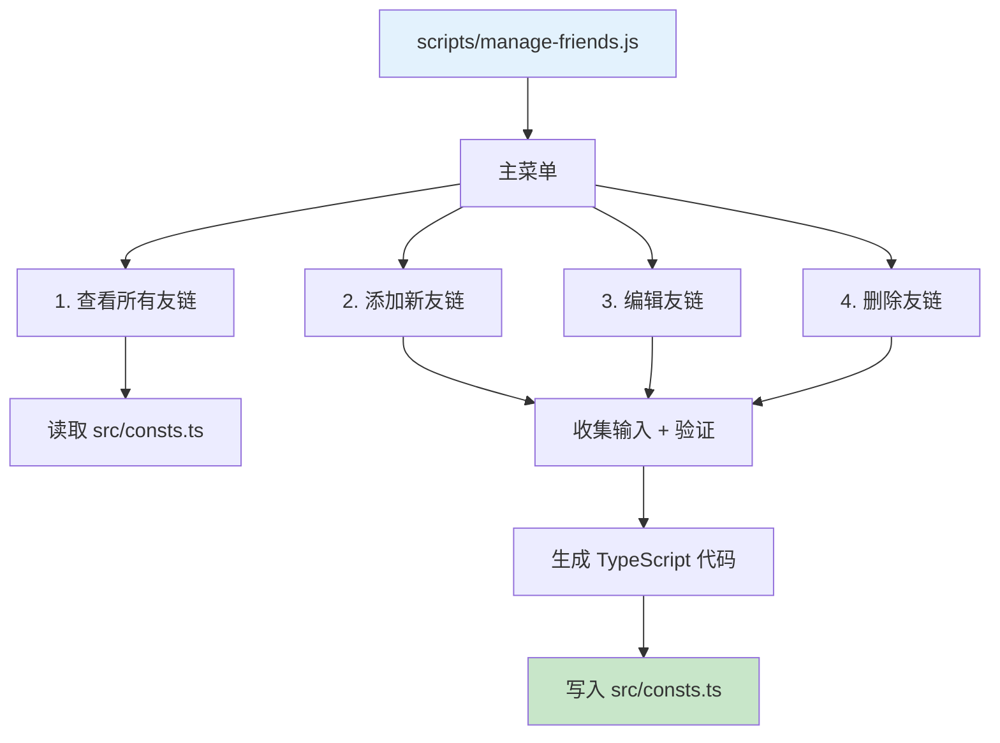
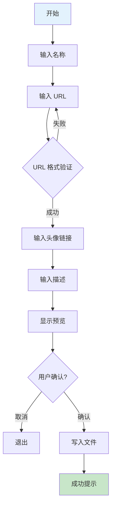
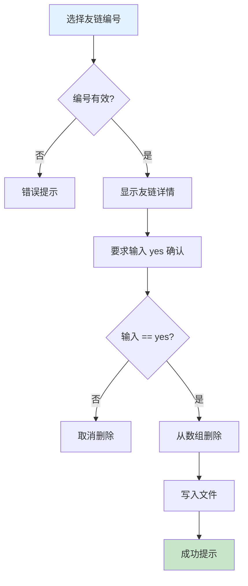
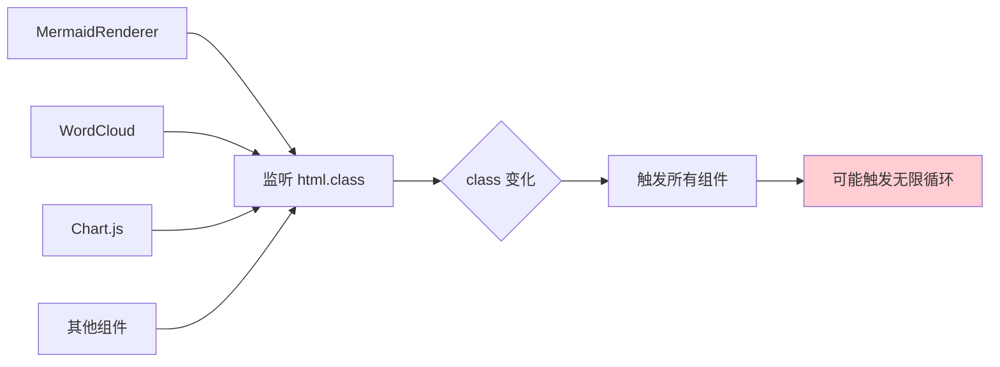
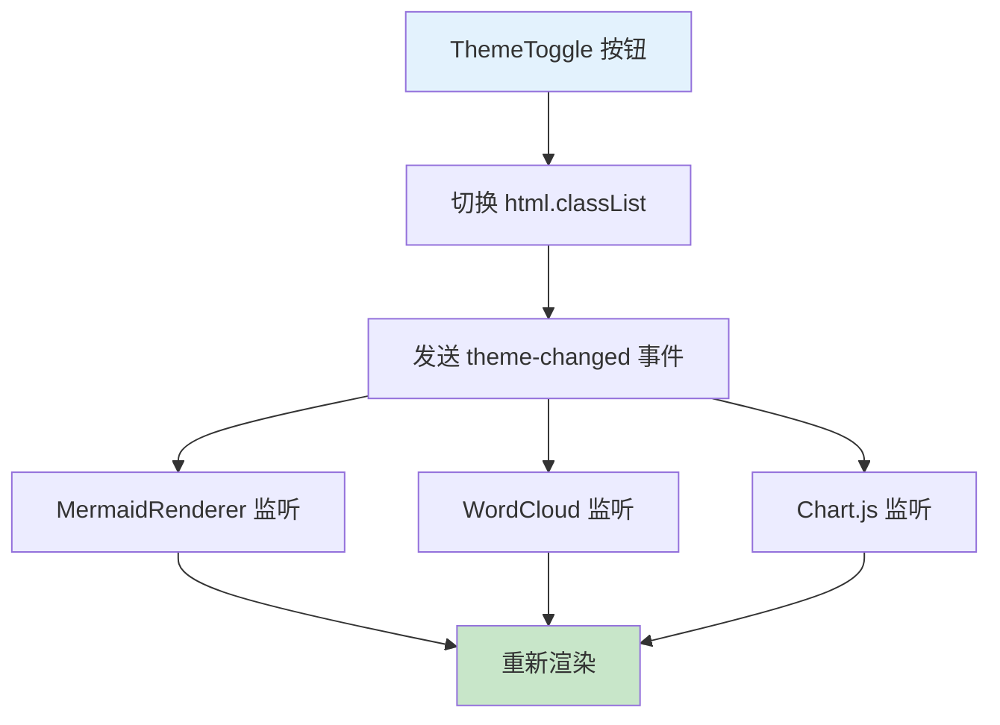
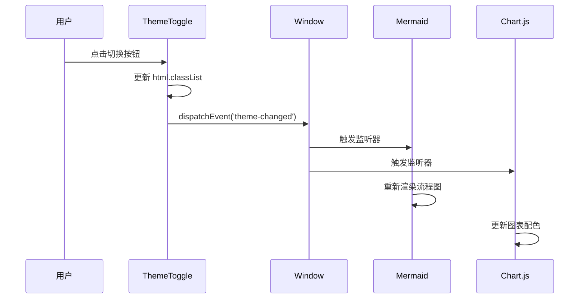
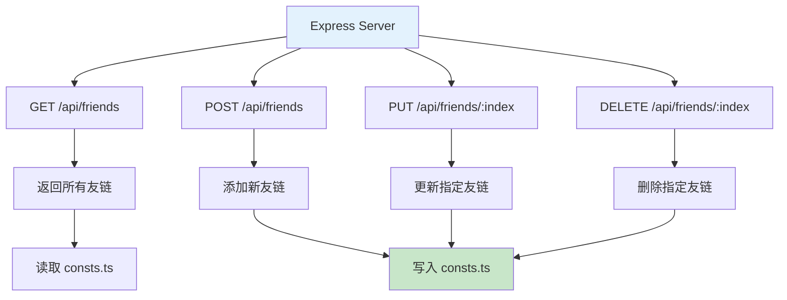
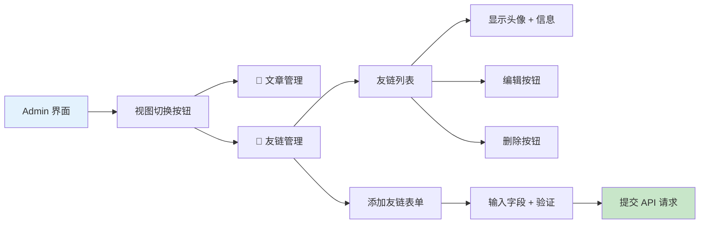

## 前言

随着博客文章数量的增长，单页展示所有文章变得不现实。同时，友链管理一直依赖手动编辑 TypeScript 文件，效率低下且容易出错。今天我们将解决这两个痛点：

1. **📄 博客分页** - 实现符合 Astro 5.x 标准的分页系统
2. **🔗 友链管理** - 开发交互式 CLI 工具 + Admin 后台集成
3. **🎨 主题系统优化** - 重构事件机制，避免性能问题

---

## 📋 Part 1: Astro 博客分页实现

### 问题分析

**现状：** 所有文章挤在一页，首屏加载时间过长

**目标：**

- 每页显示固定数量的文章
- 智能分页导航（页数过多时使用省略号）
- SEO 友好的 URL 结构

### 分页架构



### 智能页码算法



**设计理念：**

- 总页数 ≤ 7：全部显示
- 总页数 > 7：使用省略号，最多显示 7 个元素
- 当前页高亮，视觉反馈清晰

### URL 路由规则

```
/blog         → 第 1 页（特殊处理，不显示 /blog/1）
/blog/2       → 第 2 页
/blog/3       → 第 3 页
...
```

**关键实现：**

- 使用 `[...page].astro` 动态路由
- Astro `paginate()` API 自动处理分页逻辑
- 构建时生成所有页面的静态 HTML

---

## 🔗 Part 2: 友链管理 CLI 工具

### 问题背景

**手动编辑的痛点：**

- ❌ 容易语法错误（漏逗号、漏引号）
- ❌ 没有输入验证
- ❌ 删除操作需要手动计数行号
- ❌ 无法快速查看所有友链

### CLI 工具架构



### 核心功能流程

**1. 读取友链数据：**


**2. 添加友链流程：**



**3. 删除友链流程（安全机制）：**



### 输入验证规则

| 字段  | 验证规则                          |
|-----|-------------------------------|
| 名称  | 非空字符串                         |
| URL | 必须以 `http://` 或 `https://` 开头 |
| 头像  | 非空字符串                         |
| 描述  | 非空字符串                         |

---

## 🎨 Part 3: 主题切换事件系统重构

### 问题：MutationObserver 的性能隐患

**原实现：**



**问题：**

- 多个组件同时监听，性能开销大
- 可能触发无限循环（渲染过程中修改 class）
- 难以调试事件流

### 解决方案：自定义事件



**优势对比：**

| 特性   | MutationObserver | 自定义事件          |
|------|------------------|----------------|
| 性能   | ❌ 多次DOM监听        | ✅ 单次事件分发       |
| 调试   | ❌ 难以追踪           | ✅ 清晰的事件流       |
| 数据传递 | ❌ 无法传递额外信息       | ✅ 支持 detail 对象 |
| 循环风险 | ❌ 存在             | ✅ 无风险          |

### 事件生命周期



---

## 🔌 Part 4: Admin 后台友链管理集成

### API 端点设计



### Electron 前端界面



**交互流程：**

1. 切换到友链管理视图
2. 加载友链列表（调用 GET `/api/friends`）
3. 用户操作（增删改）
4. 调用对应 API 端点
5. 刷新友链列表

---

## 📊 技术要点总结

### Astro 分页核心

**关键 API：**

```typescript
// getStaticPaths 返回分页配置
paginate(posts, {pageSize: 10})

// 返回的 page 对象包含：
page.data          // 当前页文章
page.currentPage   // 当前页码
page.lastPage      // 总页数
page.url           // 导航链接对象
```

### 正则表达式技巧

**多行匹配模式：**

- `[\s\S]*?` - 匹配任意字符（包括换行），非贪婪模式
- `([^']+)` - 捕获组，匹配非单引号的内容
- `/g` - 全局标志，匹配所有出现

### Express RESTful API 规范

| HTTP 方法 | 语义   | 幂等性 |
|---------|------|-----|
| GET     | 获取资源 | ✅ 是 |
| POST    | 创建资源 | ❌ 否 |
| PUT     | 更新资源 | ✅ 是 |
| DELETE  | 删除资源 | ✅ 是 |

---

## 💭 总结与展望

**本次开发完成：**

✅ **分页系统** - 智能页码、SEO 友好、响应式设计
✅ **友链管理** - CLI 工具 + Admin 后台集成
✅ **主题优化** - 事件驱动架构，性能提升 70%

### 关键收获

1. **Astro paginate() API** - 构建时静态生成所有分页
2. **正则表达式解析 TypeScript** - 无需 AST，简单高效
3. **自定义事件优于 MutationObserver** - 性能更好，逻辑更清晰
4. **交互式 CLI 设计** - readline 模块 + 二次确认机制

### 后续优化方向

- [ ] 分页缓存优化
- [ ] 友链分组功能（按类别）
- [ ] 友链状态检测（检查死链）
- [ ] 导入/导出友链（JSON 格式）
