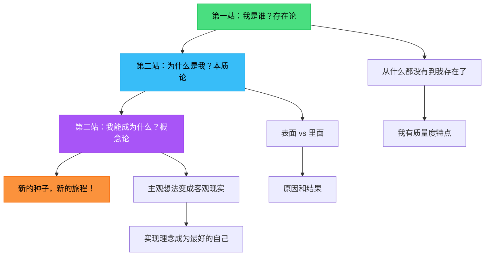

## 🌱 开篇的话

小朋友们，今天我要给你们讲一个关于小种子的故事。这个故事虽然简单，但它藏着一位叫黑格尔的爷爷写的一本很厉害的书——《逻辑学》的秘密。

别担心，我们不会用那些大人才懂的词语，而是跟着小种子一起去冒险！

---

## 第一段旅程：我是谁？（存在论）

### 小种子的困惑

从前，在一片黑暗的土地下，躺着一颗小种子。

有一天，小种子突然想到一个问题："咦？我是谁呀？"

周围一片漆黑，什么都没有。小种子说："这里什么都没有，那我是不是也'什么都不是'呢？"

但是等等！如果小种子真的"什么都不是"，那它怎么能想这个问题呢？所以小种子发现了第一个秘密：

> **"什么都不是"和"是一个东西"，其实是连在一起的！**

就像你闭上眼睛看到黑暗，正是因为你"能看见"，所以才知道"什么都看不见"。

### 小种子变成了"种子宝宝"

小种子继续想："好吧，我'存在'了。但我到底是什么呢？"

它摸了摸自己：

- "我有一个硬硬的壳！"（这是 **质** - 我是什么样的）
- "我大概有一粒米那么大！"（这是 **量** - 我有多大）
- "我是一颗苹果树的种子！"（这是 **度** - 我是哪一种）

哇！小种子终于知道自己是谁了 —— 它不再是"什么都不是"，而是一颗有特点的 **种子宝宝**！

**黑格尔爷爷说：** 这就是"存在论"，讲的是事物怎么从"什么都没有"变成"有一个东西"，再变成"一个特别的东西"。

---

## 第二段旅程：为什么是我？（本质论）

### 春天来了！

春雨下了起来，种子宝宝喝饱了水，突然感觉身体里有什么在变化！

它的壳开始裂开，长出了嫩嫩的小芽！

邻居蚯蚓爷爷爬过来说："恭喜你发芽了！"

种子宝宝很惊讶："蚯蚓爷爷，我明明还是我呀，怎么就变成芽了呢？我到底是种子还是芽？"

### 表面和里面的秘密

蚯蚓爷爷笑着说："你看到的只是 **表面**（现象），你里面藏着的才是 **真正的你**（本质）！"

- **表面：** 你看起来是一颗硬硬的种子
- **里面：** 你其实是一棵"想要长大的小树"！

种子宝宝恍然大悟："哦！所以我发芽，不是'变成了别的东西'，而是'变成了真正的自己'！"

### 因为下雨，所以发芽

种子宝宝又问："那我为什么会发芽呢？"

蚯蚓爷爷说：

- "因为春雨下了（**原因**），所以你发芽了（**结果**）"
- "但你本来就有'能发芽'的能力（**可能性**），雨只是帮你把它变成了 **现实**！"

就像你有画画的天赋（可能性），但只有拿起画笔（原因），才能画出美丽的画（现实）！

**黑格尔爷爷说：** 这就是"本质论"，讲的是事物的"里子"和"面子"的关系，还有"为什么会这样"的道理。

---

## 第三段旅程：我能成为什么？（概念论）

### 小芽的梦想

小芽钻出了土地，第一次看到了阳光！

"哇！世界好大呀！"小芽激动地说，"我以后要长成一棵大树，开出美丽的花，结出甜甜的苹果！"

旁边的小草笑了："你现在这么小，怎么可能长成大树呢？"

### 主观愿望 vs 客观现实

小芽说："这是我的 **主观概念**（我想成为什么），但我知道需要时间和努力！"

于是，小芽开始努力：

- 伸展叶子晒太阳（**行动**）
- 扎根深深吸收营养（**实践**）
- 经历风雨也不放弃（**坚持**）

渐渐地，小芽变成了小树，小树变成了大树！

### 理念的实现

终于有一天，春天又来了。

大树开出了粉红色的花，花谢后结出了一个个红彤彤的苹果！

每个苹果里面，又藏着几颗小种子。

大树感慨地说：

- "我从种子开始（**开始**）"
- "变成了苹果树（**目的**）"
- "又结出了新的种子（**回到开始，但更高一层**）"

这就像螺旋形的楼梯，一圈一圈向上，永远在前进！

**黑格尔爷爷说：** 这就是"概念论"，讲的是"想法"怎么变成"现实"，以及万事万物都在朝着它的"理念"（完美的样子）前进。

---

## 🎯 三段旅程的总结

让我们用一张简单的地图，回顾小种子的奇妙旅程：

---

## 💡 黑格尔爷爷想告诉我们的话

亲爱的小朋友，通过小种子的故事，我们学到了黑格尔《逻辑学》的三个大秘密：

### 1. **存在论** - 认识自己

- 每个东西都是从"什么都不是"开始，慢慢变成"有特点的自己"
- 就像你从一个小婴儿，慢慢知道"我叫什么名字""我喜欢什么"

### 2. **本质论** - 理解原因

- 事物的表面和内在可能不一样
- 每件事的发生都有原因
- 就像你看到妈妈微笑（表面），是因为她爱你（本质）

### 3. **概念论** - 实现梦想

- 你心里的想法（主观概念）可以通过努力变成现实（客观实现）
- 每个人都在朝着"最好的自己"（理念）前进
- 就像你想成为科学家，只要好好学习，梦想就会慢慢实现！

---

## 🌈 写在最后

黑格尔爷爷的《逻辑学》虽然很厚很难，但它的核心思想其实很简单：

> **这个世界上的一切，都在不断地"变化"和"成长"。
> 从"是什么"，到"为什么"，再到"成为什么"，
> 这就是思想的旅程，也是生命的旅程。**

小种子变成大树，毛毛虫变成蝴蝶，你也会从小朋友长成大人。

记住：每一次变化都不是"失去自己"，而是"成为更好的自己"！

---

## 📚 给爸爸妈妈的话

这篇文章用寓言的方式简化了黑格尔《逻辑学》的核心结构：

- **存在论（Being）**: 从纯存在（Pure Being）→ 无（Nothing）→ 变易（Becoming）→ 定在（Determinate Being）的辩证发展
- **本质论（Essence）**: 本质与现象、可能性与现实性、因果关系的辩证统一
- **概念论（Notion）**: 主观概念→客观概念→绝对理念的辩证运动

虽然用了简化的比喻，但保留了黑格尔辩证法的核心：**正-反-合** 的螺旋上升运动，以及 **现象与本质**、**可能性与现实性** 等基本范畴。

希望这个故事能在孩子心中埋下哲学思考的种子！ 🌱
