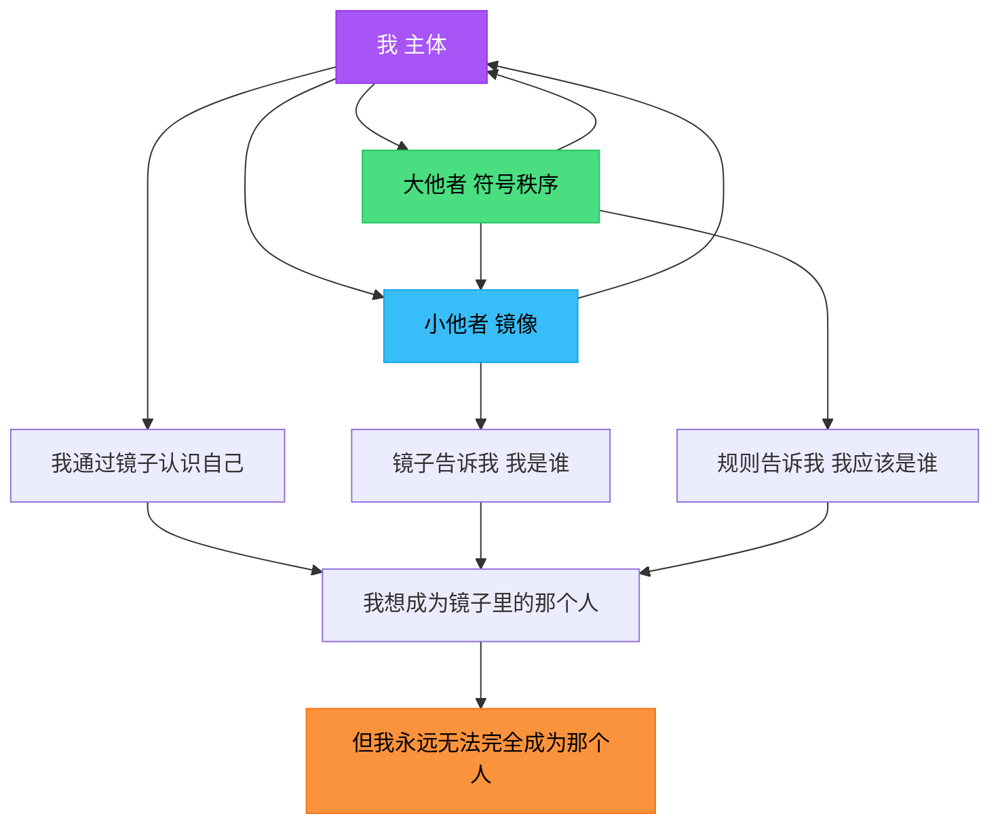

## 🪞 开场：一面神奇的镜子

小朋友们，你们照过镜子吗？

当你站在镜子前，看到那个和你一模一样的人，你会想："哇！那就是我！"

但是，法国的拉康爷爷（Jacques Lacan）说了一个很有趣的秘密：

> **镜子里的"你"，其实不完全是你！**

咦？这是什么意思呢？今天，我们就来探索三个神奇的概念：

- **小他者**（镜子里的朋友）
- **大他者**（看不见的规则）
- **还有"你"自己**

准备好了吗？让我们开始这场魔法之旅！🎪

---

## 第一站：镜子里的朋友（小他者）

### 🎭 镜子游戏的秘密

想象你第一次看到镜子（大概6个月到18个月大的时候）。

**你看到了什么？**

- 一个会跟你做同样动作的小孩
- 你挥手，他也挥手
- 你笑，他也笑
- 你跳，他也跳

**你会想：**
> "哇！那个人好像我！不对，那个人**就是**我！"

但拉康爷爷说：**等等，事情没那么简单！**

### 🧩 "我"是怎么来的？

在照镜子之前，小宝宝不知道"我"是什么。

你的小手、小脚、肚子……好像都是分开的，不知道它们都属于"你"。

**但是！当你看到镜子里的自己：**

1. **发现完整的形象** → "原来这就是完整的我！"
2. **开始模仿镜像** → "我要像那个人一样！"
3. **建立自我认同** → "我就是那个人！"

拉康爷爷把镜子里的那个"你"叫做 **小他者（petit autre / small other）**。

### 🎨 小他者不只是镜子

**小他者**就像：

- **镜子里的你** → 你看到的形象
- **照片里的你** → 你想象的样子
- **朋友眼中的你** → 你希望成为的人
- **偶像** → 你想模仿的对象

**关键秘密：**
> 你觉得"我就是这样的人"，其实是通过**看到别人**才知道的！

就像你通过镜子才知道自己长什么样，你也通过朋友、家人的反应，才知道"我是谁"。

### 📖 故事时间：小明的镜子

小明第一次看到镜子里的自己，开心地笑了："那是我！"

但妈妈说："宝贝，你的头发乱了，梳一梳吧。"

小明看着镜子，突然发现："原来我的头发乱了！"

**这就是小他者的魔法：**

- 小明通过**镜子**（小他者）看到自己的样子
- 小明通过**妈妈的话**（也是小他者）知道"头发乱"是不好的
- 小明开始**调整自己**，想变成"头发整齐的小明"

看到了吗？**"我"总是通过"你"（小他者）来认识自己！**

---

## 第二站：看不见的规则书（大他者）

### 📜 谁说头发一定要整齐？

等等！我们回到刚才的故事。

妈妈为什么说"头发乱了不好"？谁规定头发必须整齐？

**这就是大他者登场的时候了！**

### 🌌 大他者是什么？

**大他者（grand Autre / big Other）** 不是一个具体的人，而是：

1. **语言** → 你说的每一个词，都是大他者教你的
2. **规则** → "要有礼貌"、"不能撒谎"、"上课要举手"
3. **法律** → "红灯停，绿灯行"
4. **文化** → "生日要吃蛋糕"、"过年要拜年"
5. **期待** → "男孩要坚强"、"女孩要温柔"（虽然这些观念可能是错的！）

**大他者像一本看不见的超级规则书，它告诉你：**

- 什么是"好"，什么是"坏"
- 什么是"对"，什么是"错"
- 什么是"正常"，什么是"奇怪"

### 🎭 大他者 vs 小他者

让我们用表格来看看它们的区别：

| 特点        | 小他者（small other） | 大他者（big Other） |
|-----------|------------------|----------------|
| **是什么**   | 具体的人或形象          | 抽象的规则系统        |
| **例子**    | 镜子里的你、朋友、偶像      | 语言、法律、文化、期待    |
| **你能看到吗** | ✅ 能看到（或想象到）      | ❌ 看不到（但无处不在）   |
| **作用**    | 帮你建立"我是谁"的形象     | 告诉你"我应该是谁"     |
| **感觉**    | "我想像他一样！"        | "我必须遵守规则！"     |

### 🎪 故事时间：游乐场的规则

想象你在游乐场玩：

**小他者的世界：**

- 你看到小红在玩滑梯，你也想玩 → 你**模仿**小红
- 你看到小刚跑得很快，你也想跑那么快 → 你**认同**小刚
- 你照镜子，看到自己脸上有泥 → 你知道"我脸脏了"

**大他者的世界：**

- 你想插队，但你知道"要排队"（规则）
- 你想大声尖叫，但你知道"不能吵到别人"（礼貌）
- 你想一直玩，但你知道"该回家了"（时间观念）

**关键问题：这些规则是谁定的？**

答案：没有一个具体的人！

- 不是爸爸定的（虽然爸爸会提醒你）
- 不是老师定的（虽然老师会教你）
- 是**整个社会**、**整个文化**慢慢形成的！

这就是**大他者** → 一个看不见、摸不着，但无处不在的"符号秩序"（Symbolic Order）。

---

## 第三站：我、你、还有那些规则（三者的关系）

### 🎯 魔法三角形

现在，让我们把所有碎片拼起来！

### 🔄 三个角色的互动

#### **1. 我（主体）→ 小他者**

> "我通过你，看到我自己。"

- 你照镜子，看到"我"的样子
- 你看朋友，想"我也要那样"
- 你读故事书，觉得"我想成为主角"

#### **2. 小他者 → 我**

> "你让我知道，我是什么样的人。"

- 镜子告诉你："你今天穿了红色衣服。"
- 朋友告诉你："你跑得真快！"
- 照片告诉你："这就是你的样子。"

#### **3. 大他者 → 我**

> "规则告诉我，我应该是什么样的人。"

- 语言告诉你："你是'男孩'或'女孩'。"
- 文化告诉你："你是'中国人'。"
- 期待告诉你："你应该'听话'、'努力学习'。"

#### **4. 大他者 → 小他者**

> "规则塑造了我眼中的'理想自我'。"

- 你想成为"聪明的孩子"（因为大他者说聪明是好的）
- 你想成为"受欢迎的人"（因为大他者说受欢迎很重要）
- 你想成为"厉害的人"（因为大他者赞美厉害的人）

### 🎭 最重要的秘密：错位与欲望

拉康爷爷说了一个**超级重要**的秘密：

> **你永远无法完全成为"你想成为的那个人"！**

**为什么？**

1. **镜子里的"你"不是真正的你** → 那只是一个形象，一个**想象**
2. **大他者的要求永远在变** → 你刚学会"听话"，它又说"要有创意"
3. **你总是在追赶** → 你想成为镜子里那个"完美的自己"，但你永远差一点点

这就像玩"老鹰捉小鸡"：

- **你**是小鸡
- **你想成为的自己**是老鹰
- 你一直在跑，想抓住那个"完美的我"
- 但你永远抓不到，因为那个"我"总是在前面一点点

**这就是拉康说的"欲望"（Desire）！**

欲望不是"我想要一个玩具"，而是"我想成为一个……的人"。

---

## 第四站：故事大冒险

### 📖 小丽的一天

让我们用一个完整的故事，串联所有概念！

**早晨：镜子前**
> 小丽起床，照镜子（**小他者**）。
> 她看到头发乱了，想："我要梳头，因为漂亮的女孩应该头发整齐。"
> （**大他者**告诉她：整齐=漂亮）

**上学路上**
> 小丽看到同学小美穿了新裙子（**小他者**）。
> 她想："我也想像小美一样漂亮！"
> （她想**认同**小美，成为"漂亮的女孩"）

**课堂上**
> 老师问问题，小丽知道答案，但她不敢举手。
> 她想："如果我答错了，大家会笑我吗？"
> （**大他者**的规则：答错=丢脸）

**午餐时间**
> 小丽想多吃一块蛋糕，但她想起妈妈说"女孩要保持身材"。
> 她犹豫了……
> （**大他者**的期待 vs 她的欲望）

**放学后**
> 小丽回家，对着镜子练习舞蹈。
> 她想成为"优雅的芭蕾舞者"（她想象中的**理想自我**）。
> 但她发现，镜子里的自己动作还不够标准……
> （她在追赶那个"理想的我"，但总是差一点点）

**晚上睡前**
> 小丽躺在床上想："我是谁？"
> - 我是**镜子里的那个女孩**吗？（小他者）
> - 我是**大家期待的好学生**吗？（大他者）
> - 还是我只是……我自己？（**主体的困惑**）

### 💡 拉康告诉小丽的话

> "亲爱的小丽，你一直在寻找'我是谁'的答案。
>
> 但是，**'我'不是一个固定的东西**。
>
> - 你通过**镜子、朋友、照片**（小他者）看到自己
> - 你通过**语言、规则、期待**（大他者）定义自己
> - 但真正的你，是那个**永远在寻找、永远在变化**的你！
>
> 就像追逐自己的影子，你永远在路上，这就是**成为人**的魔法！"

---

## 🎯 核心概念速查表

| 概念       | 法语               | 通俗理解        | 例子                | 拉康的深意              |
|----------|------------------|-------------|-------------------|--------------------|
| **小他者**  | petit autre      | 镜子里的朋友      | 镜像、朋友、偶像、理想自我     | 想象性认同的对象，帮助建立自我形象  |
| **大他者**  | grand Autre      | 看不见的规则书     | 语言、法律、文化、社会期待     | 符号秩序，决定主体在社会中的位置   |
| **主体**   | sujet            | 正在寻找"我是谁"的你 | 每一个人              | 被语言和欲望结构的存在，永远分裂   |
| **镜像阶段** | stade du miroir  | 第一次照镜子的时刻   | 6-18个月大的婴儿认出镜中的自己 | 自我认同的开始，但也是"误认"的开始 |
| **符号秩序** | ordre symbolique | 规则的世界       | 语言、法律、文化规范        | 大他者运作的领域           |
| **想象界**  | imaginaire       | 镜子的世界       | 形象、幻想、认同          | 小他者运作的领域           |
| **欲望**   | désir            | 想成为某个样子的渴望  | "我想成为像她一样的人"      | 永远无法满足的追求，驱动主体发展   |

---

## 🎓 给爸爸妈妈的话

这篇文章用儿童语言简化了拉康精神分析的核心概念，但保留了关键的理论要素：

### **学术对应关系：**

1. **小他者（petit autre / a）**
  - **理论层次：** 想象界（Imaginary）
  - **核心机制：** 镜像阶段（Mirror Stage）
  - **功能：** 自我认同的对象，想象性认同（identification imaginaire）
  - **误认：** 主体误以为镜像就是真正的自我

2. **大他者（grand Autre / A）**
  - **理论层次：** 符号界（Symbolic）
  - **核心机制：** 语言、法律、父亲之名（Nom-du-Père）
  - **功能：** 符号性认同（identification symbolique），主体在符号秩序中的位置
  - **悖论：** 大他者本身是空洞的、不存在的，但却决定一切

3. **主体的分裂：**
  - 想象性自我（ego / moi）vs 符号性主体（subject / je）
  - 主体被**语言异化**：当你说"我"，你已经在大他者的话语中
  - 欲望是"他者的欲望"（le désir de l'Autre）：我们渴望的，是我们认为大他者渴望我们渴望的

4. **三界理论的体现：**
  - **实在界（Real）**：文章未深入，但暗示在"永远差一点点"的缺失中
  - **想象界（Imaginary）**：镜像、认同、形象
  - **符号界（Symbolic）**：语言、规则、社会结构

### **适合延伸讨论的话题：**

- 社交媒体时代，孩子们通过"点赞数"认识自己（现代的镜像阶段）
- 性别期待如何通过大他者运作（"男孩应该……"、"女孩应该……"）
- 为什么孩子总说"我长大后要当……"（对理想自我的追求）

希望这个故事能在孩子心中埋下哲学思考的种子！🌱
