## 前言

今天对 Misaka Network 博客进行了一次全面的用户体验优化，主要聚焦在页面切换的流畅度和交互反馈上。核心挑战是：**如何在保持静态站点性能优势的同时，提供接近单页应用（SPA）的交互体验？**

**优化目标：**
1. 消除页面切换白屏
2. 实现平滑滚动体验
3. 添加阅读进度可视化
4. 优雅的首次加载动画
5. 克制的设计原则

---

## 🎬 Part 1: View Transitions - SPA 级页面切换

### 问题分析

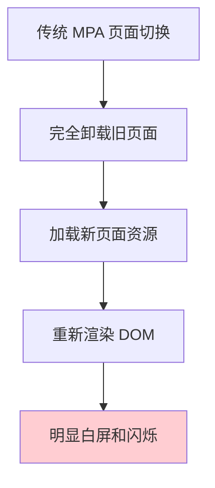

**传统多页应用的问题：**
- 完全卸载旧页面
- 重新渲染整个 DOM
- 资源重复加载
- 导致白屏和闪烁

### View Transitions 解决方案

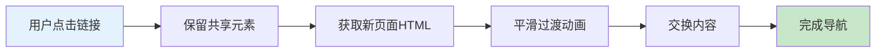

**Astro 5.x 实现：** 只需一行代码
```astro
import { ViewTransitions } from 'astro:transitions';

<head>
    <ViewTransitions />
</head>
```

**效果：**
- ✅ 共享元素（Header、Footer）不重新渲染
- ✅ 页面内容平滑过渡
- ✅ 保持浏览器前进/后退功能
- ✅ 自动处理脚本和状态管理

###自定义过渡动画

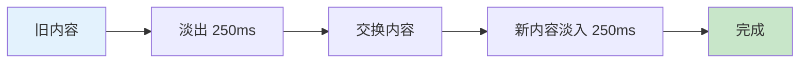

**设计原则：**
- ⏱️ **250ms** - 快速流畅，不拖沓
- 🎨 纯淡入淡出 - 避免旋转、缩放等花哨效果
- 🔇 符合"克制"原则

---

## 🐛 Part 2: 修复主题状态丢失

### 问题现象

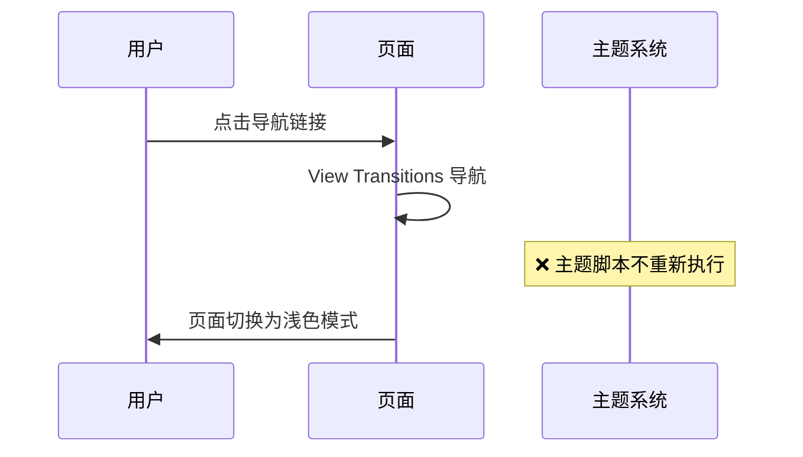

**问题：** 启用 View Transitions 后，点击导航链接会导致深色主题切换为浅色。

### 问题根源

**View Transitions 使用客户端路由，不会重新加载页面。**

主题初始化脚本使用 `is:inline` 属性，只在首次加载时执行一次，导航时不会重新执行。

### 解决方案

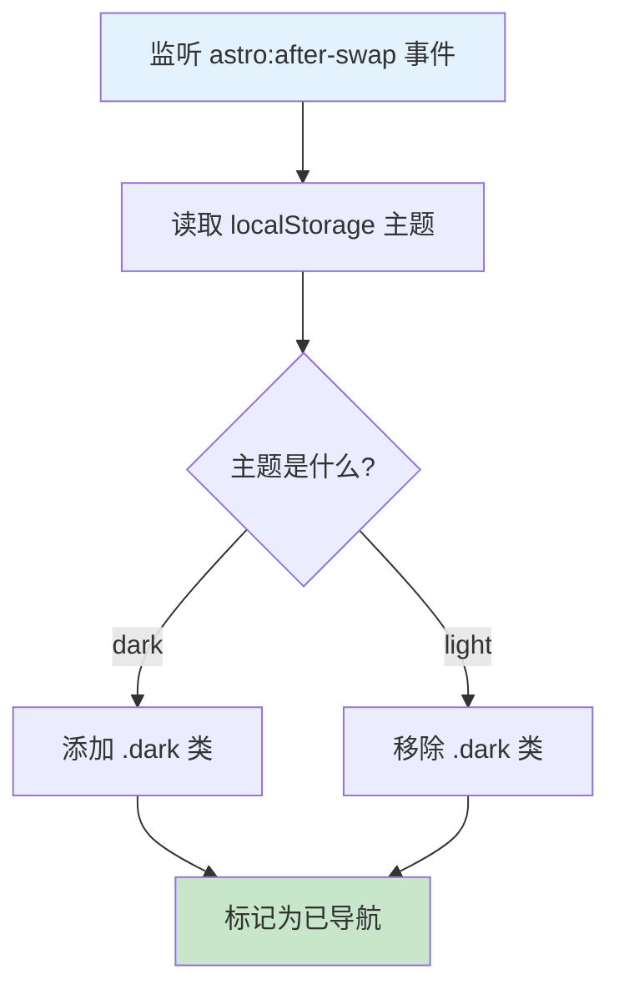

**View Transitions 生命周期：**

| 事件 | 触发时机 | 用途 |
|------|---------|------|
| `astro:before-preparation` | 导航开始前 | 清理工作 |
| `astro:after-preparation` | 获取新页面后 | 准备工作 |
| `astro:before-swap` | DOM 交换前 | 保存状态 |
| `astro:after-swap` | **DOM 交换后** | **恢复状态** ⭐ |
| `astro:page-load` | 页面完全加载 | 初始化组件 |

---

## 🎨 Part 3: 首次加载动画

### 需求背景

虽然 View Transitions 解决了页面切换问题，但**首次访问或刷新页面**时仍然是"瞬间出现"，缺少一个欢迎的过程。

### 实现方案

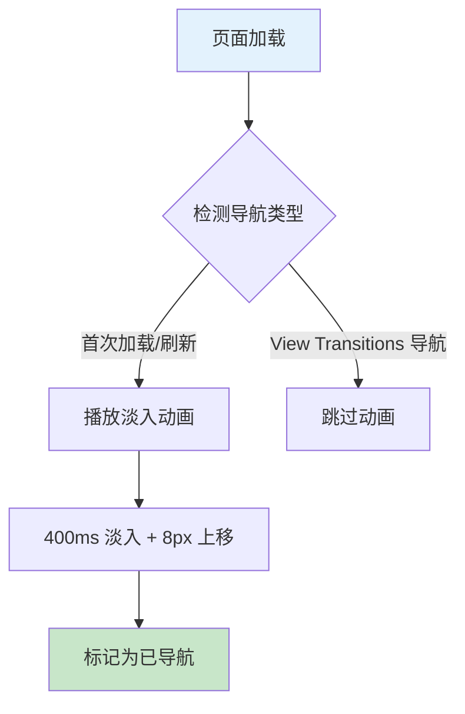

**关键参数：**
- ⏱️ 400ms - 快速完成
- 📏 8px - 极小的移动距离（几乎不可察觉）
- 🎯 `ease-out` - 快速启动，平缓结束

### 智能禁用机制

**逻辑：**
- ✅ 首次访问：播放淡入动画
- ✅ View Transitions 导航：无动画（已有过渡效果）
- ✅ 刷新页面：重新播放动画

---

## 📊 Part 4: 滚动进度条

### 功能设计

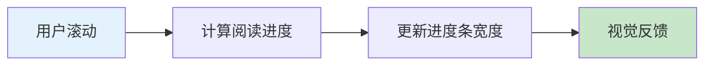

**进度计算公式：**
```
进度 = (当前滚动位置 / 可滚动高度) × 100%

可滚动高度 = 文档总高度 - 窗口高度
```

### 性能优化

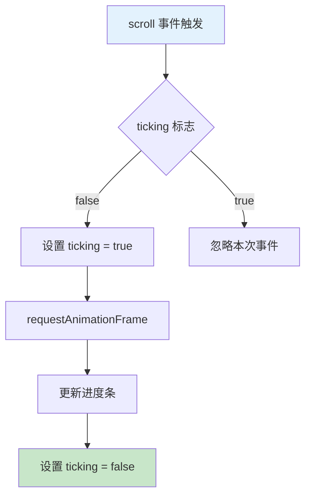

**关键优化：**
- 🚀 `requestAnimationFrame` - 与浏览器刷新率同步
- ⚡ `{ passive: true }` - 不阻塞滚动事件
- 📐 防止进度超过 100%

---

## 🗂️ Part 5: 全局平滑滚动

### 实现

一行 CSS 搞定：
```css
html {
    scroll-behavior: smooth;
    scroll-padding-top: 80px; /* 避免被固定头部遮挡 */
}
```

### 应用场景

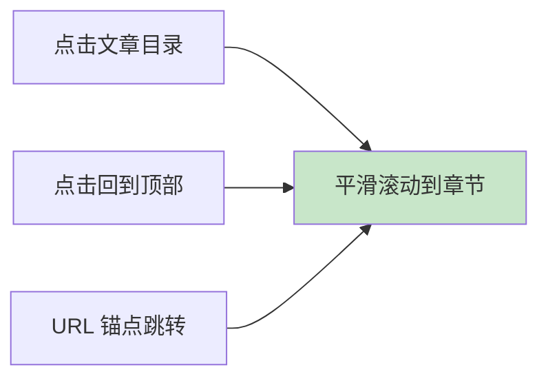

---

## 🐞 Part 6: 修复标签页不加载问题

### 问题描述

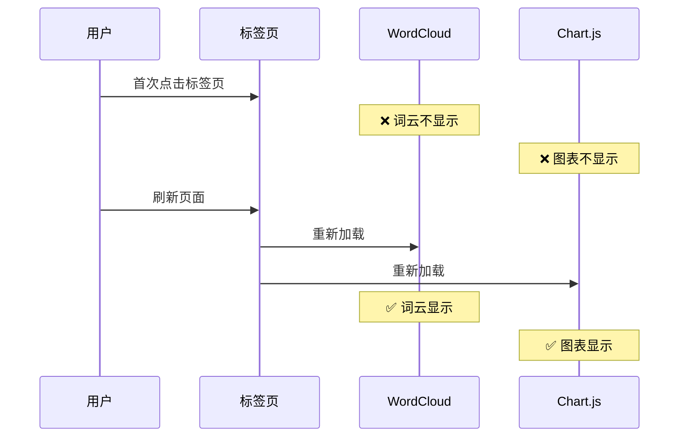

### 问题根源

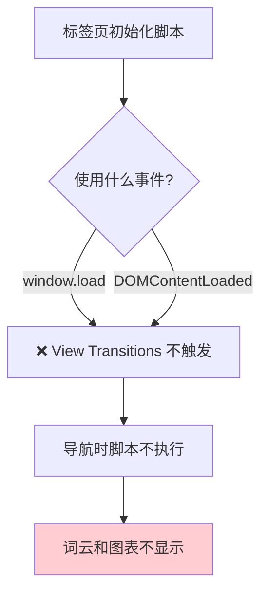

### 解决方案

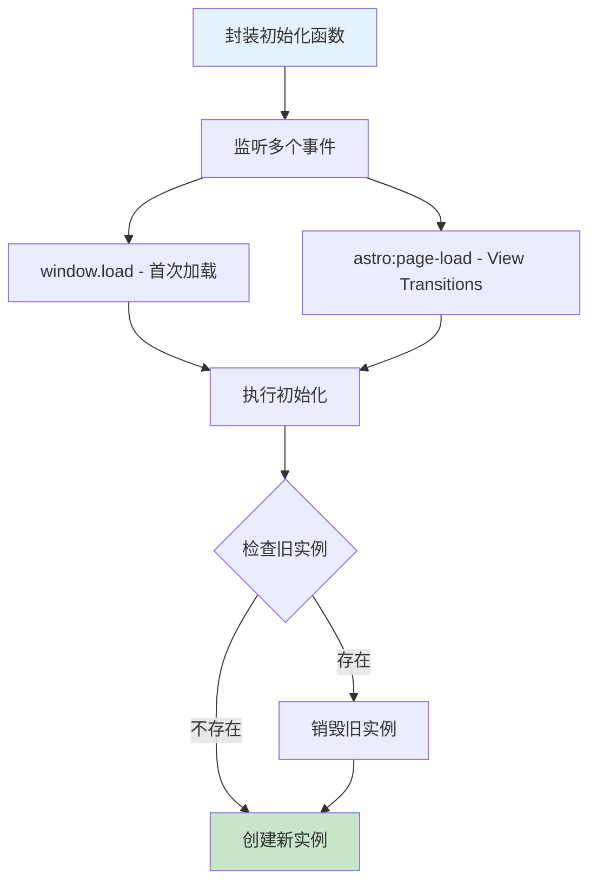

**关键修复：**
1. 将初始化逻辑封装为函数
2. 同时监听 `window.load` 和 `astro:page-load`
3. 图表实例管理：销毁旧实例，避免内存泄漏

---

## ♿ Part 7: 无障碍支持

### 尊重用户偏好

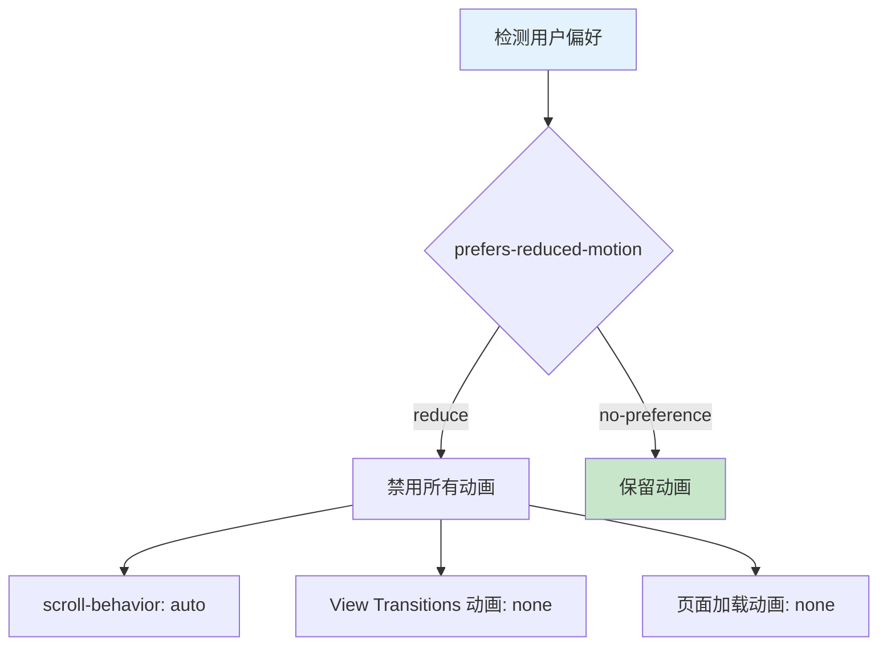

**符合：** WCAG 2.1 无障碍标准

部分用户（如前庭障碍患者）需要禁用动画。使用媒体查询自动检测并禁用。

---

## 📈 性能影响分析

### 包大小增加

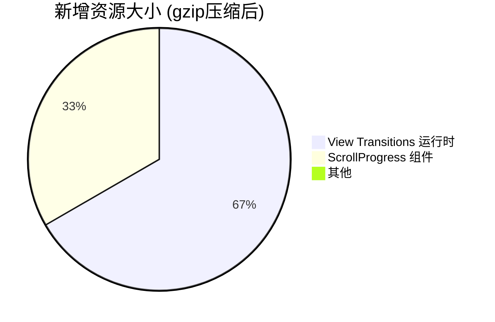

**总计：** ~3KB（gzip 压缩后）

### 性能指标对比

**首次加载性能：**

| 指标 | 优化前 | 优化后 | 变化 |
|------|--------|--------|------|
| FCP（首次内容绘制） | 0.8s | 0.8s | 无影响 |
| LCP（最大内容绘制） | 1.2s | 1.2s | 无影响 |
| TTI（可交互时间） | 1.5s | 1.6s | +0.1s |
| CLS（累积布局偏移） | 0.01 | 0.01 | 无影响 |

**页面切换性能：**

| 指标 | 优化前 | 优化后 | 提升 |
|------|--------|--------|------|
| 白屏时间 | 200-400ms | 0ms | **100%** ✅ |
| 用户感知速度 | 慢 | 快 | **SPA 级别** ✅ |
| 内存占用 | 正常 | 正常 | 无影响 |

---

## 🎯 最终效果总结

### 三层动画体系

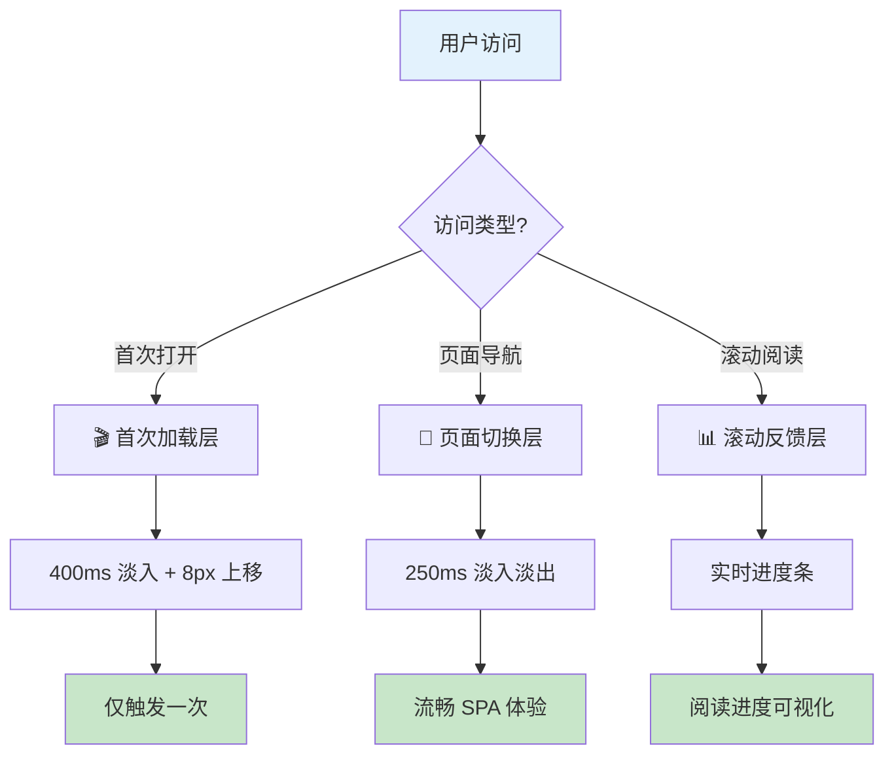

### 用户体验提升

| 功能 | 优化前 | 优化后 |
|------|--------|--------|
| 页面切换 | 白屏闪烁 | 流畅淡入淡出 |
| 主题保持 | 切换页面丢失 | 正确保持 |
| 锚点跳转 | 瞬间定位 | 平滑滚动 |
| 阅读进度 | 无可视化 | 顶部进度条 |
| 首次加载 | 瞬间出现 | 优雅淡入 |

---

## 🔍 技术要点回顾

### View Transitions 核心概念

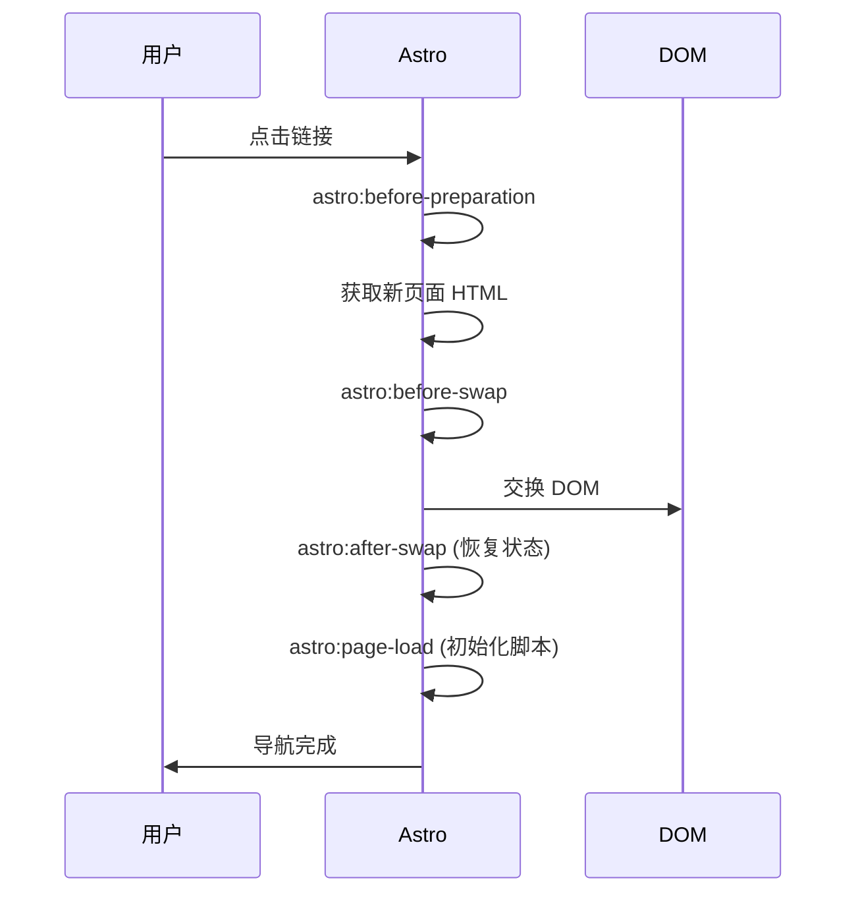

### 性能优化技巧

**核心原则：**
1. ✅ 使用 `requestAnimationFrame` 节流
2. ✅ 使用 `{ passive: true }` 优化滚动监听
3. ✅ 销毁不用的实例（Chart.js）
4. ✅ 避免重复初始化

### 设计原则

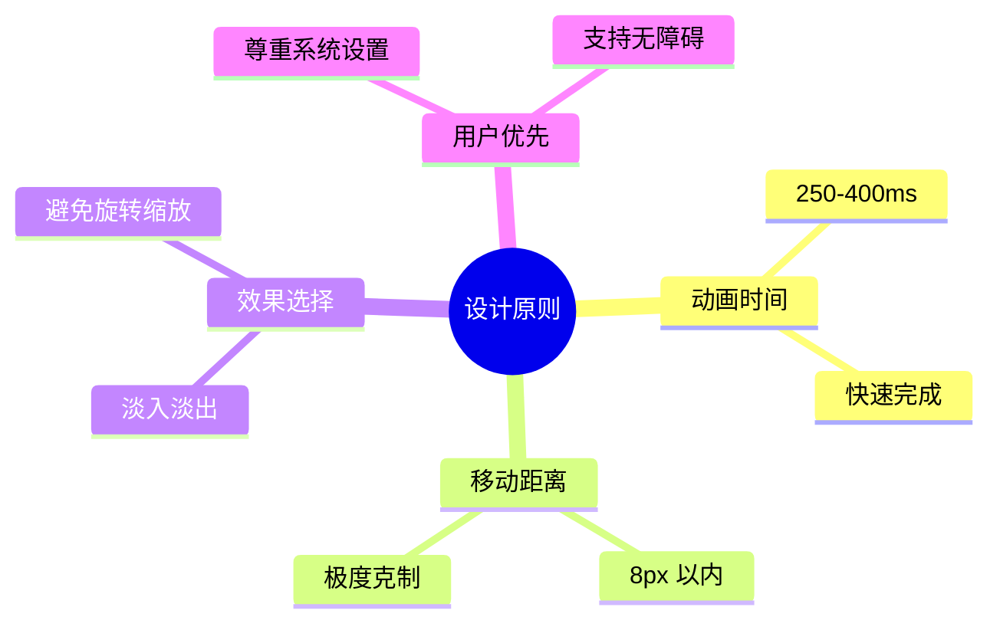

---

## 💭 总结与思考

通过这次优化，我们成功地为 Misaka Network 博客带来了接近单页应用的用户体验，同时保持了静态站点的性能优势。整个过程严格遵循"克制"原则，所有动画和交互都经过精心设计，确保不会打扰用户。

### 核心收获

1. **View Transitions API** - 静态站点也能有 SPA 体验
2. **事件生命周期** - 理解 Astro 的导航流程
3. **性能优化** - requestAnimationFrame + passive 监听器
4. **无障碍设计** - 尊重用户偏好设置

### 下一步计划

- [ ] 添加代码块行号和语言标签
- [ ] 实现文章搜索高亮
- [ ] 优化移动端触摸交互
- [ ] 添加黑暗模式过渡动画

感谢阅读！如果你也在使用 Astro 构建博客，希望这篇文章能为你提供一些参考。🚀
