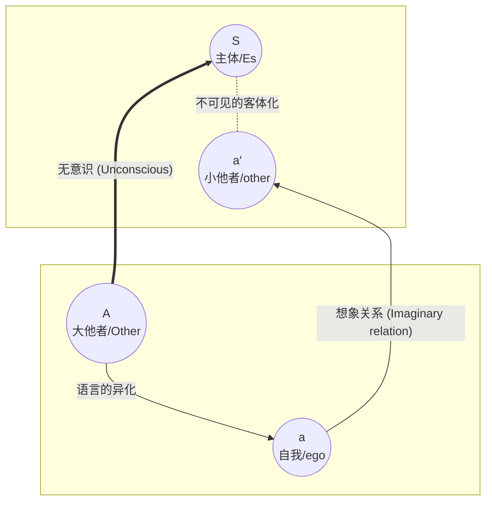

在精神分析的视野中，两个人面对面的交谈，从来就不是两个“人”在交谈。现场至少有四个角色在进行一场错综复杂的博弈。

雅克·拉康（Jacques Lacan）用一个经典的 **L图示（Schema L）**，极其精准地描绘了人类交流的这种结构性困境。它揭示了为什么我们总是感觉“词不达意”，为什么“自我”其实是一堵墙，阻挡了真理的传递。

### 一、 L图示：Z字型的命运

让我们首先来看修正后的图示。这是一个“Z”字型的结构，分为了上下两层（主体与大他者、自我与小他者）以及两条对角线。

这个图示构成了一个四边形，其中最重要的两条线是交叉的：

1. **实线轴 $a \rightarrow a'$**：这是 **想象轴**（Imaginary Axis）。
2. **双线轴 $A \rightarrow S$**：这是 **象征轴**（Symbolic Axis）。

### 二、 角落里的四个角色

要读懂这幅图，我们必须放弃日常的直觉，重新定义这四个代号：

#### 1. $(Es) S$：主体 —— 不在场的主角

位于左上角。这是弗洛伊德所说的“本我”（Id），也是拉康所说的“主体”。
它不是那个夸夸其谈的“我”，而是那个 **无法被完全表达出来的、匮乏的存在**。它充满了欲望，但它不知道该说什么。它在等待来自大他者的信息来定义自己。

#### 2. $(ego) a$：自我 —— 想象的盔甲

位于左下角。这是我们日常以为的“我自己”。
在拉康看来，自我（ego）不是主宰，而是一个 **客体（object）**。它是我们在镜像阶段（Mirror Stage）通过认同镜子里的那个完整形象而建立起来的。

* **功能**：它是防御性的。像个偏执狂一样，它总是担心自己解体，所以拼命维护统一性。它是一堵 **墙**。

#### 3. $(other) a'$：小他者 —— 镜中的倒影

位于右上角。这是你与之对话的具体的人（朋友、爱人、敌人）。
但在L图示中，它被标记为 $a'$，意味着它只是 $a$（自我）的 **投影**。我们并没有看到真实的对方，我们看到的只是“像我的人”或者“反衬我的人”。

* **关系**：这是自恋的领域。我们要么爱他（因为他像我），要么恨他（因为他抢走了我的快乐）。

#### 4. $(Other) A$：大他者 —— 幕后的立法者

位于右下角。注意是大写的 $O$。
它不是具体的人，而是 **语言、法则、文化、潜意识的场所**。
当主体 $S$ 想要说话时，它必须借用大他者 $A$ 的语言。真理和命运，都从这里发出。

### 三、 两条轴线的战争：为什么真话很难说出口？

L图示最精彩的部分在于那两条交叉线的博弈。

#### 1. 想象界的墙（The Wall of Language）

$$ a \longrightarrow a' $$
这是我们日常交流发生的层面。你看，它横亘在中间，像一道屏障。
当我们和别人说话时，其实是“我的面具”在和“你的面具”说话。我们在互扔词语，进行着自恋的互补或攻击。
在这条轴线上，充满了 **误解（Méconnaissance）**。虽然我们在说话，但其实只有“空言”（Empty Speech）。

#### 2. 无意识的切断

$$ A \longrightarrow S $$
这是真实的主体性轴线。来自大他者（潜意识）的信息试图传达给主体 $S$。
**但是，请看图示中的交叉点：** 这条线被 $a-a'$ 轴线切断了。

这意味着：**主体的真理，被自我的想象关系给拦截了。**
当潜意识试图说话（比如口误、梦、症状）时，我们的“自我”会立刻跳出来进行合理化解释，从而掩盖了真相。我们用“因为...所以...”的逻辑（想象界），扼杀了潜意识那荒诞但真实的欲望（象征界）。

### 四、 结论：主体总是收到倒错的信息

拉康通过这个图示得出了一个著名的结论：

> **“交流总是失败的。”**

在这个四角游戏中：

1. **S（主体）** 想问 **A（大他者）**：“我到底是谁？你想要我做什么？”
2. 但 **S** 没有直接通向 **A** 的路，它只能通过 **a（自我）** 去看。
3. 而 **a** 沉迷于和 **a'（小他者）** 照镜子。

所以，作为主体的我们，总是处于一种**异化（Alienation）**的状态。我们要么迷失在“像我一样”的自恋幻觉中，要么迷失在“大他者想要什么”的焦虑猜测中。

**看懂L图示，就是看懂了孤独的本质：**
我们被困在“自我”这堵墙里，听不到自己内心真实的声音，也触不到他人真实的脸庞。唯有在那个交叉点断裂的瞬间——当我们不再执着于维护面子（自我），不再执着于想象对方（小他者）时——真实的言语（Full
Speech）才有可能降临。
