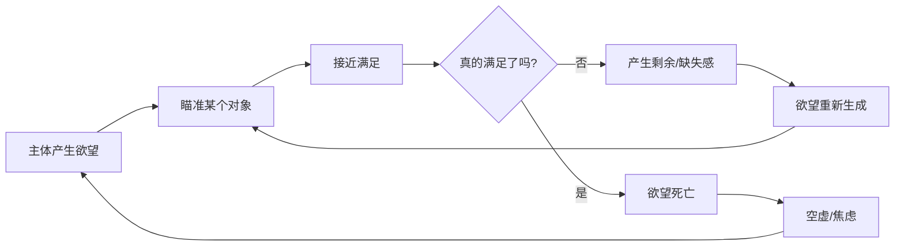

当我们说"我想吃饭"、"我想买那件衣服"、"我爱她"时,我们以为自己在表达"欲望"。但在雅克·拉康(Jacques Lacan)的精神分析理论中,这些都不是真正的欲望——它们只是**需求**(need)或**渴求**(demand)。

真正的欲望,是一种永远无法被满足的东西。它不带来快乐,却带来令人上瘾的痛苦快感。它追求的不是获得对象,而是让自己永远处于"还想再要"的状态。

理解拉康意义上的欲望,就是理解现代人最深层的存在困境:我们为什么永远感到空虚?为什么得到了还想要更多?为什么爱情、消费、成就都无法真正填补内心的那个洞?

---

## 第一章:欲望不是什么——从日常误解谈起

### 1.1 动物的需求 vs 人的欲望

小狗饿了想吃骨头,这是**需求**(need)。需求是生理性的、直接的、可以被满足的。狗吃饱了,需求就消失了。

但人不一样。当你在沙漠中濒临死亡,喝水成为唯一的生存焦点。一个月后你被救出,回到正常生活,生理上已经不再缺水,但你仍然会**不停地想喝水**。这种挥之不去的冲动,已经超越了生理需求,变成了一种**创伤性的执念**——这才是欲望。

### 1.2 拉康的核心公式

拉康用一个简洁而深刻的公式定义欲望:

$$
\text{欲望(Desire)} = \text{渴求(Demand)} - \text{需求(Need)}
$$

让我们拆解这个公式:

- **Need(需求)**:身体层面的具体要求,比如饥饿、性冲动、睡眠。这些是动物性的,可以被直接满足。
- **Demand(渴求)**:人在语言和社会结构中的所有想要。当需求进入语言表达时,它就变成了渴求。比如婴儿哭泣不只是要奶,更是要母亲的爱和关注。
- **Desire(欲望)**:当你减去那些可以被满足的生理需求后,**剩余的那个无法被填补的部分**,就是欲望。

### 1.3 一个日常的例子

你特别想吃美食。这里面包含两个层面:

1. **需求层面**:身体需要蛋白质、脂肪、碳水化合物。这些可以被满足——吃到肉、吃到鲜美的东西、吃到辣,身体的生理需求得到了满足。
2. **欲望层面**:但你"想吃美食"的这种**欲望**依然存在。就算你今天吃了蟹肉堡,明天吃了拉面,后天吃了龙虾料理,你仍然会继续想吃。因为欲望具有一种**审美的维度**,它是永远吃不饱的。

欲望的特点就是:**每当需求被满足了,你就觉得还有剩余,总会有那种未完成的感觉**。

---

## 第二章:欲望的辩证法——追求不被满足

### 2.1 欲望的悖论

拉康提出了一个惊人的观点:

> **欲望追求的,不是满足自己,而是维持自己永不满足的状态。**

这听起来很矛盾,但这就是欲望的辩证法:

- 如果欲望被彻底满足了,欲望就死了,就不会再被生产出来。
- 所以真正的欲望是**不停运转的**:你刚刚好像要满足了,但它不停地说"不是这个"(that's not it),不停地否定,然后继续向前。

### 2.2 欲望的目的:自我再生产

欲望所指向的东西有两个层面:

1. **欲望的对象**(object):表面上你想要的东西,比如一个汉堡包、一个人、一份工作。
2. **欲望的真正目的**(purpose):让欲望自身得以**持续再生产**。

举例:你肚子饿了,想吃汉堡包。

- 你的对象是那个汉堡包。
- 但你的**真正目的**不是获得汉堡包本身,而是:这个汉堡必须**好吃到让你下次还想再吃**。只有这样,你的"想吃美食"的欲望才获得了积极反馈,才能继续循环下去。

### 2.3 爱情中的欲望

在爱情中,这一点更明显:

当你爱上一个女孩,你会不断产生幻想:
- "如果能和她牵个手,那就太好了"
- 牵了手之后:"如果能一起吃顿饭,那就更完美了"
- 然后又有新的幻想不断浮现……

**欲望的真正目的不是最终得到那个女孩**。真正的目的是:让你那种**敞开的、创伤性的爱的状态**——那种孤单中颤抖、痛苦、惴惴不安的状态——不断地自我复制、自我再生产。

那个女孩最好永远若即若离,不断拒绝你又不让你死心。这样你的爱欲才能持续不断地被激发。一旦她彻底接受你,或者你们结婚了,欲望往往就开始衰退——因为它失去了那个**永不满足的张力**。

---

## 第三章:从Desire到Drive——循环的快感机器

### 3.1 欲望的两种形态

在拉康那里,当欲望瞄准一个具体对象时,它叫**desire(欲望)**;当它陷入一种重复的、强迫性的循环时,它就变成了**drive(驱力)**。

- **Desire**:强调其面向对象的一面(我想要她/它)
- **Drive**:强调其**循环运作**的一面(我停不下来地想要)

它们本质上是一回事,只是不同的视角。

### 3.2 驱力的循环运动

想象一下这个场景:

你有没有经历过**转笔停不下来**?明知道这件事毫无意义,却控制不住地一直转。你从中获得一种说不清道不明的感觉——有点怪异,有点刺激,甚至有点**爽**。

这就是驱力的体现:一种**强迫性的循环运动**,它不为了任何外在目的,只为了维持这个循环本身。

再比如消费欲望:

有人打开购物APP不停地搜索,搜了一晚上什么都没买,但他感到**满足**。为什么?因为他享受的是**搜索的过程**,而不是购买的结果。他要看琳琅满目的商品,被它们吸引、刺激,享受商品社会向他献殷勤的感觉。

这个过程让他确认:**我的欲望依然旺盛,我可以继续想要更多**。这种确认本身就构成了快感。

### 3.3 欲望的机制图解

我们可以用一个简单的流程图来理解:

欲望要么在循环中永生,要么在满足中死亡。而人类选择的是:**让它永生**。

---

## 第四章:创伤性快感——那个致命的内核

### 4.1 快感 ≠ 快乐

这是理解拉康欲望理论最关键的一点:**快感(jouissance)不等于快乐(pleasure)**。

- **快乐(pleasure)**:令人舒适、满足的感觉。比如吃饱了、睡够了、达成目标了。
- **快感(jouissance)**:一种**创伤性的、痛苦的、却令人上瘾的刺激**。它是压抑的、紧张的、甚至是危险的。

### 4.2 快感的体验

想象你深深爱着一个人,爱到无法自拔。这种状态是快乐的吗?**不**。它是:

- 极度的惴惴不安
- 孤单中的颤抖
- 一种撕裂般的痛苦
- 一种赤裸裸暴露在世界面前的脆弱感

但你**上瘾**了。你想一直保持这种状态,即使它折磨你。**这就是创伤性快感**。

拉康说,我曾经在听一首音乐时体验过这种快速循环的感觉:

> "那种感觉很痛苦,但同时又很爽,有种释放感。这种痛苦是非常深刻的内在痛苦,不是身体上的生理疼痛,而是精神上的创伤,是极度的悲伤。而这个过程中的'爽',就是一种快感。"

### 4.3 享乐的核心(Kernel of Enjoyment)

在欲望的循环运动中,会产生一个**无法被符号化的内核**,拉康称之为"**享乐的核心**"。

这个核心是:
- 压抑的
- 创伤性的
- 无法用语言描述的
- 却是吸引你、支配你的根源

它不是高潮时的舒畅,而是**高潮前极度压抑、紧绷、扭曲的状态中产生的刺激感**。

---

## 第五章:幻想与小客体a——遮蔽的机制

### 5.1 为什么需要幻想?

如果主体直接面对那个**赤裸裸的、创伤性的享乐核心**,主体会承受不了,会崩溃。

所以**幻想(fantasy)**就像一层保护膜,把那个过于激烈的快感包裹起来。

### 5.2 幻想的结构

当你特别想要买某样东西时,那个物品会被**幻想美化**:
- 它变得极具吸引力
- 带有致命的诱惑力
- 好像得到它,你的人生就完美了

这时,这个对象就不再是普通的物,而是拉康术语中的"**小客体a**"(little object a)——**欲望的原因**(cause of desire)。

### 5.3 爱情的幻想结构

你爱上了一个女孩,这个女孩就变成了一个**小客体a**。然后你会围绕她建构一个幻想:

- "如果我能和她在一起,我就会无比幸福"
- "她是我生命中的唯一"
- "得到她,我的空虚就会被填补"

但**幻想的作用**是遮蔽底层的创伤性快感。你真正上瘾的,不是她这个人,而是**那种爱欲的循环运动本身**——那种痛苦、惴惴不安、永不满足的状态。

幻想提供一个想象性的、极其理想化的图景,让你可以**不断接近但永远无法彻底得到**。这样欲望才能持续再生产。

### 5.4 基本幻想(Fundamental Fantasy)

在所有幻想中,有一个**最根本的、最具反动性的终极幻想**:

> **看到自己正在被欺凌、被羞辱(humiliated),看到自己在受苦(suffering)。**

在爱情的例子中:当你爱一个人爱到最后,突然觉得爱不动了,为什么?

因为这个**基本幻想**浮现出来了:
- 你感到自己在受苦
- 你在被你所爱的人侮辱、贬低
- 你成了受害者

如果你无法穿越这个幻想,你就只能在欲望上妥协、让步。

---

## 第六章:拉康的伦理学——不要在欲望上让步

### 6.1 第一伦理原则:Don't Give Up On Your Desire

> **"不要在你的欲望上让步。"**

这是拉康伦理学的核心。

如果你有一个欲望,一种很强烈的爱欲,那你要**一定要把它坚持到底**。

注意:**这个"坚持"不是指追求满足**。欲望的本质就是追求它不被满足。你要坚持的,是那种**永恒的、不妥协的姿态**,是那种**作为剩余意义上的欲望**。

### 6.2 第二伦理原则:穿越幻想

只有通过"不在欲望上让步",你才能**穿越幻想**(traversing the fantasy)。

什么是穿越幻想?

- 不被那些想象性的理想状态所诱惑
- 不用虚假的满足来替代真实的追求
- 直面那个创伤性的快感核心

比如,很多人说"我爱一个人,最后和他结婚了",然后就觉得圆满了、补足了、不再需要继续爱了。

他们用**婚姻这个想象性的共同体形式**,用婚后日常生活的琐碎,**压抑了原本的爱情冲动**。这个时候,他们其实已经**在欲望上妥协了**。

在拉康看来,这是被某种意识形态幻想所俘获,是一种**背叛**(betrayal)——背叛了爱的真实性,背叛了那个无法被符号化的实在界。

### 6.3 第三伦理原则:本真的行动

拉康提出一个著名的概念:**在两种死亡之间**(between two deaths)。

- 一种是生物学意义上的死亡(肉体死亡)
- 一种是符号学意义上的死亡(社会身份的消亡)

**本真的行动**只能发生在:你的符号学身份已经瓦解,但你的肉体仍然活着。

典型例子是安提戈涅:她遵循内在召唤,为死去的兄弟埋葬,违反了国王的禁令,导致她在城邦中的符号身份彻底瓦解。她成了共同体眼中的异类。

但正是在这种状态下,她的行为超越了共同体的伦理和符号系统,成为一种**神圣的姿态**。

### 6.4 两个必要条件

本真行动有两个特征:

1. **认识论上的无知**:你完全不知道你所坚持的东西意味着什么。它超出了你赖以生存的意识形态框架和本体论结构。
2. **后果的灾难性**:你明确知道,如果继续坚持,结果将是灾难性的——因为整个系统都在警告你。

**重要的是**:这种无知和灾难性**不是你预谋的**。如果你刻意追求身败名裂,以为这样就能获得本真性,那恰恰是一种**倒错**(perversion),甚至是变态。

本真行动的前提是:**你没有预谋,你并不知道自己在做什么**。是那个真实(the Real)自己降临了,你只是承载它的人。

---

## 第七章:欲望与资本主义——爱欲经济学

### 7.1 为什么要理解欲望?

理解拉康意义上的欲望,不只是个人心理分析的问题,更是**理解现代资本主义的关键**。

列宁主义的共产主义实验为什么失败?因为人们以为:
- 只要电气化了,有筒子楼
- 有电灯、热水壶
- 物质需求被满足了

共产主义就能实现。但事实证明,**人不是通过技术理性的发展或物质需求的满足就能满足的**。

人内在有一种本性是**爱欲性的**。人和动物最大的差别在于:**人有欲望**。

### 7.2 现代资本不卖商品,卖欲望

今天的资本主义已经不再只是满足你的需求。它**精准地操控你的欲望**,让你永远处在"还想再要"的状态中。

- 它卖的不是商品,而是**欲望的永动机制**
- 它制造的不是满足,而是**永不满足**
- 它塑造的不是快乐,而是**创伤性快感的循环**

消费社会的本质:
- 广告不断向你展示小客体a
- 制造幻想:"得到这个,你就圆满了"
- 但你买到后,立刻感到空虚
- 然后新的商品又成为下一个小客体a

这就是**爱欲经济学**:资本深入到神经生理学的核心层面,运用欲望的辩证法来进行统治。

### 7.3 底层的双重剥削

最底层的无产阶级:
- 在身体和健康上被奴役
- 在爱欲层面也被剥削

想想大多数劳动人民:
- 他们并不漂亮,没钱装扮自己
- 很少能体验那种小布尔乔亚式的精致爱情
- 他们的爱情关系一旦出现,就会被整个社会以一种**居高临下的方式观看**

比如:一个坐牢多年的人出狱后,前妻还愿意拥抱他。他们在电视上的形象不具备审美要素,却被资本主义媒体塑造成"真爱"的景观。

这里面存在一种**审美统治、符号学的统治**。

---

## 第八章:结语——与欲望共存

### 8.1 欲望不可能被消除

拉康告诉我们一个残酷的真相:**欲望是人之为人的本质,它不可能被彻底消除**。

只要我们:
- 使用语言
- 生活在符号秩序中
- 与大他者打交道

我们就会有匮乏,就会有欲望。

### 8.2 但我们可以选择如何对待它

拉康伦理学提供的,不是"如何消除欲望",而是"如何本真地活着":

1. **不在欲望上让步**:承认你的欲望,坚持它,不要用虚假的满足来欺骗自己。
2. **穿越幻想**:识破那些意识形态提供给你的理想图景,直面真实。
3. **准备好承担后果**:本真的行动可能导致符号身份的瓦解,但这是真实生活的代价。

### 8.3 理解欲望,理解我们自己

当你下次感到空虚、不满足、总想要更多时,不要简单地责怪自己"贪婪"或"不知足"。

试着问自己:

- 我真正想要的是什么?还是我只是想要"想要"本身?
- 这个对象是真的重要,还是只是一个小客体a,遮蔽了更深的创伤?
- 我是在追求满足,还是在逃避面对真实的自己?

理解拉康意义上的欲望,就是理解:

> **我们永远都在追寻一个不存在的完整,永远都在填补一个无法填补的洞。**
>
> **但正是这个洞,这个匮乏,这个永不满足——定义了我们作为人的尊严。**

因为只有人,才能够在明知不可能的情况下,依然**坚持欲望**,依然**拒绝妥协**,依然**勇敢地爱,勇敢地活**。

---

**参考文献**

- Lacan, Jacques. *The Ethics of Psychoanalysis (Seminar VII)*
- Lacan, Jacques. *The Four Fundamental Concepts of Psychoanalysis (Seminar XI)*
- Žižek, Slavoj. *How to Read Lacan*
- 视频素材:《【一小时哲学】拉康的伦理学》系列、《【半小时哲学·爱欲经济学】拉康意义上的欲望是什么?》
