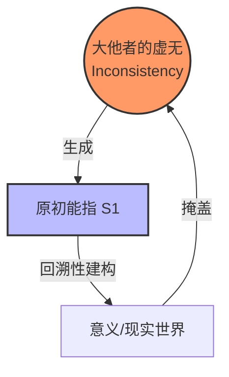

在雅克·拉康（Jacques Lacan）的三界理论中， **符号界（The Symbolic）** 占据着绝对的统治地位。它是语言、法律、文化构成的网，是我们赖以生存的“现实”本身。

但拉康告诉我们，这个现实并非坚实的土地，而是一个建立在 **“虚无”** 之上的精密操作系统。

今天，我们将借助 **“无限月读”** 与 **“操作系统”** 这两个隐喻，拆解拉康符号学的四大支柱： **大他者、原初能指、主人能指（菲勒斯）与幻想公式** 。

### 一、 大他者（The Other）：Bug 丛生的操作系统

首先，我们需要重新定义上帝、历史必然性或社会规则。在拉康眼中，它们都是 **大他者（le grand Autre, A）** 的化身。

#### 1. 无法停止的“无限月读”
想象你中了《火影忍者》中的“无限月读”。你被包裹在一个幻境中，世界源源不断地向你呈现图像和意义。
这就是 **符号秩序** 。
*   **状态** ：这是一种 **“无限阅读”** （Infinite Reading）的状态。你无法按下“暂停键”。比如当你走进一个脏乱的公厕，你无法命令大脑“不要识别这个肮脏的概念”。你被强制接入了这个意义系统，你逃无可逃。
*   **开机前** ：在进入这个系统之前（或者说在主体的史前史），存在一种**母子共同体 ** 的状态。那是混沌的、无时间的、一致的。但请注意，这个“完美过去”是我们进入系统后，**回溯性（Retroactive）** 建构出来的幻觉。它从未真正存在过。

#### 2. 大他者不存在 (The Other does not exist)
这是拉康最著名的论断之一。
如果把宇宙比作一台电脑，大他者就是那个号称完美的 **“Windows 9999”** 操作系统。
*   **真相** ：这个完美的终极系统并不存在。现实中只有充满Bug的 Win10、Win95 甚至是 DOS 系统。
*   **不一致性** ：大他者本身是 **不一致的（Inconsistent）** 。如果它真的全知全能、自洽完美，它就不需要我们了。正因为系统有漏洞，无法自我闭环，它才需要把 **主体（Subject）** “甩”出来，去填补那个裂缝。

> **哲学的推论** ：主体，就是大他者对自己“是个傻X”（系统崩溃）这一事实的感知。

### 二、 原初能指 ($S_1$)：缝合虚无的第一针

因为大他者是不完整的，它必须产生一个符号来标记这个“缺失”。

#### 1. 虚无的能指
这个符号就是 **原初能指（Primordial Signifier, $S_1$）** 。
通常，能指指向某个具体的对象（如“苹果”指向那个水果）。但 $S_1$ 指向的是什么？
它指向的是 **大他者的虚无** 。它是一个指向空集的符号。

#### 2. 缝合（Suture）
如果这种虚无直接暴露，世界就会崩塌（类似于黑客帝国代码流显现）。因此，符号系统必须进行 **缝合** 。
$S_1$ 的出现，就像是给这个裂开的伤口缝了第一针。它把那个不存在的基础“排除”到系统之外，强行建立起一套秩序，让我们以为世界是稳固的。

### 三、 主人能指与性化：菲勒斯的骗局与自由

随着 $S_1$ 的运作，我们进入了 **菲勒斯（Phallus, $\Phi$）** 的领域。在这里，拉康彻底重写了性别的定义。菲勒斯不是生物器官，而是 **符号权力的令牌** ，是那个能指链上的 **主人能指（Master Signifier）** 。

#### 1. 男性结构：被愚弄的信徒
男性逻辑是建立在 **“例外”** 基础上的（参考弗洛伊德的《图腾与禁忌》）。
*   **机制** ：男孩通过 **恐惧** （Fear of Castration）完成了阉割。他相信有一个“原始父亲”真正拥有菲勒斯（拥有全部的享乐），而自己为了不失去那个小小的“零件”，必须遵守禁令。
*   **代价** ：他的快感被严格限制在两个通道：
  1.  **崇高的集体叙事** （宏大叙事、民族主义、荣誉）。
  2.  **对女体的占有幻想** （将女性作为菲勒斯的载体）。
*   **本质** ：男人其实是被菲勒斯这个符号 **阉割** 最深的人，他一生都在维护一个他从未真正拥有的权杖。

#### 2. 女性结构：看穿一切的自由者
女性面临的是 **双重阉割** 。
*   **第一重** ：她被要求拥有她没有的东西（菲勒斯）。
*   **第二重** ：她还要为“没有”而感到焦虑。
    正是这种双重逼迫，让女性在某个时刻突然顿悟： **“原来那个所谓的菲勒斯，根本就是空的！那是虚无！”**

*   **结果** ：因为看穿了权杖的虚假，女性反而不受菲勒斯逻辑的绝对束缚。
  *   她处于 **“非全”（Not-all / Pas-tout）** 的逻辑中。
  *   她可以 **“将一切性化”** 。她的快感不局限于某个器官或某种仪式，她的身体、语言、甚至打牌赢了的瞬间，都可以成为享乐的来源。
  *   **结论** ：男人活在拥有菲勒斯的焦虑假象中，女人活在看穿菲勒斯后的自由爱欲中。

### 四、 幻想公式 ($ \diamond a$)：系统无法模拟的幽灵

最后，我们来到了拉康哲学的核心引擎：**小客体a（Objet petit a）** 。

#### 1. 系统的盲点
回到“无限月读”的比喻。一个完美的幻境系统，唯一不能模拟进去的东西是什么？
是 **产生这个幻境的机器本身** ，或者是那个 **正在注视幻境的眼睛** 。
系统无法模拟自身。那个被系统排除在外的、无法符号化的 **“实在界碎片”** ，就是小客体a。

#### 2. 欲望的黑洞
小a本身并不存在，它不是一个实体，而是一个 **引力场** 。
*   **主体 ($)** ：一个纯粹的、无内容的观察者（划杠的主体）。
*   **小客体 (a)** ：主体存在的基础，那个丢失的自我碎片。

因为我们丢失了它，所以我们拼命寻找。当我们爱上某人时，实际上是那个人的形象恰好在大他者的网格中捕获了你的小a。
*   **现象 ** ：你会觉得TA身上有“光”，TA的一举一动都充满深意。这并不是TA真的完美，而是** 小a扭曲了你眼前的符号现实** ，就像黑洞扭曲了光线。

#### 3. 幻想公式：$ \diamond a$
$$ \$ \diamond a $$
*   **含义** ： 空无的主体（\$）与导致欲望的原因（a）之间那种既结合又分离的（$\diamond$）不可能关系。
*   **功能** ：幻想不是为了以此获得快乐，而是 **为了在这个无法忍受的虚无（实在界）之上，搭建一个可以让我们活下去的舞台** 。幻想是欲望辩证法运行的轨道。

### 五、 结语：在虚构中生存

通过拉康的符号学，我们得以窥见现实的真相：

**现实（Reality）是被建构出来的虚构（Fiction）。**

我们生活在一个由语言代码编写的“操作系统”中。
*   **大他者** 是那个永远无法自洽的服务器；
*   **原初能指** 是掩盖系统漏洞的补丁；
*   **菲勒斯** 是我们顶礼膜拜却空无一物的图腾；
*   **小客体a** 则是那个永远在逃逸，却驱动着我们不停去爱、去恨、去活着的系统幽灵。

理解了这一点，或许我们就能在面对人生的荒谬时，多一份清醒的悲剧感，也多一份“看穿菲勒斯”后的自由。
